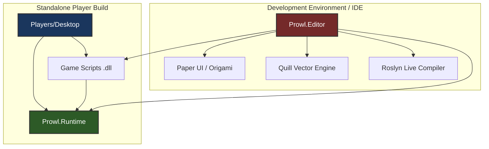

# ⚡ Core Architecture (Runtime vs Editor)

A cornerstone engineering principle of **Prowl Engine** is the strict boundary between the execution layer (**Runtime**) and the authoring tooling layer (**Editor**).

In many legacy game engines, editor code and runtime code are tightly coupled. This results in hidden dependencies, executable bloat in production builds, and risks of shipping editor-only code into commercial game packages.

In Prowl, this separation is enforced at the assembly and project dependency level.

---

## 🏛️ Assembly Hierarchy and Dependencies



---

## 🟢 1. Prowl.Runtime: The Standalone Engine Kernel

[`Prowl.Runtime`](file:///c:/Users/SaidR/Documents/GitHub/ProwlStar/Prowl.Runtime) is a completely self-sufficient assembly. It contains zero references to `Prowl.Editor`, editor UI frameworks, or live compilation tooling.

### Runtime Core Subsystems:
1. **Engine Loop:** Orchestrated in [`Game.cs`](file:///c:/Users/SaidR/Documents/GitHub/ProwlStar/Prowl.Runtime/Game.cs) and [`Application.cs`](file:///c:/Users/SaidR/Documents/GitHub/ProwlStar/Prowl.Runtime/Application.cs).
2. **Scene & Entity Graph:** Hierarchical [`GameObject`](file:///c:/Users/SaidR/Documents/GitHub/ProwlStar/Prowl.Runtime/GameObject/GameObject.cs) structures and bitmask-driven execution dispatching in [`SceneDispatcher.cs`](file:///c:/Users/SaidR/Documents/GitHub/ProwlStar/Prowl.Runtime/GameObject/SceneDispatcher.cs).
3. **Graphics Pipeline:** [`DefaultRenderPipeline.cs`](file:///c:/Users/SaidR/Documents/GitHub/ProwlStar/Prowl.Runtime/Rendering/DefaultRenderPipeline.cs) with dynamic lighting accelerated by [`LightBVH.cs`](file:///c:/Users/SaidR/Documents/GitHub/ProwlStar/Prowl.Runtime/Rendering/LightBVH.cs).
4. **Deterministic Physics:** Managed Jitter Physics 2 integration ([`PhysicsWorld.cs`](file:///c:/Users/SaidR/Documents/GitHub/ProwlStar/Prowl.Runtime/Physics/PhysicsWorld.cs)).
5. **Spatial Audio:** Managed wrapper layer over native MiniAudio.
6. **Input Management:** Decoupled action maps, composite bindings, and hardware listeners.
7. **Asset Backend:** Abstract [`AssetDatabase`](file:///c:/Users/SaidR/Documents/GitHub/ProwlStar/Prowl.Runtime/AssetDatabase.cs) resolved in production through [`PlayerAssetBackend.cs`](file:///c:/Users/SaidR/Documents/GitHub/ProwlStar/Prowl.Runtime/PlayerAssetBackend.cs).

> [!TIP]
> **Shipping Headless or Custom Runners:** You can reference `Prowl.Runtime.dll` directly in custom console applications, simulation harnesses, or specialized game runners without launching the editor.

---

## 🔴 2. Prowl.Editor: The Authoring IDE

[`Prowl.Editor`](file:///c:/Users/SaidR/Documents/GitHub/ProwlStar/Prowl.Editor) is a rich client application built **on top of** `Prowl.Runtime`.

### Editor Responsibilities:
1. **Immediate Mode UI:** Built with **Paper UI**, **Origami**, and vector rendering by **Quill**.
2. **Core Panels:**
   - [`HierarchyPanel`](file:///c:/Users/SaidR/Documents/GitHub/ProwlStar/Prowl.Editor/GUI/Panels/HierarchyPanel.cs): Live scene tree with drag-and-drop parenting and selection.
   - [`InspectorPanel`](file:///c:/Users/SaidR/Documents/GitHub/ProwlStar/Prowl.Editor/GUI/Panels/InspectorPanel.cs): Property reflection, undo-tracked modifications, and `CustomEditor` rendering.
   - [`SceneViewPanel`](file:///c:/Users/SaidR/Documents/GitHub/ProwlStar/Prowl.Editor/GUI/Panels/SceneViewPanel.cs): Viewport camera navigation, 3D translation/rotation/scale gizmos, and debug visualizers.
   - [`GameViewPanel`](file:///c:/Users/SaidR/Documents/GitHub/ProwlStar/Prowl.Editor/GUI/Panels/GameViewPanel.cs): Real-time game view with simulated input focus.
   - [`ProjectPanel`](file:///c:/Users/SaidR/Documents/GitHub/ProwlStar/Prowl.Editor/GUI/Panels/ProjectPanel.cs): File system asset explorer, asset imports, and 3D mesh/texture/audio previews.
3. **Hot Reloading:**
   Uses Roslyn APIs ([`RoslynScriptBackend.cs`](file:///c:/Users/SaidR/Documents/GitHub/ProwlStar/Prowl.Editor/Projects/Scripting/RoslynScriptBackend.cs)) to detect changes in `.cs` files, compile assemblies into memory, and migrate live component state seamlessly without restarting the play session.
4. **Prefab Architecture:**
   Delta property tracking, nested prefabs, and override management in [`PrefabUtility.cs`](file:///c:/Users/SaidR/Documents/GitHub/ProwlStar/Prowl.Editor/Prefabs/PrefabUtility.cs).

---

## 🔵 3. Players/Desktop: The Distribution Runner

Located in [`Players/Desktop`](file:///c:/Users/SaidR/Documents/GitHub/ProwlStar/Players/Desktop), this project serves as the host template for producing final standalone executables (`.exe` on Windows, native binaries on Linux and macOS).

### Standalone Startup Sequence:
1. **Entry Point (`Program.cs`):** Initializes the native window through the windowing subsystem.
2. **Manifest Loading:** Reads `PlayerManifest` and packaged configuration files.
3. **Asset Backend Setup:** Sets `AssetDatabase.Current = new PlayerAssetBackend(...)` to resolve compiled assets from compressed packages.
4. **Boot Scene:** Instantiates the initial game scene declared in project settings and triggers `Game.Run()`.

---

## 🛡️ Best Practice for Developers

```csharp
// ❌ WRONG: Never import Prowl.Editor in runtime gameplay scripts
using Prowl.Editor; // Will trigger a compiler error when building the standalone player!

// ✅ RIGHT: Wrap editor-only code with preprocessor symbols:
#if PROWL_EDITOR
using Prowl.Editor;
#endif

public class PlayerMotor : MonoBehaviour
{
    public float MovementSpeed = 5.0f;

#if PROWL_EDITOR
    // Compiled only inside the Editor environment
    public override void DrawGizmos()
    {
        // Render custom editor gizmos
    }
#endif
}
```

---

## 🔗 Related Topics
- Customize the inspector: [[🎛️ Custom Editors & Inspector Customization]].
- Build and export your game: [[📦 Build System & Desktop Player]].
- Understand scene management: [[🧱 GameObjects & Components]].
