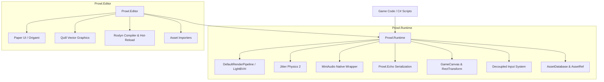

# 🧭 What is Prowl Engine

**Prowl Engine** (ProwlStar) is an open-source, **MIT-licensed** 3D and 2D game engine built entirely in **pure modern C# on .NET 10**. It was engineered to deliver a productive, transparent, and high-performance workflow with an architectural design and scripting API immediately familiar to **Unity** developers—while eliminating proprietary black boxes, bloat, and vendor lock-in.

---

## 🎯 Design Philosophy

1. **Pure Modern C# (.NET 10):**
   Unlike engines that rely on a C++ kernel with thin C# bindings (causing marshaling overhead and debugging friction), Prowl is implemented in C# from the ground up. This allows step-in debugging into every subsystem, zero marshaling costs, and cross-platform native execution.

2. **KISS (Keep It Simple, Stupid):**
   Architectural layers remain minimal and pragmatic. The engine avoids unnecessarily deep inheritance trees, convoluted dependency webs, and unreadable generated code.

3. **Strict Runtime vs. Editor Decoupling:**
   `Prowl.Runtime` is completely standalone. A packaged game references only the runtime and dependencies, completely excluding `Prowl.Editor` for minimal binary footprints and instant boot times.

4. **Zero-GC in Hot Execution Paths:**
   The primary execution loops (`Update`, `FixedUpdate`, `RenderPass`, physics solver) are engineered with zero heap allocations in mind, utilizing value types, preallocated buffers, and `in`/`ref` semantics.

---

## 🏗️ Technology Stack

---

## ⚡ Core Engine Capabilities

### 1. Scripting & Entity Model
- `GameObject` and `MonoBehaviour` architecture matching industry standards.
- High-speed event dispatching via `SceneDispatcher` using bitmask comparisons rather than per-frame reflection lookups.
- Roslyn-based **Hot Reloading** preserving scene state during active gameplay.

### 2. Modern Graphics & Rendering Pipeline
- Modular **DefaultRenderPipeline** supporting deferred and forward paths.
- **LightBVH** spatial acceleration structure supporting hundreds of real-time dynamic light sources with **ShadowAtlas** shadow projection.
- Physical Based Rendering (PBR) workflows with roughness, metallic, normal, occlusion, and precomputed BRDF look-up tables.
- GPU Instancing (`InstancedMeshRenderable`) and skeletal vertex deformation (`SkinnedMeshRenderer`).
- Subpixel Morphological Anti-Aliasing (SMAA).

### 3. Advanced Physics (Jitter Physics 2)
- Multi-threaded, deterministic 3D physics solver.
- Rigid bodies (`Rigidbody3D`) supporting Dynamic, Kinematic, and Static motion types with pose interpolation/extrapolation.
- Comprehensive collider library: Box, Sphere, Capsule, Cylinder, Cone, Mesh, and optimized `TerrainCollider`.
- Mechanical constraints: BallSocket, HingeJoint, PrismaticJoint, UniversalJoint, and linear/angular motors.
- Specialized vehicle dynamics (`WheelCollider`) and kinematic controllers (`CharacterController`).

### 4. 3D Spatial Audio (MiniAudio)
- Native cross-platform backend for Windows, Linux, macOS, and Android.
- True 3D positional audio, distance attenuation curves, and Doppler shifts.
- Professional audio mixer (`AudioMixer`) with hierarchical buses and snapshot crossfades.
- Real-time DSP effects chain: Reverb, delay, equalizer, and biquad filters.

### 5. Dual UI Systems
- **In-Game UI:** Powered by `GameCanvas`, `RectTransform`, and interactive controls (`UIButton`, `UISlider`, `UIInputField`, `UIScrollRect`) driven by a decoupled `EventSystem`.
- **Editor UI:** Immediate-mode vector UI engine powered by **Paper UI**, **Origami**, and **Quill**.

### 6. Serialization & Asset Management
- High-efficiency serialization powered by **Prowl.Echo**, eliminating the performance overhead of massive YAML files.
- GUID-based asset identification with lazy reference loading (`AssetRef<T>`) and idle-time resource eviction.

---

## 🔗 Quick Navigation
- Transitioning from Unity? Read: [[🔄 Unity Migration & Comparison Guide]].
- System structure: [[⚡ Core Architecture (Runtime vs Editor)]].
- Start scripting: [[⏱️ Lifecycle & Game Loop]].
