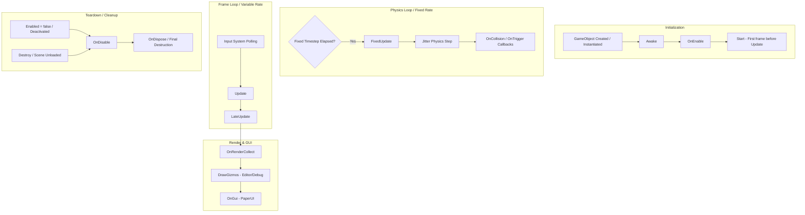

# ⏱️ Lifecycle & Game Loop in Prowl Engine

The execution flow of a game in **Prowl Engine** is orchestrated by two central systems: the main game loop ([`Game.cs`](file:///c:/Users/SaidR/Documents/GitHub/ProwlStar/Prowl.Runtime/Game.cs)) and the scene event dispatcher ([`SceneDispatcher.cs`](file:///c:/Users/SaidR/Documents/GitHub/ProwlStar/Prowl.Runtime/GameObject/SceneDispatcher.cs)).

Unlike Unity, where engine messages are invoked via internal C++ name reflection, Prowl's lifecycle hooks are **explicit virtual methods** resolved once at component registration time and stored as cached bitmasks (`SceneCallbacks`), guaranteeing zero reflection overhead and zero empty calls per frame.

---

## 🔄 Complete Lifecycle Flowchart



---

## ⚡ The Role of SceneDispatcher

The engine utilizes [`SceneDispatcher`](file:///c:/Users/SaidR/Documents/GitHub/ProwlStar/Prowl.Runtime/GameObject/SceneDispatcher.cs) as the single hub for component event execution.

### Internal Mechanics:
1. **One-Time Type Reflection (`Compute`):**
   When a `MonoBehaviour` type is first encountered, the dispatcher inspects which virtual methods are overridden (`OverridesVirtual`).
2. **Binary Bitmask (`SceneCallbacks`):**
   A dense bitmask flag is generated:
   ```csharp
   [Flags]
   internal enum SceneCallbacks
   {
       None = 0,
       Start = 1 << 0,
       Update = 1 << 1,
       LateUpdate = 1 << 2,
       FixedUpdate = 1 << 3,
       RenderCollect = 1 << 4,
       DrawGizmos = 1 << 5,
       OnGui = 1 << 6,
       CollisionBegin = 1 << 7,
       CollisionEnd = 1 << 8,
       TriggerEnter = 1 << 9,
       TriggerStay = 1 << 10,
       TriggerExit = 1 << 11,
   }
   ```
3. **Zero-Overhead Dispatching:**
   During every tick, checking whether a component requires dispatching is a primitive bitwise operation: `(callbacks & SceneCallbacks.Update) != 0`. If you didn't override a callback, the engine does not even iterate over your instance.

---

## 📋 Lifecycle Methods in Detail

### 1. Initialization
- `Awake()`: Invoked immediately when a `MonoBehaviour` is added to a `GameObject` or upon scene deserialization. Use this strictly for internal field initialization and local component caching.
- `OnEnable()`: Fires whenever the component becomes enabled and active in the scene hierarchy (`EnabledInHierarchy == true`). Runs in PlayMode and inside the editor if decorated with `[ExecuteAlways]`.
- `Start()`: Called exactly once before the first frame's `Update()` executes. Safe for external cross-GameObject dependency linking.

### 2. Physics Simulation Loop (`FixedUpdate`)
- Triggered at constant fixed time intervals (`Physics.FixedDeltaTime`), decoupled from variable render framerates.
- All force applications (`rb.AddForce(...)`), velocities, and torques must execute inside this hook.
- Physical collision events (`OnCollisionBegin`, `OnCollisionEnd`, `OnTriggerEnter`, `OnTriggerStay`, `OnTriggerExit`) are dispatched immediately following Jitter's solver step.

### 3. Frame Logic Loop (`Update` & `LateUpdate`)
- `Update()`: Invoked once per rendered frame. Used for timers, input capture, and general gameplay logic.
- `LateUpdate()`: Invoked after all `Update()` calls have executed across the scene. Ideal for camera controllers following player movement.

### 4. Rendering & GUI Loop
- `OnRenderCollect()`: Allows components to submit render commands or custom batching items into the rendering pipeline prior to drawing.
- `DrawGizmos()`: Invoked inside the Editor for drawing debug wireframes, icons, and bounding volumes.
- `OnGui()`: Immediate-mode GUI calls using PaperUI.

### 5. Cleanup & Disposal
- `OnDisable()`: Fires when the component or its parent GameObject is disabled.
- `OnDispose()`: Called when the object is permanently destroyed. Used for unregistering events and cleaning up native handles.

---

## 💻 Practical Code Example

```csharp
using Prowl.Runtime;
using Prowl.Vector;

public class PlayerLifecycleDemo : MonoBehaviour
{
    private Rigidbody3D _rb;
    private Float3 _moveInput;
    private float _moveSpeed = 8.0f;

    public override void Awake()
    {
        base.Awake();
        // Cache local components (Zero GC)
        TryGetComponent<Rigidbody3D>(out _rb);
    }

    public override void OnEnable()
    {
        base.OnEnable();
        // Event subscriptions
    }

    public override void Start()
    {
        base.Start();
        // External dependency linking
    }

    public override void Update()
    {
        base.Update();
        // Input acquisition
        float x = (Input.GetKey(Key.D) ? 1 : 0) - (Input.GetKey(Key.A) ? 1 : 0);
        float z = (Input.GetKey(Key.W) ? 1 : 0) - (Input.GetKey(Key.S) ? 1 : 0);
        _moveInput = new Float3(x, 0, z);
    }

    public override void FixedUpdate()
    {
        base.FixedUpdate();
        // Apply physics forces
        if (_rb.IsValid() && _moveInput.sqrMagnitude > 0.001f)
        {
            Float3 force = _moveInput * _moveSpeed;
            _rb.AddForce(force, ForceMode.Force);
        }
    }

    public override void OnDisable()
    {
        base.OnDisable();
        // Cancel async tasks or unregister listeners
    }
}
```

---

## 🔗 Related Notes
- The base component class: [[🧬 MonoBehaviour in Prowl]].
- Composition model: [[🧱 GameObjects & Components]].
- Optimization standards: [[🎯 Best Practices & Performance (Zero GC)]].
