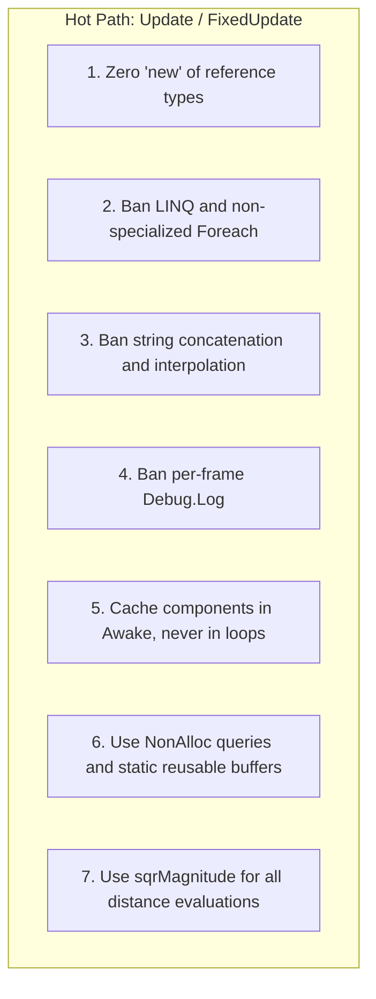

# 🎯 Best Practices & Performance (Zero GC) in Prowl Engine

In high-performance interactive games running on managed runtimes (.NET), the **Garbage Collector (GC)** is the primary culprit behind frame rate stuttering and sudden frame time spikes. When the GC triggers a collection generation to reclaim short-lived heap allocations, execution threads can be suspended (*Stop-the-World*), instantly shattering smooth 60 or 120 FPS targets.

In Prowl Engine, the golden rule across all execution hot paths (**Hot Paths:** `Update`, `FixedUpdate`, `LateUpdate`, physics solver steps, and render passes) is: **ZERO HEAP ALLOCATIONS (ZERO GC)**.

---

## 🛑 The 7 Cardinal Rules of the Hot Path



---

## 🔍 Detailed Pattern Analysis and Solutions

### 1. No `new` for Reference Types in Loops
Classes (`class`) allocate on the GC heap. Structs (`struct`) allocate on the execution stack.
```csharp
// ❌ WRONG: Allocates a new heap object every single frame
public override void Update()
{
    base.Update();
    List<Enemy> enemies = new List<Enemy>(); // 💥 Garbage generated per frame
}

// ✅ RIGHT: Reuse a persistent collection preallocated during initialization
private readonly List<Enemy> _cachedEnemies = new(64);

public override void Update()
{
    base.Update();
    _cachedEnemies.Clear(); // Clears count without releasing buffer memory (0 GC)
}
```

---

### 2. Ban LINQ in Game Loops
LINQ queries (`.Where()`, `.Select()`, `.OrderBy()`, `.FirstOrDefault()`) allocate anonymous delegates, enumerators, and closures on the heap per invocation.
```csharp
// ❌ WRONG: Hidden heap allocations and iterator overhead
var closest = _enemies.Where(e => e.IsAlive).OrderBy(e => (e.Position - pos).sqrMagnitude).FirstOrDefault();

// ✅ RIGHT: Indexed for-loop with value types
Enemy bestTarget = null;
float minSqrDist = float.MaxValue;

for (int i = 0; i < _enemies.Count; i++)
{
    Enemy e = _enemies[i];
    if (!e.IsAlive) continue;

    float d = (e.Position - pos).sqrMagnitude;
    if (d < minSqrDist)
    {
        minSqrDist = d;
        bestTarget = e;
    }
}
```

---

### 3. Strings & `Debug.Log`: Invisible Performance Killer
Strings in .NET are immutable. Every concatenation (`+`) or template interpolation (`$"Value: {x}"`) allocates a brand-new string object on the heap.
```csharp
// ❌ WRONG: Continuous allocations + console I/O stalling the main thread
public override void Update()
{
    base.Update();
    Debug.Log($"Current Position: {Transform.Position.x}, {Transform.Position.y}"); // 💥 Disastrous for framerate
}

// ✅ RIGHT: Log only exceptional events or during initialization
public override void Awake()
{
    base.Awake();
    Debug.Log("Subsystem initialized successfully.");
}
```

---

### 4. Physics Queries: Static `NonAlloc` Buffers
When casting rays or checking spatial bounds, always utilize `NonAlloc` API overloads paired with preallocated arrays.
```csharp
// ❌ WRONG: RaycastAll allocates an array on every call
RaycastHit[] hits = Physics.RaycastAll(ray, maxDistance);

// ✅ RIGHT: Static reusable buffer
private static readonly RaycastHit[] s_hitBuffer = new RaycastHit[16];

public void CheckObstacles()
{
    int hitCount = Physics.RaycastNonAlloc(Transform.Position, Transform.Forward, s_hitBuffer, 10.0f);
    for (int i = 0; i < hitCount; i++)
    {
        ref readonly RaycastHit hit = ref s_hitBuffer[i];
        // Process hit data with zero allocation
    }
}
```

---

### 5. Distance Comparisons: `sqrMagnitude` vs `Distance`
Computing square roots (`Math.Sqrt`) is one of the most computationally expensive operations on modern CPUs.
```csharp
// ❌ SLOW: Computes costly square root
float distance = Float3.Distance(Transform.Position, targetPos);
if (distance < 5.0f) { ... }

// ✅ FAST: Compare against squared threshold (5 * 5 = 25)
float sqrDist = (Transform.Position - targetPos).sqrMagnitude;
if (sqrDist < 25.0f) { ... }
```

---

### 6. Tag Comparisons: `CompareTag`
```csharp
// ❌ WRONG: .Tag == creates a temporary string copy
if (other.Tag == "Player") { }

// ✅ RIGHT: Optimized internal ordinal comparison without allocations
if (other.CompareTag("Player")) { }
```

---

### 7. Object Pooling for Ephemeral Entities
Projectiles, particles, and impact sparks should be recycled via object pools rather than repeatedly instantiated and destroyed:

```csharp
public class BulletPool : MonoBehaviour
{
    [SerializeField] private AssetRef<Prefab> _bulletPrefab;
    [SerializeField] private int _initialPoolSize = 50;

    private readonly Queue<GameObject> _pool = new();

    public override void Awake()
    {
        base.Awake();
        for (int i = 0; i < _initialPoolSize; i++)
        {
            GameObject b = GameObject.Instantiate(_bulletPrefab.Res);
            b.Enabled = false;
            _pool.Enqueue(b);
        }
    }

    public GameObject Spawn(Float3 position, Quaternion rotation)
    {
        GameObject b = _pool.Count > 0 ? _pool.Dequeue() : GameObject.Instantiate(_bulletPrefab.Res);
        b.Transform.Position = position;
        b.Transform.Rotation = rotation;
        b.Enabled = true;
        return b;
    }

    public void Despawn(GameObject b)
    {
        b.Enabled = false;
        _pool.Enqueue(b);
    }
}
```

---

## 🔗 Related Topics
- Engine execution architecture: [[⏱️ Lifecycle & Game Loop]].
- Non-alloc physics queries: [[🎯 Raycasting & Shape Queries]].
- Material batching and shader state: [[🔮 Materials, Shaders & PropertyState]].
