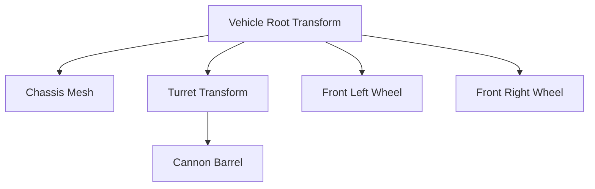

# 📐 Transform & Hierarchies in Prowl Engine

Spatial representation and tree hierarchy within any Prowl scene is governed by the [`Transform`](file:///c:/Users/SaidR/Documents/GitHub/ProwlStar/Prowl.Runtime/Math/Transform.cs) class (located in the `Prowl.Vector` namespace).

Every [`GameObject`](file:///c:/Users/SaidR/Documents/GitHub/ProwlStar/Prowl.Runtime/GameObject/GameObject.cs) possesses exactly one `Transform` instance. It is not an optional `MonoBehaviour`, but an intrinsic structural component managing local and world transformation matrices ([`Float4x4`](file:///c:/Users/SaidR/Documents/GitHub/ProwlStar/Prowl.Runtime/Math)) and parent-child scene graph relationships.

---

## 🧭 Coordinate System and Mathematical Types

Prowl Engine operates with modern, high-speed SIMD math structures from `Prowl.Vector`:

| Type | Dimensions | Common Usage |
| :--- | :--- | :--- |
| `Float2` | 2D Vector `(x, y)` | Screen space, UV coordinates, UI layouts. |
| `Float3` | 3D Vector `(x, y, z)` | World positions, scale, linear velocities, spatial directions. |
| `Float4` | 4D Vector `(x, y, z, w)` | HDR Colors, homogeneous vector math. |
| `Quaternion` | Quaternion `(x, y, z, w)` | Continuous 3D rotations without Gimbal Lock. |
| `Float4x4` | 4x4 Matrix | Affine spatial transformations (Translation, Rotation, Projection). |

---

## 📊 Core Properties of Transform

### 1. Position
- `Transform.LocalPosition`: Position relative to the parent object's local origin.
- `Transform.Position`: Absolute coordinates in world space (derived via `Parent.LocalToWorldMatrix`).

### 2. Rotation
- `Transform.LocalRotation`: Local orientation as a `Quaternion`.
- `Transform.Rotation`: Absolute orientation in world space.
- `Transform.LocalEulerAngles` / `Transform.EulerAngles`: Degree-based representation (Pitch, Yaw, Roll).

### 3. Scale
- `Transform.LocalScale`: 3D scale relative to parent coordinates (`Float3`).
- `Transform.LossyScale`: Approximate global scale incorporating accumulated ancestral scales.

### 4. Unit Directional Vectors
- `Transform.Forward`: Normalized unit vector pointing directly ahead in world coordinates.
- `Transform.Up`: Normalized unit vector pointing upwards.
- `Transform.Right`: Normalized unit vector pointing to the right.

---

## 🌲 Parent-Child Hierarchy Management



### Hierarchy Manipulation in C#:
```csharp
using Prowl.Runtime;
using Prowl.Vector;

// Set a new parent while preserving world orientation
childGo.Transform.SetParent(parentGo.Transform, worldPositionStays: true);

// Detach from parent (promote to root scene entity)
childGo.Transform.SetParent(null);

// Iterate through child transforms
int count = parentGo.Transform.ChildCount;
for (int i = 0; i < count; i++)
{
    Transform child = parentGo.Transform.GetChild(i);
    Debug.Log($"Child {i}: {child.GameObject.Name}");
}

// Detach all direct children
parentGo.Transform.DetachChildren();
```

---

## 🧮 Transforming Points, Directions, and Vectors

Transform coordinates between an object's local space and world space:

```csharp
// 1. Transform Point (Affected by Position, Rotation, and Scale)
// e.g., Finding the world position of a muzzle attachment point:
Float3 worldMuzzle = cannonTransform.TransformPoint(new Float3(0, 0, 2.5f));

// Inverse: World coordinates back into local space
Float3 localTarget = cannonTransform.InverseTransformPoint(enemyWorldPosition);

// 2. Transform Direction (Affected only by Rotation, remains normalized)
Float3 worldShootDirection = cannonTransform.TransformDirection(Float3.Forward);

// 3. Transform Vector (Affected by Rotation and Scale, but not translation)
Float3 worldOffset = cannonTransform.TransformVector(localOffset);
```

---

## 🔄 Kinematic Helper Methods

```csharp
public class HelicopterRotor : MonoBehaviour
{
    [SerializeField] private float _rotationSpeed = 720.0f;

    public override void Update()
    {
        base.Update();

        // Local rotation around Y axis
        Transform.Rotate(new Float3(0, _rotationSpeed * (float)Time.deltaTime, 0), isWorldSpace: false);
    }
}

public class TurretLook : MonoBehaviour
{
    public void AimAtTarget(Float3 targetPosition)
    {
        // Direct forward axis towards target, maintaining Up alignment
        Transform.LookAt(targetPosition, Float3.Up);
    }
}
```

---

## ⚡ Matrix Caching and Versioning

Internally, `Transform` maintains a monotonic version counter (`_version`). The matrices `LocalToWorldMatrix` and `WorldToLocalMatrix` are lazily recomputed only when the position, rotation, or scale of the current object or any ancestor in the tree changes.

> [!TIP]
> **Performance Recommendation:**
> Repeatedly modifying `Transform.Position` multiple times per frame invalidates the matrix cache repeatedly. Always accumulate offsets and write to `Transform.Position` once per frame.

---

## 🔗 Related Topics
- Engine execution order: [[⏱️ Lifecycle & Game Loop]].
- Entity container: [[🧱 GameObjects & Components]].
- Viewport rendering: [[📷 Cameras & RenderContext]].
