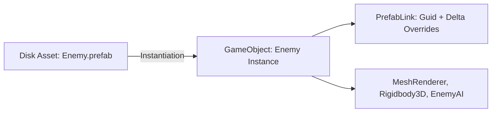

# 📦 Prefabs & Override System in Prowl Engine

A **Prefab** in Prowl Engine is a serialized asset that encapsulates a full [`GameObject`](file:///c:/Users/SaidR/Documents/GitHub/ProwlStar/Prowl.Runtime/GameObject/GameObject.cs) hierarchy alongside all configured components. It enables developers to instantiate pre-assembled entities repeatedly while maintaining a persistent live link to the source master asset on disk.

Prowl incorporates a sophisticated **Nested Prefab** and **Property Override** architecture, managed at runtime via [`PrefabLink.cs`](file:///c:/Users/SaidR/Documents/GitHub/ProwlStar/Prowl.Runtime/GameObject/PrefabLink.cs) and inside the editor through [`PrefabUtility.cs`](file:///c:/Users/SaidR/Documents/GitHub/ProwlStar/Prowl.Editor/Prefabs/PrefabUtility.cs).

---

## 🧬 Anatomy of a Prefab Instance

When a prefab is dragged into a scene or instantiated at runtime, it does not exist as an unlinked clone. The root `GameObject` and all descendants receive an internal binding component ([`PrefabLink`](file:///c:/Users/SaidR/Documents/GitHub/ProwlStar/Prowl.Runtime/GameObject/PrefabLink.cs)):



### What PrefabLink Handles:
1. **Source Identity Tracking:** Stores the immutable `Guid` of the master `.prefab` asset.
2. **Delta Recording:** Only records attributes modified locally on this specific instance relative to the master asset.
3. **Asset Synchronization:** Whenever the source prefab is modified in the project browser (e.g., updating a mesh or shader), changes propagate across all scenes while preserving local overrides.

---

## 🛠️ Supported Override Categories

Prowl's prefab pipeline tracks three primary categories of instance delta:

1. **Property Overrides:**
   Modifications to serialized fields (`[SerializeField]`), such as adjusting an entity's health or speed value.
2. **Added Components & Entities:**
   Novel components attached exclusively to an individual instance (e.g., a special quest trigger added to a standard NPC).
3. **Removed Components:**
   Components declared on the source prefab that are deliberately stripped or suppressed in a specific instance.

---

## 💻 Instantiating Prefabs in C#

### 1. Robust References with `AssetRef<Prefab>`
The idiomatic way to reference prefabs in Prowl is through `AssetRef<Prefab>`:

```csharp
using Prowl.Runtime;
using Prowl.Runtime.Resources;
using Prowl.Vector;

public class Spawner : MonoBehaviour
{
    // Serialized GUID reference exposed to Inspector
    [SerializeField] private AssetRef<Prefab> _enemyPrefab;
    [SerializeField] private float _spawnInterval = 2.0f;

    private float _timer;

    public override void Update()
    {
        base.Update();

        _timer += (float)Time.deltaTime;
        if (_timer >= _spawnInterval)
        {
            _timer = 0f;
            SpawnEnemy();
        }
    }

    private void SpawnEnemy()
    {
        // Guard against unassigned asset
        if (!_enemyPrefab.IsAvailable) return;

        // Instantiate into active scene
        GameObject enemyInstance = GameObject.Instantiate(_enemyPrefab.Res);
        enemyInstance.Transform.Position = Transform.Position + new Float3(0, 1, 0);
        enemyInstance.Transform.Rotation = Transform.Rotation;
    }
}
```

---

## 🎛️ Editor Prefab Workflow

Selecting a Prefab instance inside the `HierarchyPanel` or `InspectorPanel` provides options:

- **Apply Overrides:** Pushes instance deltas back to the `.prefab` file on disk, immediately updating all other instances across the project.
- **Revert Overrides:** Discards local changes on this instance and restores values from the master prefab.
- **Unpack / Break Prefab:** Removes `PrefabLink`, converting the instance into standard independent GameObjects.

---

## ⚡ Serialization with Prowl.Echo

Unlike Unity's YAML-based `.prefab` files (which suffer from slow parser speeds and merge-conflict nightmares), Prowl utilizes **Prowl.Echo**:
- High-efficiency binary serialization for standalone releases.
- Clean, diff-friendly human-readable format for version control.
- Delta-only serialization: Scenes record only the prefab GUID and modified properties, keeping scene file sizes microscopic.

---

## 🔗 Related Topics
- Entity lifecycle: [[🧱 GameObjects & Components]].
- Serialization internals: [[📜 Serialization with Prowl.Echo]].
- Asset registry: [[🗄️ AssetDatabase & AssetRef]].
