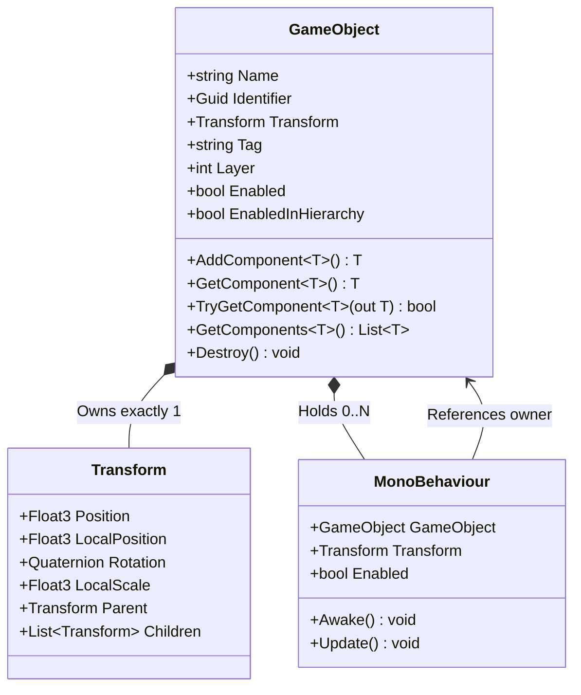

# 🧱 GameObjects & Components in Prowl Engine

The core scene graph in **Prowl Engine** is built upon the **GameObject-Component** composition model. Every distinct entity existing in a scene is an instance of [`GameObject`](file:///c:/Users/SaidR/Documents/GitHub/ProwlStar/Prowl.Runtime/GameObject/GameObject.cs), whose capabilities, appearance, and physical behavior are determined by the attached [`MonoBehaviour`](file:///c:/Users/SaidR/Documents/GitHub/ProwlStar/Prowl.Runtime/GameObject/MonoBehaviour.cs) components.

---

## 🏗️ Anatomy of a GameObject

A `GameObject` in Prowl acts as a lightweight container possessing:
1. **Identity:** A display name (`Name`), a persistent global unique identifier (`Guid Identifier`), and a parent scene reference (`Scene`).
2. **Spatial Transform:** Every `GameObject` possesses exactly one [`Transform`](file:///c:/Users/SaidR/Documents/GitHub/ProwlStar/Prowl.Runtime/Math/Transform.cs) component governing its 3D space orientation and scene hierarchy.
3. **Classification:** A string-based `Tag` for fast semantic lookup and an integer `Layer` for physics and rendering masks.
4. **Active State:** Boolean flags `Enabled` and `EnabledInHierarchy`.
5. **Component Array:** A contiguous collection of attached `MonoBehaviour` instances.



---

## 🛠️ Manipulating GameObjects in C#

### 1. Creation and Instantiation
```csharp
using Prowl.Runtime;
using Prowl.Vector;

// Create an empty GameObject
GameObject emptyEntity = new GameObject("MyEntity");
emptyEntity.Transform.Position = new Float3(0, 5, 0);

// Create with initial components
GameObject lightEntity = new GameObject("MainLight", typeof(PointLight));

// Instantiate a Prefab or scene clone
GameObject clone = GameObject.Instantiate(existingPrefab);
clone.Transform.Position = new Float3(10, 0, 0);
```

### 2. Component Management
```csharp
// Attach a component
Rigidbody3D rb = playerGo.AddComponent<Rigidbody3D>();
rb.Mass = 75f;

// Query an existing component
Camera cam = playerGo.GetComponent<Camera>();

// Recommended zero-allocation lookup
if (playerGo.TryGetComponent<AudioSource>(out var audio))
{
    audio.Play();
}

// Retrieve multiple components
var allColliders = playerGo.GetComponents<Collider>();

// Hierarchical searches
CharacterController controller = playerGo.GetComponentInParent<CharacterController>();
MeshRenderer[] meshRenderers = playerGo.GetComponentsInChildren<MeshRenderer>().ToArray();

// Remove a component
playerGo.RemoveComponent(rb);
```

### 3. Activation & Hierarchy Toggling
```csharp
// Enable or disable the GameObject
playerGo.Enabled = false; // Deactivates this entity and all its children

// Inspect active status in the hierarchy
if (playerGo.EnabledInHierarchy)
{
    // Executes only if both this object and all ancestors are active
}
```

### 4. Entity Destruction
```csharp
// Destroy at the end of the current frame
playerGo.Destroy();

// Deferred destruction after delay in seconds
bulletGo.Destroy(3.0f);
```

---

## 🏷️ Tags & Layers System

Prowl provides a centralized tag and layer registry ([`TagLayerManager.cs`](file:///c:/Users/SaidR/Documents/GitHub/ProwlStar/Prowl.Runtime/GameObject/TagLayerManager.cs)).

### Using Tags
```csharp
// Set tag
enemyGo.Tag = "Enemy";

// High-speed comparison
if (other.CompareTag("Player"))
{
    // Interaction logic
}
```

### Using Layers
Layers are integer bits (0 to 31) used for physics queries and camera culling masks.
```csharp
// Set layer from string
doorGo.Layer = LayerMask.NameToLayer("Interactable");

// Check layer mask membership
LayerMask mask = LayerMask.GetMask("Enemy", "Obstacle");
if (((1 << other.Layer) & mask.Value) != 0)
{
    // Object matches the specified mask
}
```

---

## ⚡ Performance: Caching Over Queries

> [!CAUTION]
> **Strict Prohibition in Hot Loops (`Update`/`FixedUpdate`):**
> Never invoke `GetComponent`, `Find`, or `GetComponentsInChildren` inside per-frame updates. These operations traverse lists and incur CPU overhead.

### The Correct Caching Pattern:
```csharp
public class EnemyAI : MonoBehaviour
{
    private Rigidbody3D _rb;
    private AudioSource _audio;

    public override void Awake()
    {
        base.Awake();
        // Cached once during Awake (Zero GC)
        TryGetComponent(out _rb);
        TryGetComponent(out _audio);
    }

    public override void FixedUpdate()
    {
        base.FixedUpdate();
        // Direct O(1) invocation using cached reference
        if (_rb.IsValid())
        {
            _rb.AddForce(Float3.Forward, ForceMode.Force);
        }
    }
}
```

---

## 🔗 Related Topics
- Understand execution flow: [[⏱️ Lifecycle & Game Loop]].
- Learn the component base class: [[🧬 MonoBehaviour in Prowl]].
- Spatial math and parenting: [[📐 Transform & Hierarchies]].
