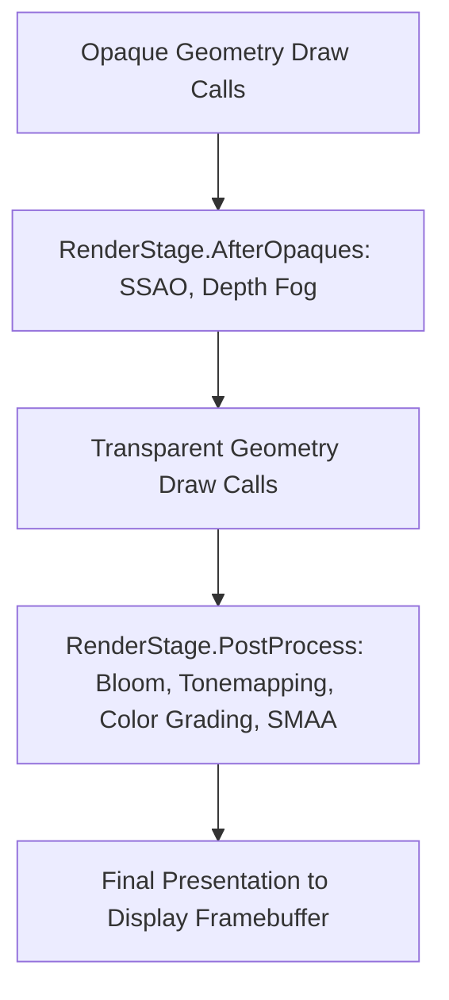

# ✨ Post-Processing & SMAA in Prowl Engine

Post-processing image effects enhance rendered framebuffers by introducing physical lens distortions, exposure adjustments, color grading palettes, and anti-aliasing passes prior to final screen presentation.

In Prowl Engine, all screen-space filters derive from the abstract [`ImageEffect`](file:///c:/Users/SaidR/Documents/GitHub/ProwlStar/Prowl.Runtime/Rendering/ImageEffect.cs) class and execute within the [`DefaultRenderPipeline`](file:///c:/Users/SaidR/Documents/GitHub/ProwlStar/Prowl.Runtime/Rendering/DefaultRenderPipeline.cs) loop. Furthermore, the engine features an embedded, native implementation of **SMAA (Subpixel Morphological Anti-Aliasing)** ([`SMAALookupTextures.cs`](file:///c:/Users/SaidR/Documents/GitHub/ProwlStar/Prowl.Runtime/Rendering/SMAALookupTextures.cs)).

---

## ⏳ Execution Injection Stages (RenderStage)

An `ImageEffect` can declare its execution timing via the `RenderStage` enum:



1. **`RenderStage.AfterOpaques`:**
   Executes immediately after rendering opaque geometry and sky elements, but **before** drawing alpha-blended transparent surfaces or particles. Ideal for Screen-Space Ambient Occlusion (SSAO), depth-based fog, and screen-space reflections.
2. **`RenderStage.PostProcess`:**
   Operates upon the fully assembled color scene. The appropriate stage for Bloom, lens flare, chromatic aberration, vignette, ACES tonemapping, and anti-aliasing.

---

## 🎯 SMAA: Cinema-Grade Anti-Aliasing

Subpixel Morphological Anti-Aliasing (**SMAA**) is a leading real-time edge-smoothing technique:

### Why SMAA Over FXAA or TAA?
- **Versus FXAA:** FXAA applies a blunt directional blur that suppresses jaggies at the expense of blurring high-frequency textures and text. SMAA reconstructs subpixel vector discontinuities, preserving razor-sharp texture fidelity.
- **Versus TAA:** TAA depends on velocity buffers and temporal history reprojection, which inherently produces noticeable trailing artifacts (*ghosting*) behind fast-moving entities. SMAA 1x has zero ghosting.
- **Versus MSAA:** MSAA multiplies depth buffer memory footprints and fails to resolve aliasing within alpha-tested foliage. SMAA operates with a microscopic memory footprint across all geometric surfaces.

### The SMAA Pipeline in Prowl:
1. **Edge Detection:** Identifies color luminance or depth discontinuities across neighboring fragments.
2. **Blending Weight Calculation:** Queries two precomputed lookup textures (`SearchTex` and `AreaTex` baked via [`SMAALookupTextures.cs`](file:///c:/Users/SaidR/Documents/GitHub/ProwlStar/Prowl.Runtime/Rendering/SMAALookupTextures.cs)) to determine exact subpixel edge distance and orientation.
3. **Neighborhood Blending:** Interpolates pixels along the tangent vector of the detected edge.

---

## 💻 Authoring Custom Post-Processing Effects

Implementing custom post-processing shaders takes only a few lines of C#:

```csharp
using Prowl.Runtime;
using Prowl.Runtime.Rendering;
using Prowl.Runtime.Resources;
using Prowl.Vector;

[ExecuteAlways]
public class NightVisionEffect : ImageEffect
{
    [SerializeField] private AssetRef<Shader> _nightVisionShader;
    [SerializeField] private float _intensity = 1.5f;

    private Material _material;

    // Declare pipeline execution phase
    public override RenderStage Stage => RenderStage.PostProcess;

    public override void OnRenderEffect(RenderContext context)
    {
        if (!_nightVisionShader.IsAvailable) return;

        // Lazy initialize material instance
        if (_material.IsNotValid())
            _material = new Material(_nightVisionShader.Res);

        _material.SetFloat("_Intensity", _intensity);

        // Acquire temporary render target from pool
        RenderTexture temp = context.GetTemporaryRT();

        // Process fullscreen blit through material shader
        Graphics.Blit(context.ColorBuffer, temp, _material);

        // Blit back into primary color buffer
        Graphics.Blit(temp, context.ColorBuffer);

        // Return temporary texture to pool (Zero Memory Leaks)
        context.ReleaseTemporaryRT(temp);
    }
}
```

### Attaching to Camera
Attach `NightVisionEffect` to the GameObject containing the [`Camera`](file:///c:/Users/SaidR/Documents/GitHub/ProwlStar/Prowl.Runtime/Components/Camera.cs) component. The pipeline automatically registers and executes it during its frame collection phase.

---

## 🔗 Related Topics
- Pipeline overview: [[🎨 Rendering Pipeline (DefaultRenderPipeline)]].
- Render targets & viewports: [[📷 Cameras & RenderContext]].
- Shaders and materials: [[🔮 Materials, Shaders & PropertyState]].
