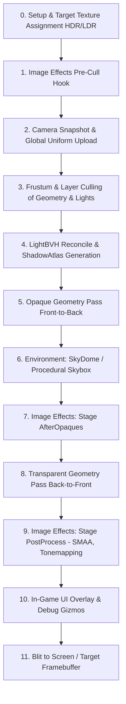

# 🎨 Rendering Pipeline (DefaultRenderPipeline) in Prowl Engine

The graphics subsystem in Prowl Engine is constructed around the abstract [`RenderPipeline`](file:///c:/Users/SaidR/Documents/GitHub/ProwlStar/Prowl.Runtime/Rendering/RenderPipeline.cs), with [`DefaultRenderPipeline`](file:///c:/Users/SaidR/Documents/GitHub/ProwlStar/Prowl.Runtime/Rendering/DefaultRenderPipeline.cs) serving as the default implementation responsible for drawing 3D/2D geometry, resolving dynamic illumination via BVH, computing cascaded shadows, and applying post-processing effects.

---

## 🔄 Execution Flow & Render Order of Operations

The `Internal_Render` method executes the following deterministic stages on each frame:



---

## 🧩 Architectural Stages in Depth

### 1. Frustum Culling and Renderable Collection
- The camera captures a [`CameraSnapshot`](file:///c:/Users/SaidR/Documents/GitHub/ProwlStar/Prowl.Runtime/Rendering/DefaultRenderPipeline.cs) containing its `View` and `Projection` matrices.
- `CollectRenderables` scans the active scene and extracts all active mesh renderables (`MeshRenderable`, `InstancedMeshRenderable`, `SkinnedMeshRenderable`) and light sources.
- `CullRenderables` tests bounding boxes (`Bounds`) against the camera's view frustum planes and `CullingMask`, culling non-visible objects before command submission.

### 2. Light Acceleration via LightBVH & Shadow Atlas
- Rather than legacy forward rendering with a low fixed light limit (e.g., 4 or 8 lights), Prowl employs **SceneLightSystem** and **LightBVH** ([`LightBVH.cs`](file:///c:/Users/SaidR/Documents/GitHub/ProwlStar/Prowl.Runtime/Rendering/LightBVH.cs)).
- Active point and spot lights are inserted into a GPU-texture-packed Bounding Volume Hierarchy (BVH).
- Shadows are rendered to a single consolidated memory atlas: the **ShadowAtlas** ([`ShadowAtlas.cs`](file:///c:/Users/SaidR/Documents/GitHub/ProwlStar/Prowl.Runtime/Rendering/ShadowAtlas.cs)).

### 3. Opaque Geometry Pass (Front-to-Back)
- Opaque meshes are sorted by distance from closest to furthest relative to the camera.
- This maximizes GPU **Early-Z testing**, discarding obscured fragments prior to running expensive fragment shaders.

### 4. Sky and Atmospheric Environment
- Evaluates procedural atmosphere shaders ([`DefaultShader.ProceduralSkybox`](file:///c:/Users/SaidR/Documents/GitHub/ProwlStar/Prowl.Runtime/Rendering/DefaultRenderPipeline.cs)) or the embedded sky dome mesh.

### 5. Transparent Pass (Back-to-Front)
- Alpha-blended surfaces are sorted from furthest to closest to ensure accurate physical color blending.

### 6. Image Effects Pipeline (Post-Processing)
- Subdivided into two distinct injection stages (`RenderStage.AfterOpaques` and `RenderStage.PostProcess`), enabling custom full-screen effects like SSAO, Bloom, Color Grading, and Subpixel Morphological Anti-Aliasing (**SMAA**).

---

## ⚙️ Camera Pipeline Configuration

Control pipeline behavior through the [`Camera`](file:///c:/Users/SaidR/Documents/GitHub/ProwlStar/Prowl.Runtime/Components/Camera.cs) component:

```csharp
using Prowl.Runtime;
using Prowl.Vector;

public class CameraSetup : MonoBehaviour
{
    public override void Awake()
    {
        base.Awake();
        if (TryGetComponent<Camera>(out var cam))
        {
            cam.HDR = true; // Enables 16-bit floating point render target
            cam.FarClipPlane = 1000f;
            cam.NearClipPlane = 0.1f;
            cam.FieldOfView = 65f;
            cam.ClearColor = new Color(0.1f, 0.12f, 0.15f, 1f);
        }
    }
}
```

---

## 🔗 Related Topics
- Viewports and cameras: [[📷 Cameras & RenderContext]].
- Spatial light acceleration: [[💡 Lighting, Shadows & LightBVH]].
- Material uniforms and shaders: [[🔮 Materials, Shaders & PropertyState]].
- Post-processing and anti-aliasing: [[✨ Post-Processing & SMAA]].
