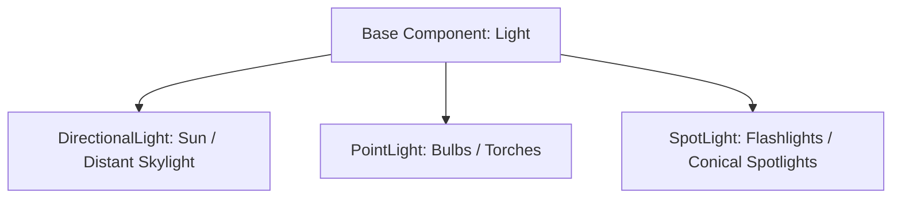

# 💡 Lighting, Shadows & LightBVH in Prowl Engine

The lighting architecture in Prowl Engine pairs physically based radiance calculations (PBR) with an advanced spatial acceleration structure known as **LightBVH** ([`LightBVH.cs`](file:///c:/Users/SaidR/Documents/GitHub/ProwlStar/Prowl.Runtime/Rendering/LightBVH.cs)), enabling scenes with **hundreds of active dynamic lights** rendered in real time without fragment shader stalls.

---

## 🔦 Supported Light Source Types



### 1. `DirectionalLight`
- Emulates distant celestial sources placed at infinity.
- Light rays are parallel across the entire scene volume.
- Supports **Cascaded Shadow Maps (CSM)**, partitioning the camera view frustum into depth cascades to balance close-up crispness with distant terrain coverage.

### 2. `PointLight`
- Radiates light isotropically in all directions from a single spatial origin.
- Parameters: `Intensity`, `Color`, and `Range` (spherical attenuation boundary).
- Attenuation follows the inverse-square law with smooth cubic cutoffs at boundary ranges.

### 3. `SpotLight`
- Radiates directional cone-shaped illumination.
- Parameters: `SpotAngle` (outer cone limit), `InnerSpotAngle` (inner penumbra transition), and `Range`.
- Projects conical shadow maps into designated atlas tiles.

---

## 🚀 The LightBVH Breakthrough: Hundreds of Dynamic Lights in Forward

In traditional forward pipelines (classic Unity or Godot), objects are constrained to a low fixed light count (e.g., 4 to 8 lights per draw pass). Exceeding this limit forces multi-pass rendering (exploding draw calls) or full Deferred shading (demanding high memory bandwidth and penalizing MSAA and transparency).

Prowl solves this bottleneck through **LightBVH**:

### How LightBVH Works:
1. **Spatial Bounding Volume Hierarchy (BVH):**
   Every frame, [`SceneLightSystem`](file:///c:/Users/SaidR/Documents/GitHub/ProwlStar/Prowl.Runtime/Rendering/SceneLightSystem.cs) clusters all active point and spot light influence spheres into a balanced binary spatial bounding volume tree.
2. **GPU Texture Encoding:**
   The hierarchical tree nodes and physical light attributes (position, color, intensity, attenuation factors) are flattened into GPU-accessible buffer textures ([`LightBVHTextures.cs`](file:///c:/Users/SaidR/Documents/GitHub/ProwlStar/Prowl.Runtime/Rendering/LightBVHTextures.cs)).
3. **Logarithmic O(log N) Shader Traversal:**
   When a fragment is shaded on the GPU, the fragment shader traverses the BVH hierarchy, descending only through nodes whose bounding boxes intersect the world coordinate. Irrelevant lights are eliminated in logarithmic time $O(\log N)$ rather than linear iteration $O(N)$.

---

## 🌑 Shadow Management & The ShadowAtlas

All shadows cast across the scene are packed into a single shared texture: the **ShadowAtlas** ([`ShadowAtlas.cs`](file:///c:/Users/SaidR/Documents/GitHub/ProwlStar/Prowl.Runtime/Rendering/ShadowAtlas.cs)).

### Key Shadow Features:
- **Dynamic Tile Allocation:** Resolution tiles are dynamically assigned based on camera proximity and projected screen area.
- **Acne Prevention:** Configurable `ShadowBias` and `NormalBias` parameters eliminate self-shadowing moiré patterns.
- **Percentage Closer Filtering (PCF):** Smooth penumbra filtering for realistic soft shadow transitions.

---

## 💻 Scripting Lights in C#

```csharp
using Prowl.Runtime;
using Prowl.Vector;

public class LightingSetupExample : MonoBehaviour
{
    public override void Awake()
    {
        base.Awake();

        // Instantiate a dynamic point light entity
        GameObject lampGo = new GameObject("StreetLamp");
        lampGo.Transform.Position = new Float3(0, 4, 0);

        PointLight lamp = lampGo.AddComponent<PointLight>();
        lamp.Color = new Color(1.0f, 0.85f, 0.6f); // Warm incandescent tint
        lamp.Intensity = 5.0f;
        lamp.Range = 15.0f;
        lamp.CastShadows = true;
        lamp.ShadowBias = 0.005f;
    }
}
```

---

## 🔗 Related Topics
- Pipeline orchestration: [[🎨 Rendering Pipeline (DefaultRenderPipeline)]].
- Shaders and materials: [[🔮 Materials, Shaders & PropertyState]].
- Ambient lighting and probes: [[🪞 Light Probes & Spherical Harmonics]].
