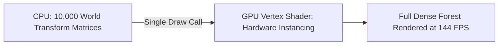

# 💨 Instanced & Skinned Mesh Rendering in Prowl Engine

To render densely populated game environments (forests with thousands of trees, asteroid belts, grass blades) and lifelike animated characters at smooth framerates, Prowl Engine implements two specialized GPU rendering pipelines:
1. **GPU Instancing:** Via [`InstancedMeshRenderable.cs`](file:///c:/Users/SaidR/Documents/GitHub/ProwlStar/Prowl.Runtime/InstancedMeshRenderable.cs) and [`ProceduralInstancedRenderable.cs`](file:///c:/Users/SaidR/Documents/GitHub/ProwlStar/Prowl.Runtime/ProceduralInstancedRenderable.cs).
2. **Skeletal Mesh Deforming (Skinning):** Via [`SkinnedMeshRenderer.cs`](file:///c:/Users/SaidR/Documents/GitHub/ProwlStar/Prowl.Runtime/Components/SkinnedMeshRenderer.cs) and [`SkinnedMeshRenderable.cs`](file:///c:/Users/SaidR/Documents/GitHub/ProwlStar/Prowl.Runtime/SkinnedMeshRenderable.cs).

---

## 🌲 GPU Instancing: Thousands of Meshes in a Single Draw Call

The traditional performance bottleneck in modern 3D rendering is rarely the GPU's polygon throughput, but rather the CPU overhead of submitting individual command buffers (*Draw Calls*).

### How Instancing Operates in Prowl:
Instead of submitting draw calls per individual rock or blade of grass:
1. The engine batches entities sharing an identical [`Mesh`](file:///c:/Users/SaidR/Documents/GitHub/ProwlStar/Prowl.Runtime/Resources/Mesh.cs) and [`Material`](file:///c:/Users/SaidR/Documents/GitHub/ProwlStar/Prowl.Runtime/Resources/Material.cs).
2. Uploads an array of transformation matrices (`Float4x4[]`) into a GPU instance buffer.
3. Issues a single atomic `DrawMeshInstanced` command instructing the graphics hardware to draw $N$ copies simultaneously.



### C# Instanced Drawing Example:
```csharp
using Prowl.Runtime;
using Prowl.Runtime.Resources;
using Prowl.Vector;

public class AsteroidBeltSpawner : MonoBehaviour
{
    [SerializeField] private AssetRef<Mesh> _asteroidMesh;
    [SerializeField] private AssetRef<Material> _asteroidMaterial;
    [SerializeField] private int _count = 2000;

    private Float4x4[] _matrices;

    public override void Awake()
    {
        base.Awake();
        _matrices = new Float4x4[_count];

        for (int i = 0; i < _count; i++)
        {
            float angle = (i / (float)_count) * MathF.PI * 2f;
            float distance = 50f + (Random.Shared.NextSingle() * 20f);
            Float3 pos = new Float3(MathF.Cos(angle) * distance, (Random.Shared.NextSingle() - 0.5f) * 10f, MathF.Sin(angle) * distance);

            _matrices[i] = Float4x4.CreateTranslation(pos);
        }
    }

    public override void OnRenderCollect()
    {
        base.OnRenderCollect();

        if (_asteroidMesh.IsAvailable && _asteroidMaterial.IsAvailable)
        {
            // Submit instanced batch to active render pipeline
            Graphics.DrawMeshInstanced(_asteroidMesh.Res, _asteroidMaterial.Res, _matrices, _count);
        }
    }
}
```

---

## 🦴 SkinnedMeshRenderer: Skeletal Animation

For biological characters, soft-body meshes, or cloth rigs, Prowl provides [`SkinnedMeshRenderer`](file:///c:/Users/SaidR/Documents/GitHub/ProwlStar/Prowl.Runtime/Components/SkinnedMeshRenderer.cs).

### Skinned Mesh Data Layout:
- **Bones:** Array referencing the [`Transform`](file:///c:/Users/SaidR/Documents/GitHub/ProwlStar/Prowl.Runtime/Math/Transform.cs) components comprising the skeletal rig.
- **Root Bone:** The root anchor of the skeletal hierarchy.
- **Bind Poses:** The inverse transformation matrices of each bone captured in the neutral reference pose (*T-Pose* or *A-Pose*).
- **Per-Vertex Weights:** Each vertex in the mesh binds to up to 4 influencing bones with normalized weights summing to 1.0.

```csharp
public class CharacterRigViewer : MonoBehaviour
{
    public override void Awake()
    {
        base.Awake();

        if (TryGetComponent<SkinnedMeshRenderer>(out var skinnedRenderer))
        {
            Debug.Log($"Character initialized with {skinnedRenderer.Bones.Length} bones.");
            Debug.Log($"Root anchor: {skinnedRenderer.RootBone.GameObject.Name}");
        }
    }
}
```

### GPU Linear Blend Skinning:
1. Every frame, as bones transform (driven by animation tracks or physical ragdolls), the engine evaluates the bone matrix palette:
   $$\text{BoneMatrix}_i = \text{CurrentPose}_i \times \text{BindPose}_i$$
2. The palette is uploaded to the vertex shader.
3. The vertex shader deforms each vertex using its weighted bone influence:
   $$v_{\text{deformed}} = \sum_{j=0}^{3} w_j \cdot (\text{BoneMatrix}_j \cdot v_{\text{original}})$$

---

## ⚡ Performance Best Practices
- **Bone Influence Caps:** Utilize 4 bones per vertex for hero characters, and cap at 2 bones per vertex for background crowd entities.
- **Accurate Skeletal Bounds:** Ensure `SkinnedMeshRenderer.Bounds` comfortably encloses the maximum extension of all animation clips to prevent frustum-culling pop-in.

---

## 🔗 Related Topics
- Pipeline overview: [[🎨 Rendering Pipeline (DefaultRenderPipeline)]].
- Shaders and materials: [[🔮 Materials, Shaders & PropertyState]].
- Zero-allocation guidelines: [[🎯 Best Practices & Performance (Zero GC)]].
