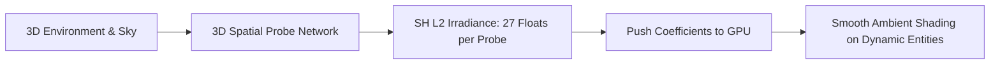

# 🪞 Light Probes & Spherical Harmonics in Prowl Engine

To produce realistic physical rendering, dynamic entities (moving player characters, physics props, vehicles) must receive indirect bounced light from surrounding surfaces (walls, sky, floors). However, tracing real-time diffuse indirect global illumination rays per frame is computationally prohibitive on standard consumer hardware.

Prowl Engine solves indirect ambient transfer using **Light Probes** ([`LightProbeGroup.cs`](file:///c:/Users/SaidR/Documents/GitHub/ProwlStar/Prowl.Runtime/Components/LightProbeGroup.cs)) and **Order-2 Spherical Harmonics (SH L2)** ([`SphericalHarmonicsL2.cs`](file:///c:/Users/SaidR/Documents/GitHub/ProwlStar/Prowl.Runtime/Rendering/SphericalHarmonicsL2.cs)).

---

## 🌐 What are Spherical Harmonics?

Spherical Harmonics represent a mathematical technique for encoding continuous functions defined across the surface of a unit sphere into a compact array of scalar coefficients (analogous to how a 1D Fourier series represents complex audio waveforms as frequency coefficients).

In Prowl:
- The engine uses **L2 (Order 2)** harmonics, storing directional irradiance across the sphere in **9 coefficients per color channel** (R, G, B), totaling **27 floating-point values**.
- Shaders evaluate diffuse ambient irradiance arriving at any normal vector using an ultra-efficient polynomial expression composed of simple multiply-add (`MAD`) operations.



---

## 📦 LightProbeGroup and LightProbeVolume

### 1. [`LightProbeGroup`](file:///c:/Users/SaidR/Documents/GitHub/ProwlStar/Prowl.Runtime/Components/LightProbeGroup.cs)
A scene component defining a 3D cloud of spatial probe sampling points.
- Probes are strategically placed near lighting transitions (e.g., doorways between dim interiors and sunny exteriors, or adjacent to brightly colored bounce surfaces).
- The editor establishes a 3D tetrahedral network between adjacent probes using 3D Delaunay triangulation.

### 2. [`LightProbeVolume`](file:///c:/Users/SaidR/Documents/GitHub/ProwlStar/Prowl.Runtime/Rendering/LightProbeVolume.cs)
Handles runtime interpolation:
- As an entity moves through space, the runtime locates the 4 surrounding probe points forming the bounding tetrahedron.
- Linearly blends the spherical harmonic coefficients using the entity's barycentric coordinates.
- Delivers artifact-free, continuous ambient lighting transitions without light-popping.

---

## 💻 Working with SphericalHarmonicsL2 in C#

```csharp
using Prowl.Runtime;
using Prowl.Runtime.Rendering;
using Prowl.Vector;

public class AmbientLightingExample : MonoBehaviour
{
    public override void Awake()
    {
        base.Awake();

        // Instantiate an empty L2 spherical harmonics struct
        SphericalHarmonicsL2 sh = new SphericalHarmonicsL2();

        // Add cool sky irradiance contribution from above
        sh.AddDirectionalLight(Float3.Up, new Color(0.2f, 0.4f, 0.8f, 1f), 1.0f);

        // Add warm bounce irradiance from reddish ground below
        sh.AddDirectionalLight(Float3.Down, new Color(0.4f, 0.2f, 0.1f, 1f), 0.5f);

        // Sample ambient irradiance for a surface normal facing forward
        Color evaluatedColor = sh.Evaluate(Float3.Forward);
    }
}
```

---

## ⚡ Technical Advantages
1. **Negligible Memory Footprint:** 27 floats per probe versus megabyte-heavy cubemap textures.
2. **Dynamic Continuity:** Provides characters with continuous indirect light responsiveness.
3. **Zero-GC Architecture:** `SphericalHarmonicsL2` is implemented as an unmanaged `struct` residing purely in memory contiguous buffers or the stack.

---

## 🔗 Related Topics
- Graphics pipeline: [[🎨 Rendering Pipeline (DefaultRenderPipeline)]].
- Dynamic lights: [[💡 Lighting, Shadows & LightBVH]].
- Animated character meshes: [[💨 Instanced & Skinned Mesh Rendering]].
