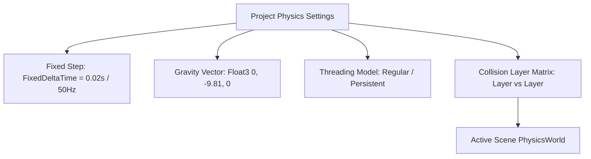

# 🌍 PhysicsWorld & Configuration in Prowl Engine

The physics simulation in Prowl Engine is powered by **Jitter Physics 2**, a high-performance, multithreaded, deterministic 3D physics library written entirely in pure managed C#.

The central orchestration hub per scene is [`PhysicsWorld.cs`](file:///c:/Users/SaidR/Documents/GitHub/ProwlStar/Prowl.Runtime/Physics/PhysicsWorld.cs). It governs rigid bodies, kinematic constraints, the fixed timestep, the layer collision matrix ([`CollisionMatrix.cs`](file:///c:/Users/SaidR/Documents/GitHub/ProwlStar/Prowl.Runtime/Physics/CollisionMatrix.cs)), and background mesh baking.

---

## ⚡ Key Capabilities of Jitter Physics 2 in Prowl

1. **Pure Managed C# & Native Multithreading:**
   No C++ P/Invoke marshaling overhead. Broad-phase pair finding and island solver tasks scale across all available CPU cores.
2. **Determinism & Stacking Stability:**
   The impulse-based velocity/position constraint solver delivers high stability for tall object stacks and articulated mechanisms.
3. **Automatic Orphan Collider Handling:**
   Placing a `Collider` on a `GameObject` without adding a `Rigidbody3D` does not cause errors or undefined behavior. Prowl attaches it to an internal static body per layer, acting as stationary environment geometry at zero CPU cost.

---

## 🎛️ Simulation Configuration



### Global Parameters:
- **Gravity:** 3D acceleration vector applied to dynamic bodies (default: `Float3(0, -9.81f, 0)`).
- **FixedDeltaTime:** The fixed simulation step duration (default: 0.02s = 50 Hz, or 0.0166s = 60 Hz).
- **PhysicsThreadModel:**
  - `Regular`: Dispatches worker threads dynamically per physics tick.
  - `Persistent`: Keeps worker threads alive across ticks to minimize scheduling latency.

---

## 🛑 Collision Layer Matrix (CollisionMatrix)

[`CollisionMatrix`](file:///c:/Users/SaidR/Documents/GitHub/ProwlStar/Prowl.Runtime/Physics/CollisionMatrix.cs) filters broad-phase interaction between entity layers, pruning unnecessary narrow-phase contact calculations:

```csharp
using Prowl.Runtime;

public class PhysicsLayerSetup : MonoBehaviour
{
    public override void Awake()
    {
        base.Awake();

        int playerLayer = LayerMask.NameToLayer("Player");
        int playerBullets = LayerMask.NameToLayer("PlayerBullets");
        int enemyBullets = LayerMask.NameToLayer("EnemyBullets");

        // Disable collision between player bullets and the player
        Physics.CollisionMatrix.SetCollision(playerLayer, playerBullets, canCollide: false);

        // Disable collision between opposing bullet projectiles
        Physics.CollisionMatrix.SetCollision(playerBullets, enemyBullets, canCollide: false);
    }
}
```

### Ignoring Collisions on Specific Body Pairs:
Suppress contact calculation between two explicit bodies without affecting global layers:
```csharp
// Prevent vehicle chassis from colliding with its seated driver
Scene.Current.Physics.IgnoreCollisionBetween(carRigidbody, playerRigidbody);

// Re-enable contact
Scene.Current.Physics.EnableCollisionBetween(carRigidbody, playerRigidbody);
```

---

## 🍞 Physics Mesh Baking (BakeMesh)

Arbitrary triangle mesh colliders ([`MeshCollider`](file:///c:/Users/SaidR/Documents/GitHub/ProwlStar/Prowl.Runtime/Components/Physics/Colliders/MeshCollider.cs)) require an internal bounding volume hierarchy of triangles for fast collision checks.

Prowl performs this via [`PhysicsWorld.BakeMesh(mesh)`](file:///c:/Users/SaidR/Documents/GitHub/ProwlStar/Prowl.Runtime/Physics/PhysicsWorld.cs):
- The baked data is cached directly on the [`Mesh`](file:///c:/Users/SaidR/Documents/GitHub/ProwlStar/Prowl.Runtime/Resources/Mesh.cs) reference (`mesh.BakedPhysics`).
- **Completely Thread-Safe:** Meshes can be pre-baked on background worker threads during scene loading without stalling the main rendering thread.
- If dozens of GameObjects share identical mesh geometry, the bake executes once and is shared across all collider instances.

---

## 🔗 Related Topics
- Rigid bodies and forces: [[🧊 Rigidbodies & Force Modes]].
- Collider shapes: [[📐 Colliders (Primitives, Mesh, Terrain)]].
- Spatial queries: [[🎯 Raycasting & Shape Queries]].
