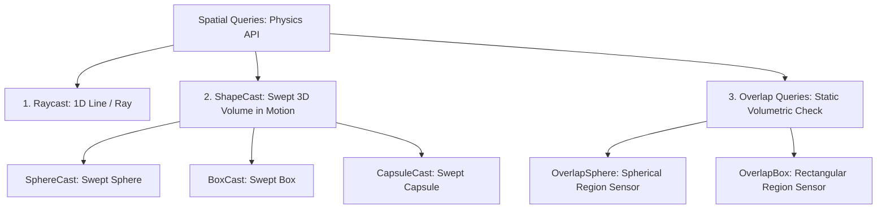

# 🎯 Raycasting & Shape Queries in Prowl Engine

Spatial queries empower game subsystems (firearms hitscan, enemy AI line-of-sight, proximity sensors, ground probes) to interrogate world physics geometry without relying on spontaneous physical contact events.

Prowl Engine provides a comprehensive suite of static spatial queries in [`Physics`](file:///c:/Users/SaidR/Documents/GitHub/ProwlStar/Prowl.Runtime/Physics/PhysicsWorld.cs), spanning linear **Raycasts**, volumetric sweeps (**ShapeCasts**), and spatial tests (**Overlap Queries**), all equipped with dedicated `NonAlloc` overloads enforcing **Zero Garbage Collection Overhead**.

---

## 🔍 Spatial Query Taxonomy



---

## ⚡ 1. Raycasting (Hitscan & Precision Probes)

A **Raycast** projects an infinitesimal mathematical line from an origin along a direction vector up to a maximum travel distance.

### The [`RaycastHit`](file:///c:/Users/SaidR/Documents/GitHub/ProwlStar/Prowl.Runtime/Physics/RaycastHit.cs) Result Struct:
When contact occurs, the hit payload struct is populated:
- `hit.Point`: Exact 3D world coordinates of the contact point (`Float3`).
- `hit.Normal`: Normalized surface normal vector perpendicular to the contacted face (`Float3`), essential for orienting decal projections and particle reflections.
- `hit.Distance`: Euclidean distance from the ray origin to the impact point.
- `hit.Collider`: Direct reference to the hit [`Collider`](file:///c:/Users/SaidR/Documents/GitHub/ProwlStar/Prowl.Runtime/Components/Physics/Colliders/Collider.cs).
- `hit.Rigidbody`: Reference to the attached `Rigidbody3D` (if present).

### Production Hitscan Example:
```csharp
using Prowl.Runtime;
using Prowl.Vector;

public class WeaponHitscan : MonoBehaviour
{
    [SerializeField] private float _range = 100f;
    [SerializeField] private float _damage = 25f;
    [SerializeField] private LayerMask _targetLayers;

    public void FireWeapon(Camera playerCam)
    {
        Float3 rayOrigin = playerCam.Transform.Position;
        Float3 rayDirection = playerCam.Transform.Forward;

        // Perform ray query against filtered layer mask
        if (Physics.Raycast(rayOrigin, rayDirection, out RaycastHit hit, _range, _targetLayers.Value))
        {
            Debug.Log($"Hit: {hit.Collider.GameObject.Name} at {hit.Point}");

            // Apply damage if target has a Health component
            if (hit.Collider.GameObject.TryGetComponent<Health>(out var health))
            {
                health.TakeDamage(_damage);
            }
        }
    }
}
```

---

## 🎳 2. Shape Casting (Swept Volumes)

Infinitesimal rays can occasionally slip through narrow gaps or fail to represent thick projectiles.

**ShapeCast** sweeps a 3D volume along a directional travel vector:
- `Physics.SphereCast(origin, radius, direction, out RaycastHit hit, distance, layerMask)`
- `Physics.BoxCast(center, halfExtents, direction, orientation, out RaycastHit hit, distance, layerMask)`
- `Physics.CapsuleCast(point1, point2, radius, direction, out RaycastHit hit, distance, layerMask)`

---

## 🧲 3. NonAlloc Queries: Zero Memory Allocations

> [!IMPORTANT]
> In legacy engine APIs, invoking `Physics.RaycastAll` or `Physics.OverlapSphere` allocates a new array on the GC heap per call.
> In Prowl Engine, **always employ the `NonAlloc` overloads paired with preallocated buffers**.

### Area Explosion Example (OverlapSphereNonAlloc):
```csharp
public class ExplosiveBarrel : MonoBehaviour
{
    [SerializeField] private float _explosionRadius = 8.0f;
    [SerializeField] private float _explosionForce = 50.0f;

    // Static buffer shared across all barrels (Zero GC)
    private static readonly Collider[] s_overlapBuffer = new Collider[32];

    public void Explode()
    {
        Float3 center = Transform.Position;
        int layerMask = LayerMask.GetMask("Default", "Enemy", "Debris");

        // Fill preallocated buffer
        int hitCount = Physics.OverlapSphereNonAlloc(center, _explosionRadius, s_overlapBuffer, layerMask);

        for (int i = 0; i < hitCount; i++)
        {
            Collider col = s_overlapBuffer[i];
            if (col.TryGetComponent<Rigidbody3D>(out var rb))
            {
                Float3 direction = (rb.Transform.Position - center).normalized;
                float distance = Float3.Distance(rb.Transform.Position, center);
                float falloff = 1.0f - Math.Clamp(distance / _explosionRadius, 0f, 1f);

                // Apply radial physical impulse
                rb.AddForce(direction * (_explosionForce * falloff), ForceMode.Impulse);
            }
        }

        GameObject.Destroy();
    }
}
```

---

## 🔗 Related Topics
- Collider geometry: [[📐 Colliders (Primitives, Mesh, Terrain)]].
- Rigidbodies and dynamics: [[🧊 Rigidbodies & Force Modes]].
- Optimization standards: [[🎯 Best Practices & Performance (Zero GC)]].
