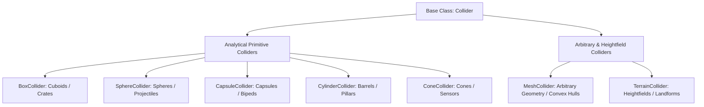
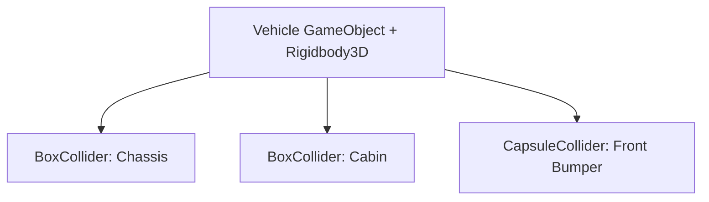

# 📐 Colliders (Primitives, Mesh, Terrain) in Prowl Engine

A **Collider** component defines the impenetrable geometric boundary of a `GameObject`. While the `MeshRenderer` governs visible rasterized geometry, the `Collider` governs physical presence and collision responses inside the **Jitter Physics 2** solver.

---

## 📦 Supported Collider Geometries



### 1. Primitive Colliders (Maximum Computational Efficiency)
Primitives are evaluated analytically by the CPU using SAT, GJK, and EPA algorithms. They incur negligible CPU cost:
- **[`BoxCollider`](file:///c:/Users/SaidR/Documents/GitHub/ProwlStar/Prowl.Runtime/Components/Physics/Colliders/BoxCollider.cs):** Defined by 3D `Size` (X, Y, Z dimensions) and an offset `Center`.
- **[`SphereCollider`](file:///c:/Users/SaidR/Documents/GitHub/ProwlStar/Prowl.Runtime/Components/Physics/Colliders/SphereCollider.cs):** Defined by its `Radius`. The most performant collision shape in the engine.
- **[`CapsuleCollider`](file:///c:/Users/SaidR/Documents/GitHub/ProwlStar/Prowl.Runtime/Components/Physics/Colliders/CapsuleCollider.cs):** Defined by `Radius` and `Height`. Essential for characters navigating uneven stairs and ledges without snagging.
- **[`CylinderCollider`](file:///c:/Users/SaidR/Documents/GitHub/ProwlStar/Prowl.Runtime/Components/Physics/Colliders/CylinderCollider.cs):** Precision cylinders for barrels, wheels, and architectural columns.
- **[`ConeCollider`](file:///c:/Users/SaidR/Documents/GitHub/ProwlStar/Prowl.Runtime/Components/Physics/Colliders/ConeCollider.cs):** Directional cones for sensors, triggers, and projectile heads.

---

### 2. [`MeshCollider`](file:///c:/Users/SaidR/Documents/GitHub/ProwlStar/Prowl.Runtime/Components/Physics/Colliders/MeshCollider.cs) (Arbitrary 3D Meshes)
Utilizes the exact polygon geometry of an imported [`Mesh`](file:///c:/Users/SaidR/Documents/GitHub/ProwlStar/Prowl.Runtime/Resources/Mesh.cs) asset.

Two distinct operational modes exist:
1. **Static Triangle Mesh (`Convex = false`):**
   - Retains concavity, interior rooms, doorways, and arches.
   - **Constraint:** Must be attached exclusively to **static** or kinematic entities. Dynamic free-moving rigidbodies cannot use concave triangle meshes.
2. **Convex Hull (`Convex = true`):**
   - Jitter 2 computes the minimal convex hull enveloping the polygon vertices, eliminating internal concavities.
   - **Allowed on Dynamic Rigidbody3D:** Can bounce, roll, and tumble with realistic dynamics.

---

### 3. [`TerrainCollider`](file:///c:/Users/SaidR/Documents/GitHub/ProwlStar/Prowl.Runtime/Components/Physics/TerrainCollider.cs) (Optimized Heightfields)
Engineered specifically for expansive open-world landforms:
- Instead of indexing millions of individual triangles, it evaluates a 2D matrix of height samples.
- Resolves contact tests in $O(1)$ constant time by projecting world entity coordinates onto grid sample coordinates.

---

## 🧲 Compound Colliders

To represent complex physical objects (e.g., an office desk with four legs and a tabletop, or an aircraft with fuselage and wings) while preserving peak primitive performance:



In Prowl:
- Attach a single `Rigidbody3D` to the root `GameObject`.
- Add multiple primitive `Collider` components across the root and child GameObjects.
- **Jitter 2 automatically fuses them into a single compound body**, calculating the unified center-of-mass and composite inertia tensor without the performance cost of a `MeshCollider`.

---

## 🚪 Trigger Volumes (TriggerVolume)

To detect volume entry (door opening zones, quest triggers, hazard zones) without physical rebound impulses:

Use the [`TriggerVolume`](file:///c:/Users/SaidR/Documents/GitHub/ProwlStar/Prowl.Runtime/Components/Physics/TriggerVolume.cs) component:
```csharp
using Prowl.Runtime;

public class CheckpointZone : MonoBehaviour
{
    public override void OnTriggerEnter(Rigidbody3D other)
    {
        base.OnTriggerEnter(other);
        if (other.CompareTag("Player"))
        {
            Debug.Log("Checkpoint triggered.");
        }
    }
}
```

---

## 🔗 Related Topics
- Simulation world: [[🌍 PhysicsWorld & Configuration]].
- Forces and dynamics: [[🧊 Rigidbodies & Force Modes]].
- Spatial raycasting: [[🎯 Raycasting & Shape Queries]].
