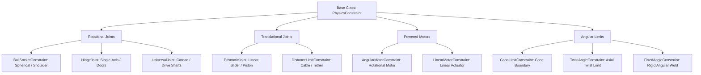

# 🔗 Joints & Constraints in Prowl Engine

Physical constraints or **Joints** couple two rigidbodies ([`Rigidbody3D`](file:///c:/Users/SaidR/Documents/GitHub/ProwlStar/Prowl.Runtime/Components/Physics/Rigidbody3D.cs)) or anchor a dynamic body against the static world environment, constraining specific translational or rotational degrees of freedom.

In Prowl Engine, mechanical constraints are powered directly by the analytical solver in **Jitter Physics 2** ([`PhysicsConstraint.cs`](file:///c:/Users/SaidR/Documents/GitHub/ProwlStar/Prowl.Runtime/Components/Physics/Constraints/PhysicsConstraint.cs)), enabling hinges, suspension pistons, tethers, organic ragdoll skeletons, and complex mechanical linkages.

---

## 🛠️ Complete Catalog of Joints & Constraints



---

## 📋 Primary Component Descriptions

### 1. [`BallSocketConstraint`](file:///c:/Users/SaidR/Documents/GitHub/ProwlStar/Prowl.Runtime/Components/Physics/Constraints/BallSocketConstraint.cs) (Spherical Joint)
- Locks all 3 linear translational degrees of freedom at the anchor point while allowing all 3 rotational axes to pivot freely.
- Models biological ball-and-socket joints such as shoulders and hips in ragdoll skeletons.

### 2. [`HingeJoint`](file:///c:/Users/SaidR/Documents/GitHub/ProwlStar/Prowl.Runtime/Components/Physics/Constraints/HingeJoint.cs) (Revolute / Pin Joint)
- Restricts movement to rotation around a single axis (e.g., vertical Y-axis for swinging doors, or horizontal axis for vehicle wheels and elbows).
- Parameters: `Axis`, `Anchor`, `UseLimits` (minimum/maximum angle limits), and `Spring/Damper` restitution.

### 3. [`PrismaticJoint`](file:///c:/Users/SaidR/Documents/GitHub/ProwlStar/Prowl.Runtime/Components/Physics/Constraints/PrismaticJoint.cs) (Linear Slider)
- Permits translation strictly along a single linear rail vector while locking all relative rotations.
- Ideal for mechanical pistons, vehicle shock absorbers, and sliding elevators.

### 4. [`DistanceLimitConstraint`](file:///c:/Users/SaidR/Documents/GitHub/ProwlStar/Prowl.Runtime/Components/Physics/Constraints/DistanceLimitConstraint.cs) (Tether / Distance Cap)
- Constrains the Euclidean distance between two anchor coordinates within defined minimum and maximum boundaries.
- Models crane winch cables, swinging ropes, and anchor tethers.

### 5. [`AngularMotorConstraint`](file:///c:/Users/SaidR/Documents/GitHub/ProwlStar/Prowl.Runtime/Components/Physics/Constraints/AngularMotorConstraint.cs) (Powered Rotary Actuator)
- Applies continuous torque to reach and sustain a target angular velocity (`TargetVelocity`) up to a clamping torque threshold (`MaxTorque`).
- Used for driving rotors, powered wheels, conveyor rollers, and rotating machinery.

---

## 💻 C# Example: Interactive Swinging Door with HingeJoint

```csharp
using Prowl.Runtime;
using Prowl.Vector;

public class InteractiveDoor : MonoBehaviour
{
    private HingeJoint _hinge;
    private Rigidbody3D _doorRb;

    public override void Awake()
    {
        base.Awake();

        _doorRb = GetComponent<Rigidbody3D>();
        _hinge = AddComponent<HingeJoint>();

        // Place the pivot anchor along the door's side frame
        _hinge.Anchor = new Float3(-0.9f, 0, 0);

        // Hinge rotates around vertical Up axis
        _hinge.Axis = Float3.Up;

        // When ConnectedBody is null, anchors directly to the immovable world
        _hinge.ConnectedBody = null;
    }

    public void PushDoor()
    {
        // Apply an impulse at the outer door handle to swing it open
        _doorRb.AddForceAtPosition(Transform.Forward * 15f, Transform.Position + new Float3(0.8f, 0, 0), ForceMode.Impulse);
    }
}
```

---

## ⚡ Constraint Solver Stability Tips
- **Mass Ratios:** Avoid joining bodies with extreme mass disparities (e.g., a 1 kg body connected to a 10,000 kg body). Maintain ratios within $1:10$ to prevent numerical oscillation.
- **Substepping:** For long articulated chains (ropes with >5 segments) or high-velocity mechanisms, tune `FixedDeltaTime` to `0.01s` (100 Hz) for enhanced rigidity.

---

## 🔗 Related Topics
- Rigidbody physics: [[🧊 Rigidbodies & Force Modes]].
- Vehicle wheels: [[🚗 WheelCollider & Vehicles]].
- Character motion: [[🚶 CharacterController]].
