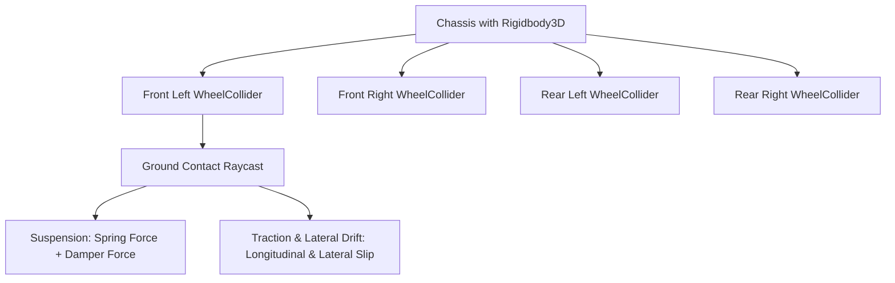

# 🚗 WheelCollider & Vehicles in Prowl Engine

Simulating wheeled vehicles (sports cars, heavy trucks, buggies) via primitive cylinder colliders invariably produces numerical instability, bouncing, and artificial friction.

Prowl Engine provides a dedicated production-grade component: [`WheelCollider.cs`](file:///c:/Users/SaidR/Documents/GitHub/ProwlStar/Prowl.Runtime/Components/Physics/WheelCollider.cs). It operates as a **raycast/shapecast suspension wheel**, calculating linear spring deflection, hydraulic damper resistance, and slip-based longitudinal and lateral friction forces (*Pacejka Slip Curves*).

---

## 🏎️ WheelCollider Architecture



### 1. Suspension Dynamics
- **`SuspensionDistance`:** Maximum suspension travel in meters (e.g., 0.3m).
- **`SpringRate`:** Elastic stiffness in $N/m$ supporting vehicle chassis weight.
- **`DamperRate`:** Velocity damping preventing perpetual oscillation after bumps.
- **`TargetPosition`:** Neutral rest position of the spring (from 0.0 fully extended to 1.0 fully compressed).

### 2. Kinematics & Propulsion
- **`Radius`:** Geometric wheel radius in meters.
- **`SteerAngle`:** Steering angle in degrees directing the wheel's forward heading.
- **`MotorTorque`:** Drive torque in $N \cdot m$ applied to accelerate.
- **`BrakeTorque`:** Friction braking torque to decelerate or lock the wheel.

### 3. Slip-Based Friction Mechanics
- **Longitudinal Slip:** Measures the discrepancy between wheel rotational rim speed and ground linear speed. Simulates acceleration bite, ABS lockup, and straight-line wheelspin.
- **Lateral Slip (Slip Angle):** Measures sideways slip angle against travel heading. Dictates cornering grip and controlled power sliding (*Drifting*).

---

## 💻 Complete C# 4-Wheel RWD Vehicle Controller

```csharp
using Prowl.Runtime;
using Prowl.Vector;

public class CarController : MonoBehaviour
{
    [Header("Wheels")]
    [SerializeField] private WheelCollider _frontLeft;
    [SerializeField] private WheelCollider _frontRight;
    [SerializeField] private WheelCollider _rearLeft;
    [SerializeField] private WheelCollider _rearRight;

    [Header("Visual Meshes")]
    [SerializeField] private Transform _frontLeftMesh;
    [SerializeField] private Transform _frontRightMesh;
    [SerializeField] private Transform _rearLeftMesh;
    [SerializeField] private Transform _rearRightMesh;

    [Header("Motor & Steering Parameters")]
    [SerializeField] private float _maxMotorTorque = 400f;
    [SerializeField] private float _maxSteerAngle = 30f;
    [SerializeField] private float _brakeForce = 800f;

    private float _steerInput;
    private float _throttleInput;
    private bool _braking;

    public override void Update()
    {
        base.Update();

        // Capture input
        _steerInput = (Input.GetKey(Key.D) ? 1 : 0) - (Input.GetKey(Key.A) ? 1 : 0);
        _throttleInput = (Input.GetKey(Key.W) ? 1 : 0) - (Input.GetKey(Key.S) ? 1 : 0);
        _braking = Input.GetKey(Key.Space);

        // Synchronize visual wheel poses
        UpdateWheelVisual(_frontLeft, _frontLeftMesh);
        UpdateWheelVisual(_frontRight, _frontRightMesh);
        UpdateWheelVisual(_rearLeft, _rearLeftMesh);
        UpdateWheelVisual(_rearRight, _rearRightMesh);
    }

    public override void FixedUpdate()
    {
        base.FixedUpdate();

        // 1. Steer front wheels
        float currentSteer = _steerInput * _maxSteerAngle;
        _frontLeft.SteerAngle = currentSteer;
        _frontRight.SteerAngle = currentSteer;

        // 2. Drive rear wheels (RWD)
        float currentTorque = _braking ? 0f : (_throttleInput * _maxMotorTorque);
        _rearLeft.MotorTorque = currentTorque;
        _rearRight.MotorTorque = currentTorque;

        // 3. 4-Wheel braking
        float currentBrake = _braking ? _brakeForce : 0f;
        _frontLeft.BrakeTorque = currentBrake;
        _frontRight.BrakeTorque = currentBrake;
        _rearLeft.BrakeTorque = currentBrake;
        _rearRight.BrakeTorque = currentBrake;
    }

    private void UpdateWheelVisual(WheelCollider col, Transform visual)
    {
        if (col == null || visual == null) return;
        col.GetWorldPose(out Float3 pos, out Quaternion rot);
        visual.Position = pos;
        visual.Rotation = rot;
    }
}
```

---

## ⚡ Tuning and Stability Insights
- **Center of Mass:** A top-heavy vehicle will flip over during cornering. Offset the `Rigidbody3D.CenterOfMass` downwards:
  ```csharp
  rb.CenterOfMass = new Float3(0, -0.4f, 0);
  ```
- **Anti-Roll Stabilizers:** For high-speed racing, implement anti-roll bars applying opposing vertical suspension forces across axle pairs to reduce body roll.

---

## 🔗 Related Topics
- Dynamic bodies: [[🧊 Rigidbodies & Force Modes]].
- Mechanical joints: [[🔗 Joints & Constraints]].
- Character motion: [[🚶 CharacterController]].
