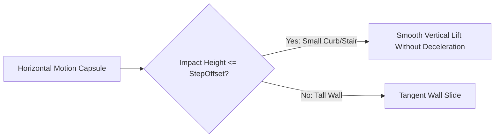

# 🚶 CharacterController in Prowl Engine

Moving a biped humanoid character using a standard dynamic `Rigidbody3D` frequently introduces undesirable artifacts: bouncing downhill, snagging on minor step thresholds, unwanted tumbling upon lateral collisions, and sluggish stops.

To deliver responsive player movement, Prowl Engine includes [`CharacterController.cs`](file:///c:/Users/SaidR/Documents/GitHub/ProwlStar/Prowl.Runtime/Components/Physics/CharacterController.cs). It operates as a specialized kinematic capsule controller that bypasses external unwanted physical rotational inertia, steps up stairs seamlessly, and slides along walls and slopes.

---

## 🏗️ Core CharacterController Properties

| Property | Type | Description |
| :--- | :--- | :--- |
| `Height` | `float` | Total capsule height in meters (e.g., 1.8m). |
| `Radius` | `float` | Capsule cross-section radius (e.g., 0.4m). |
| `Center` | `Float3` | Capsule center offset relative to the GameObject origin. |
| `SlopeLimit` | `float` | Maximum climbable surface angle in degrees (e.g., 45°). |
| `StepOffset` | `float` | Maximum stair height the character steps over automatically (e.g., 0.3m). |
| `SkinWidth` | `float` | Collision buffer envelope preventing capsule penetration into sharp mesh edges. |
| `IsGrounded` | `bool` | `true` if the character is firmly resting on a walkable surface. |
| `Velocity` | `Float3` | Realized movement velocity after collision resolution. |

---

## 🏃 Movement APIs: `Move()` vs `SimpleMove()`

Prowl provides two displacement methods:

### 1. `Move(Float3 motion)` (Full Gameplay Authority)
- Displaces the character by an absolute relative motion offset vector ($\Delta \text{pos}$).
- **Does not apply gravity automatically:** You maintain total authority over vertical acceleration, jumping, dashes, and airborne states.
- The standard choice for commercial action titles.

### 2. `SimpleMove(Float3 speed)` (Rapid Arcade Motion)
- Takes a velocity vector in meters/second ($m/s$).
- **Applies gravity automatically** along the downward axis.
- Disallows custom airborne jump velocities.

---

## 💻 Complete Production-Ready FPS Controller in C#

```csharp
using Prowl.Runtime;
using Prowl.Vector;

public class FPSController : MonoBehaviour
{
    [Header("Movement")]
    [SerializeField] private float _walkSpeed = 5.0f;
    [SerializeField] private float _runSpeed = 9.0f;
    [SerializeField] private float _jumpHeight = 1.8f;
    [SerializeField] private float _gravity = -19.62f;

    private CharacterController _cc;
    private Float3 _verticalVelocity;

    public override void Awake()
    {
        base.Awake();
        TryGetComponent(out _cc);
    }

    public override void Update()
    {
        base.Update();

        // 1. Ground detection
        bool grounded = _cc.IsGrounded;
        if (grounded && _verticalVelocity.Y < 0)
        {
            // Small downward clamp to stick firmly against downward slopes
            _verticalVelocity.Y = -2.0f;
        }

        // 2. Horizontal and vertical input acquisition
        float inputX = (Input.GetKey(Key.D) ? 1 : 0) - (Input.GetKey(Key.A) ? 1 : 0);
        float inputZ = (Input.GetKey(Key.W) ? 1 : 0) - (Input.GetKey(Key.S) ? 1 : 0);
        bool running = Input.GetKey(Key.LeftShift);

        float currentSpeed = running ? _runSpeed : _walkSpeed;
        Float3 moveDirection = (Transform.Right * inputX) + (Transform.Forward * inputZ);

        if (moveDirection.sqrMagnitude > 1.0f)
            moveDirection = moveDirection.normalized;

        Float3 horizontalMotion = moveDirection * currentSpeed * (float)Time.deltaTime;

        // 3. Jump impulse
        if (Input.GetKeyDown(Key.Space) && grounded)
        {
            // Classical kinematic equation: v = sqrt(-2 * g * h)
            _verticalVelocity.Y = MathF.Sqrt(-2f * _gravity * _jumpHeight);
        }

        // 4. Accumulate gravitational acceleration
        _verticalVelocity.Y += _gravity * (float)Time.deltaTime;

        // 5. Submit composite displacement to CharacterController
        Float3 totalMotion = horizontalMotion + (_verticalVelocity * (float)Time.deltaTime);
        _cc.Move(totalMotion);
    }
}
```

---

## 🧗 Slope & Stair Stepping (StepOffset)



- When encountering vertical obstacles lower than or equal to `StepOffset`, the solver elevates the capsule base above the lip, sustaining forward momentum.
- If a terrain face exceeds `SlopeLimit`, upward progress is barred and downward gravitational sliding occurs.

---

## 🔗 Related Topics
- Player input: [[🎮 Input System Architecture]].
- World physics: [[🌍 PhysicsWorld & Configuration]].
- Ground raycasting: [[🎯 Raycasting & Shape Queries]].
