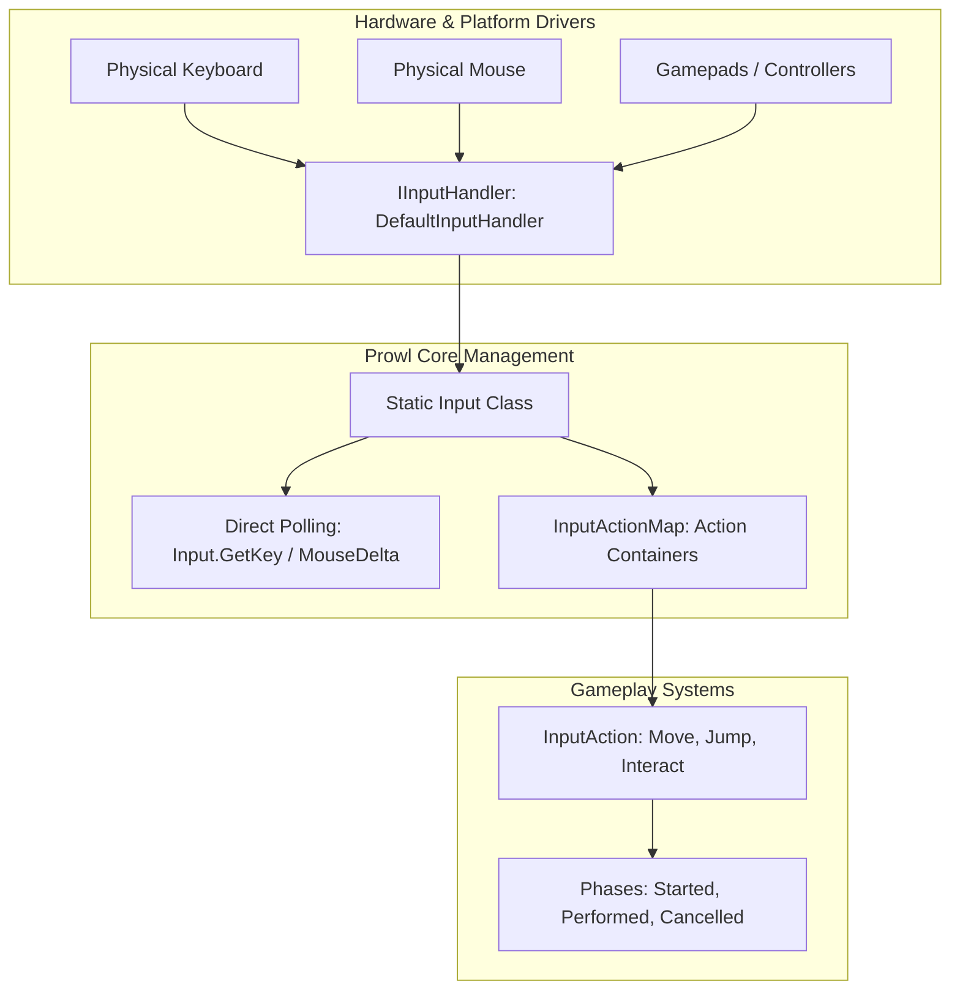

# 🎮 Input System Architecture in Prowl Engine

The input subsystem in **Prowl Engine** delivers two complementary architectural layers:
1. **Low-Level Direct Polling API:** Direct querying of keys, mouse buttons, and cursor deltas via the static [`Input`](file:///c:/Users/SaidR/Documents/GitHub/ProwlStar/Prowl.Runtime/InputManagement/Input.cs) class (ideal for rapid prototypes and editor tooling).
2. **Decoupled Action-Based Input Architecture:** Inspired by Unity's modern Input System, centered on [`InputActionMap`](file:///c:/Users/SaidR/Documents/GitHub/ProwlStar/Prowl.Runtime/InputManagement/InputActionMap.cs) and [`InputAction`](file:///c:/Users/SaidR/Documents/GitHub/ProwlStar/Prowl.Runtime/InputManagement/InputAction.cs), where gameplay logic binds semantically to player intent (*"Jump"*, *"Fire"*, *"Move"*) rather than physical hardware scancodes (*Space*, *Left Click*, *WASD*).

---

## 🏗️ Input Subsystem Architecture



---

## 🕹️ 1. Direct Low-Level Polling API

The static [`Input`](file:///c:/Users/SaidR/Documents/GitHub/ProwlStar/Prowl.Runtime/InputManagement/Input.cs) facade permits immediate query of current hardware states:

### Keyboard Queries:
```csharp
// Continuous key press check
if (Input.GetKey(Key.W)) { ... }

// Key down transition this frame
if (Input.GetKeyDown(Key.Space)) { ... }

// Key release transition this frame
if (Input.GetKeyUp(Key.Escape)) { ... }
```

### Mouse and Cursor Queries:
```csharp
// Mouse button press (0 = Left, 1 = Right, 2 = Middle)
if (Input.GetMouseButtonDown(0)) { ... }

// Absolute cursor position in window pixels
Int2 mousePos = Input.MousePosition;

// Per-frame relative motion delta
Float2 mouseDelta = Input.MouseDelta;

// Mouse scroll wheel delta
float scroll = Input.MouseWheel;

// Confine and lock cursor for first-person camera control
Input.CursorLocked = true;
Input.CursorVisible = false;
```

---

## 🗺️ 2. Action-Based Decoupled Input

Decoupling gameplay systems from concrete peripheral devices is an architectural best practice.

### Key Benefits:
- **Runtime Remapping:** Players can customize keyboard/gamepad bindings through settings menus without altering character controller scripts.
- **Unified Multi-Device Support:** A single *"Move"* event maps seamlessly across WASD keyboard keys and analog gamepad thumbsticks.
- **Integrated Processing Pipelines:** Deadzone filtering, axis inversion, and 2D vector normalization are executed before dispatching values to gameplay scripts.

### Action Execution Phases (`InputActionPhase`):
- `Disabled`: Action is quiescent and ignores input events.
- `Started`: The interaction threshold has been crossed (e.g., initial button depression).
- `Performed`: The action is actively held or successfully triggered (main callback invoked).
- `Cancelled`: Peripheral returned to neutral rest state (button released).

---

## 💻 C# Action Creation and Consumption

```csharp
using Prowl.Runtime;
using Prowl.Runtime.InputManagement;
using Prowl.Vector;

public class PlayerActionInputDemo : MonoBehaviour
{
    private InputActionMap _playerMap;
    private InputAction _jumpAction;
    private InputAction _moveAction;

    public override void Awake()
    {
        base.Awake();

        // 1. Instantiate the action map
        _playerMap = new InputActionMap("PlayerControls");

        // 2. Define a button action (Jump)
        _jumpAction = _playerMap.AddAction("Jump", InputActionType.Button);
        _jumpAction.AddBinding("<Keyboard>/space");
        _jumpAction.AddBinding("<Gamepad>/buttonSouth"); // 'A' button on Xbox

        // Subscribe using named methods (Prevents closure allocations)
        _jumpAction.Performed += OnJumpPerformed;

        // 3. Define a 2D composite vector action (WASD Move)
        _moveAction = _playerMap.AddAction("Move", InputActionType.Value, InputActionValueType.Float2);
        _moveAction.AddCompositeBinding2D(
            up: "<Keyboard>/w",
            down: "<Keyboard>/s",
            left: "<Keyboard>/a",
            right: "<Keyboard>/d"
        );
    }

    public override void OnEnable()
    {
        base.OnEnable();
        _playerMap.Enable(); // Start listening
    }

    public override void OnDisable()
    {
        base.OnDisable();
        _playerMap.Disable(); // Cease listening
    }

    private void OnJumpPerformed(InputActionContext ctx)
    {
        Debug.Log("Jump action triggered!");
    }

    public override void Update()
    {
        base.Update();
        // Sample 2D vector during frame update
        Float2 moveVector = _moveAction.ReadValue<Float2>();
        if (moveVector.sqrMagnitude > 0.001f)
        {
            Transform.Translate(new Float3(moveVector.x, 0, moveVector.y) * 5f * (float)Time.deltaTime);
        }
    }
}
```

---

## 🔗 Related Topics
- Maps and bindings: [[🗺️ Input Action Maps & Bindings]].
- Modifiers and deadzones: [[🕹️ Processors & Composites]].
- Complete controller examples: [[💻 Character Controller Input Examples]].
