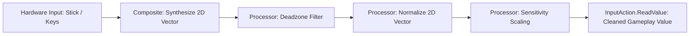

# 🕹️ Processors & Composites in Prowl Engine

Raw input captured directly from physical hardware is rarely ready for direct consumption by character locomotion or camera systems:
- Analog gamepad sticks exhibit mechanical **Stick Drift** (faint non-zero readings when sitting at rest).
- Keyboard diagonal movement (`W` + `D`) produces a resultant vector of $\sqrt{1^2 + 1^2} \approx 1.414$, making characters sprint 41% faster diagonally if unnormalized.
- Mouse input demands customizable sensitivity scaling and vertical inversion.

In Prowl Engine, these issues are handled in an extensible fashion through the **Processors ([`IInputProcessor.cs`](file:///c:/Users/SaidR/Documents/GitHub/ProwlStar/Prowl.Runtime/InputManagement/IInputProcessor.cs))** and **Composites ([`InputComposites.cs`](file:///c:/Users/SaidR/Documents/GitHub/ProwlStar/Prowl.Runtime/InputManagement/InputComposites.cs))** pipeline.

---

## ⚙️ The Input Processing Pipeline



---

## 🛠️ Built-in Standard Processors

### 1. `DeadzoneProcessor`
Eliminates unwanted neutral stick drift:
- **`Min` (Default: 0.125f):** Vector magnitudes below this threshold are snapped to absolute zero.
- **`Max` (Default: 0.925f):** Magnitudes above this threshold are remapped to 1.0f, guaranteeing full speed on worn thumbsticks.
- Linearly remaps intermediate values to prevent abrupt step transitions upon leaving the deadzone.

### 2. `NormalizeVector2Processor`
Eliminates diagonal movement speed exploits:
- When vector length exceeds 1.0 (such as pressing `W` and `D` concurrently on a keyboard), clamps vector magnitude to exactly 1.0.
- Preserves fractional analog deflection (e.g. 40% tilt for stealth walking).

### 3. `InvertProcessor`
Negates input values:
- Essential for accessibility options in flight simulators and inverted third-person look controls.

### 4. `ScaleProcessor`
Multiplies raw values by a scalar sensitivity factor (e.g., mouse DPI multipliers or analog turning rates).

---

## 💻 Configuring Processors in C#

Processors can be attached to actions or individual device bindings:

```csharp
using Prowl.Runtime;
using Prowl.Runtime.InputManagement;
using Prowl.Vector;

public class CustomInputSetup : MonoBehaviour
{
    private InputActionMap _controls;
    private InputAction _lookAction;

    public override void Awake()
    {
        base.Awake();
        _controls = new InputActionMap("CameraLook");

        // 1. Declare camera look action
        _lookAction = _controls.AddAction("Look", InputActionType.Value, InputActionValueType.Float2);

        // 2. Mouse binding with pixel sensitivity scaling
        var mouseBinding = _lookAction.AddBinding("<Mouse>/delta");
        mouseBinding.AddProcessor(new ScaleVector2Processor(scaleX: 0.15f, scaleY: 0.15f));

        // 3. Gamepad stick binding with deadzone filtering
        var stickBinding = _lookAction.AddBinding("<Gamepad>/rightStick");
        stickBinding.AddProcessor(new DeadzoneProcessor(min: 0.15f, max: 0.95f));
        stickBinding.AddProcessor(new ScaleVector2Processor(scaleX: 120f, scaleY: 120f));
    }

    public override void OnEnable() => _controls.Enable();
    public override void OnDisable() => _controls.Disable();
}
```

---

## 🧪 Authoring Custom Input Processors

Implement [`IInputProcessor`](file:///c:/Users/SaidR/Documents/GitHub/ProwlStar/Prowl.Runtime/InputManagement/IInputProcessor.cs) to inject custom mathematical transformations:

```csharp
public class CubicCurveProcessor : IInputProcessor
{
    // Cubic response curve for ultra-fine precision near center: f(x) = x^3
    public object Process(object value, InputAction action)
    {
        if (value is float f)
        {
            return f * f * f;
        }
        else if (value is Float2 v)
        {
            float len = v.magnitude;
            if (len < 0.001f) return Float2.Zero;
            float newLen = len * len * len;
            return v.normalized * newLen;
        }

        return value;
    }
}
```

---

## 🔗 Related Topics
- Core input architecture: [[🎮 Input System Architecture]].
- Binding configuration: [[🗺️ Input Action Maps & Bindings]].
- Practical character movement: [[💻 Character Controller Input Examples]].
