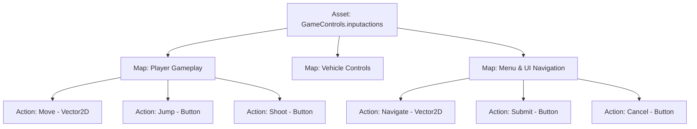

# 🗺️ Input Action Maps & Bindings in Prowl Engine

Modern video games rarely rely on a single monolithic control scheme. A player on foot walks and jumps; upon boarding a vehicle they steer and accelerate; and inside an inventory or pause screen, directional controls navigate buttons rather than moving the character avatar.

In Prowl Engine, control scheme partitioning is solved through **Action Maps ([`InputActionMap`](file:///c:/Users/SaidR/Documents/GitHub/ProwlStar/Prowl.Runtime/InputManagement/InputActionMap.cs))** and **Bindings ([`InputBinding`](file:///c:/Users/SaidR/Documents/GitHub/ProwlStar/Prowl.Runtime/InputManagement/InputBinding.cs))**, authored in C# code or graphically within dedicated `.inputactions` assets.

---

## 📂 Organizing Actions into Maps



### Context Switching at Runtime:
When the user triggers a pause state:
```csharp
public class PauseManager : MonoBehaviour
{
    [SerializeField] private InputActionMap _playerMap;
    [SerializeField] private InputActionMap _uiMap;

    public void OpenPauseMenu()
    {
        // Deactivate player locomotion input (WASD/firing ignored)
        _playerMap.Disable();

        // Activate menu navigation actions
        _uiMap.Enable();

        // Release and display cursor for mouse interaction
        Input.CursorLocked = false;
        Input.CursorVisible = true;
    }

    public void ClosePauseMenu()
    {
        _uiMap.Disable();
        _playerMap.Enable();
        Input.CursorLocked = true;
        Input.CursorVisible = false;
    }
}
```

---

## 🔗 Binding Types and Device Paths

Each [`InputAction`](file:///c:/Users/SaidR/Documents/GitHub/ProwlStar/Prowl.Runtime/InputManagement/InputAction.cs) holds one or more hardware path bindings defined via standardized device path notation:

| Peripheral | Path Notation Syntax | Example Path |
| :--- | :--- | :--- |
| **Keyboard** | `<Keyboard>/keyName` | `<Keyboard>/space`, `<Keyboard>/w`, `<Keyboard>/leftShift` |
| **Mouse** | `<Mouse>/control` | `<Mouse>/leftButton`, `<Mouse>/rightButton`, `<Mouse>/delta` |
| **Gamepad** | `<Gamepad>/control` | `<Gamepad>/buttonSouth` (A/X), `<Gamepad>/leftStick`, `<Gamepad>/rightTrigger` |

---

## 🧩 Composite Bindings

A **Composite Binding** synthesizes multiple discrete hardware inputs (e.g., 4 independent keyboard keys) into a single unified structured value before dispatching to game logic:

### 1. 2D Vector Composite (WASD or D-Pad -> `Float2`)
Aggregates four directional keys into a continuous 2D planar vector:
```csharp
InputAction moveAction = playerMap.AddAction("Move", InputActionType.Value, InputActionValueType.Float2);

// Bind keyboard keys
moveAction.AddCompositeBinding2D(
    up: "<Keyboard>/w",
    down: "<Keyboard>/s",
    left: "<Keyboard>/a",
    right: "<Keyboard>/d"
);

// Concurrently bind Gamepad Analog Stick to the same action
moveAction.AddBinding("<Gamepad>/leftStick");
```

### 2. 1D Axis Composite (Buttons/Triggers -> `float`)
Combines two opposing keys into a continuous 1D scalar ranging between -1.0 and +1.0 (ideal for aircraft rudders or zoom):
```csharp
InputAction zoomAction = playerMap.AddAction("Zoom", InputActionType.Value, InputActionValueType.Float);

zoomAction.AddCompositeBinding1D(
    negative: "<Keyboard>/q",
    positive: "<Keyboard>/e"
);
```

---

## 💾 User Key Rebinding

Allowing players to rebind custom keys in the options menu is built-in:

```csharp
public class RebindUI : MonoBehaviour
{
    public void StartRebind(InputAction actionToRebind)
    {
        // 1. Temporarily pause action listening
        actionToRebind.Disable();

        // 2. Await next raw key event
        Input.OnKeyEvent += (KeyCode pressedKey, bool isDown) =>
        {
            if (isDown)
            {
                // 3. Mutate binding path
                actionToRebind.ChangeBinding(0, $"<Keyboard>/{pressedKey.ToString().ToLower()}");

                // 4. Re-enable listening
                actionToRebind.Enable();
            }
        };
    }
}
```

---

## 🔗 Related Topics
- Architecture overview: [[🎮 Input System Architecture]].
- Deadzones and curves: [[🕹️ Processors & Composites]].
- Complete controller scripts: [[💻 Character Controller Input Examples]].
