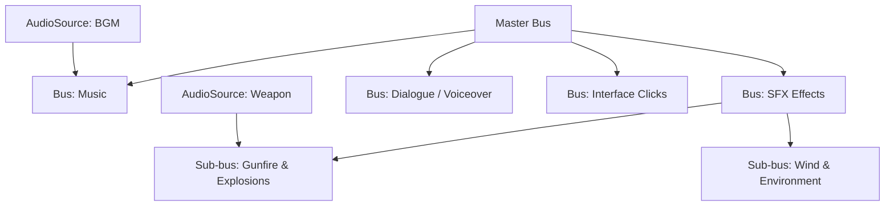

# 🎛️ AudioMixer & Snapshots in Prowl Engine

In commercial games, tuning individual sound source volumes directly in code is unmaintainable. An enterprise audio hierarchy must organize sounds into distinct acoustic categories (Music, Voiceover, SFX, Weapons, UI) and balance their overall levels, routing, and effects collectively.

Prowl Engine features a hierarchical sub-mix routing engine driven by [`AudioMixer.cs`](file:///c:/Users/SaidR/Documents/GitHub/ProwlStar/Prowl.Runtime/Audio/AudioMixer.cs) and dynamic scenario interpolation using [`AudioMixerSnapshot.cs`](file:///c:/Users/SaidR/Documents/GitHub/ProwlStar/Prowl.Runtime/Audio/AudioMixerSnapshot.cs).

---

## 🎚️ Hierarchical Bus Architecture



### Mixer Capabilities:
- **Logarithmic Decibel (dB) Attenuation:** Volume is governed across industry-standard decibels:
  - $0 \text{ dB}$: Nominal reference amplitude ($100\%$).
  - $-6 \text{ dB}$: Half power amplitude ($50\%$).
  - $-80 \text{ dB}$: Complete digital silence (*Muted*).
- **Hierarchical Propagation:** Attenuating the parent `SFXBus` automatically scales downstream child channels (`WeaponsBus` and `AmbienceBus`), preserving internal mix ratios.
- **Per-Bus DSP Chains:** Insert real-time equalizers, lowpass filters, and reverb units on specific sub-buses or across the Master output.

---

## 📸 Snapshots: Dynamic Acoustic Environment Blending

An **AudioMixerSnapshot** stores a complete configuration preset of all bus volumes, pitches, and DSP effect parameters across the `AudioMixer`.

### Practical Use Cases:
1. **Pause Screen:** The `Paused` snapshot lowers Music by $-10 \text{ dB}$ and routes SFX through a severe LowPass filter to muffle background gameplay while browsing menus.
2. **Submerged / Underwater:** The `Underwater` snapshot dampens high-frequency treble and elevates low-frequency sub-bass resonance.
3. **Concussion / Shell-Shock:** Drastically attenuates world audio while fading in a high-pitch tinnitus tone and the protagonist's heartbeat.

---

## 💻 Scripting Mixers and Snapshots in C#

```csharp
using Prowl.Runtime;
using Prowl.Runtime.Audio;

public class AudioSnapshotController : MonoBehaviour
{
    [SerializeField] private AudioMixer _mainMixer;
    [SerializeField] private AudioMixerSnapshot _normalSnapshot;
    [SerializeField] private AudioMixerSnapshot _underwaterSnapshot;
    [SerializeField] private AudioMixerSnapshot _pausedSnapshot;

    public void EnterWater()
    {
        // Smoothly crossfade to underwater acoustics over 0.75 seconds
        _underwaterSnapshot.TransitionTo(0.75f);
    }

    public void ExitWater()
    {
        // Restore ambient acoustics over 0.5 seconds
        _normalSnapshot.TransitionTo(0.5f);
    }

    public void SetMusicVolumeSlider(float sliderValue01)
    {
        // Map linear UI slider value (0.0001 to 1.0) to logarithmic decibels (-80dB to 0dB)
        float decibels = MathF.Log10(Math.Max(sliderValue01, 0.0001f)) * 20f;
        _mainMixer.SetFloat("MusicVolume", decibels);
    }
}
```

---

## 🦆 Audio Ducking (Dynamic Voiceover Priority)

**Audio Ducking** automatically ducks background music whenever critical radio dialogue or narrative speech triggers:

```csharp
public class RadioDialogue : MonoBehaviour
{
    [SerializeField] private AudioMixer _mixer;

    public void StartRadioTransmission()
    {
        // Instantly ducks music volume by 12 decibels
        _mixer.SetFloat("MusicVolume", -12f);
    }

    public void EndRadioTransmission()
    {
        // Restores music to standard 0 dB unity level
        _mixer.SetFloat("MusicVolume", 0f);
    }
}
```

---

## 🔗 Related Topics
- Engine backend: [[🔊 Audio Engine & AudioContext]].
- 3D sound emitters: [[🎧 AudioListener & 3D AudioSource]].
- Real-time DSP plugins: [[🧪 DSP Audio Effects]].
