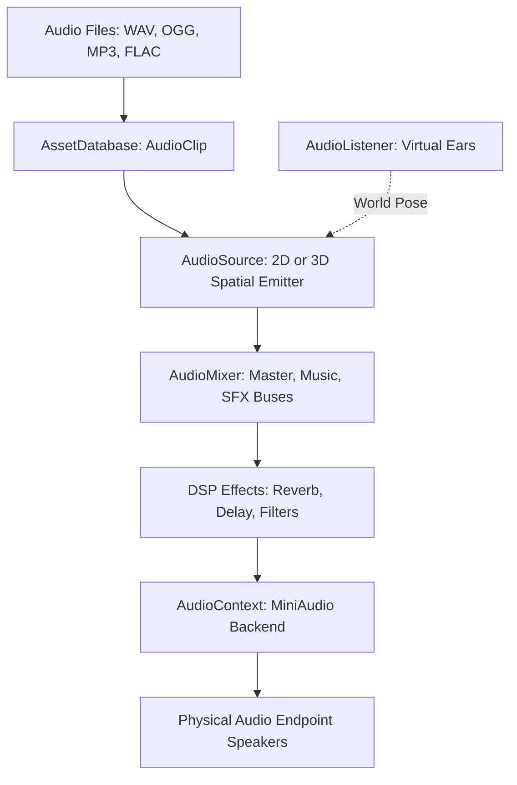

# 🔊 Audio Engine & AudioContext in Prowl Engine

The audio playback subsystem in Prowl Engine is powered by a high-efficiency managed wrapper over **MiniAudio**, one of the most widely respected, portable, low-latency C audio libraries in modern game development.

The central hardware interface for the audio pipeline is [`AudioContext.cs`](file:///c:/Users/SaidR/Documents/GitHub/ProwlStar/Prowl.Runtime/Audio/AudioContext.cs).

---

## 🎧 Advantages of MiniAudio Integration

1. **Native Cross-Platform Execution:**
   Precompiled shared libraries for Windows (x64/x86), Linux (x64/ARM), macOS (Universal/Apple Silicon), and Android located directly in [`Libraries/`](file:///c:/Users/SaidR/Documents/GitHub/ProwlStar/Libraries).
2. **Built-in Multi-Format Decoding:**
   Seamless in-memory and streaming decoding for:
   - **WAV:** Uncompressed, zero-latency PCM audio for instantaneous sound effects (footsteps, impacts, gunshots).
   - **OGG Vorbis:** Compressed format for general game SFX.
   - **MP3:** Universal format for music and background ambience.
   - **FLAC:** Lossless high-fidelity compression for orchestral soundtracks.
3. **Decoupled Dedicated Audio Thread:**
   Audio decoding and DSP mixing runs on an asynchronous OS audio thread, ensuring temporary CPU rendering stalls never trigger audio stuttering or dropouts.

---

## 🏗️ Audio Pipeline Architecture



---

## 🎛️ AudioContext Master Control

Manage global audio state through the static `AudioContext` interface:

```csharp
using Prowl.Runtime.Audio;

public class AudioManager : MonoBehaviour
{
    public void SetMasterVolume(float volume)
    {
        // Linear scale clamped between 0.0f and 1.0f
        AudioContext.MasterVolume = Math.Clamp(volume, 0.0f, 1.0f);
    }

    public void MuteAllAudio(bool mute)
    {
        AudioContext.IsMuted = mute;
    }

    public void SuspendAudio()
    {
        // Suspend driver when application loses focus
        AudioContext.Suspend();
    }

    public void ResumeAudio()
    {
        AudioContext.Resume();
    }
}
```

---

## ⚡ Memory Decompression vs Disk Streaming (AudioClip)

When importing audio assets:
- **Load in Memory:** Decompressed into uncompressed PCM RAM upon loading. Mandatory for short, frequently repeated sound effects (< 5 seconds) to prevent disk I/O stalls.
- **Stream from Disk:** Streams small chunks incrementally into memory ring buffers. Obligatory for multi-minute ambient music tracks and long spoken voiceover lines.

---

## 🔗 Related Topics
- 3D spatial sound: [[🎧 AudioListener & 3D AudioSource]].
- Sub-mix routing: [[🎛️ AudioMixer & Snapshots]].
- Real-time DSP filters: [[🧪 DSP Audio Effects]].
