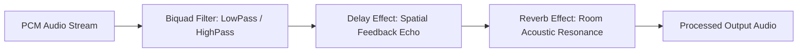

# 🧪 DSP Audio Effects in Prowl Engine

Digital Signal Processing (**DSP**) transforms audio waveforms in real time to recreate physical architectural acoustics (cathedrals, tunnels, damp caves), retro audio stylings (vintage radios, walkie-talkies), or surreal space environments.

In Prowl Engine, the audio effect architecture is anchored by the unified [`IAudioEffect`](file:///c:/Users/SaidR/Documents/GitHub/ProwlStar/Prowl.Runtime/Audio/Effects) interface. This enables developers to connect modular DSP chains directly to individual [`AudioSource`](file:///c:/Users/SaidR/Documents/GitHub/ProwlStar/Prowl.Runtime/Components/Audio/AudioSource.cs) components or to entire sub-buses inside the [`AudioMixer`](file:///c:/Users/SaidR/Documents/GitHub/ProwlStar/Prowl.Runtime/Audio/AudioMixer.cs).

---

## 🎛️ Standard Native DSP Effects Catalog



### 1. `ReverbEffect` (Acoustic Space Simulation)
Models the diffuse reflection of sound waves scattering off surrounding boundary geometry:
- **`RoomSize` (0.0 to 1.0):** Physical scale of the virtual room (from a compact closet to a massive cathedral).
- **`Damping` (0.0 to 1.0):** Acoustic absorption by soft materials (carpet/wood versus stone/metal).
- **`WetMix` / `DryMix`:** Ratio between processed reverberant reflections (*Wet*) and direct unaltered signal (*Dry*).

### 2. `DelayEffect` (Discrete Time Echo)
Repeats the incoming audio signal across fixed time offsets:
- **`DelayTime`:** Time delay duration in seconds (e.g., 0.25s).
- **`Feedback` (0.0 to 0.99):** Percentage of the delayed signal reinjected into the buffer loop (governs decay repetition count).

### 3. `BiquadFilterEffect` (Frequency Cutoff Filters)
Essential tool for environmental occlusion and dynamic audio feedback:
- **`FilterType.LowPass`:** Attenuates high treble frequencies while preserving low bass. Mandatory for muffled underwater acoustics or listening to audio through closed wooden doors.
- **`FilterType.HighPass`:** Strips out bass and sub-bass rumble, leaving harsh high frequencies. Emulates walkie-talkies, bullhorns, and intercom speakers.
- **`CutoffFrequency`:** Pivot cutoff threshold in Hertz (20 Hz to 20,000 Hz).
- **`QFactor` (Resonance):** Emphasizes and boosts frequencies immediately surrounding the cutoff point.

### 4. `DistortionEffect` (Waveform Clipping & Drive)
Applies non-linear waveform saturation:
- Imparts aggressive industrial grit to plasma rifles, damaged communication channels, and alien monster vocals.

---

## 💻 Scripting DSP Chains in C#

```csharp
using Prowl.Runtime;
using Prowl.Runtime.Audio;
using Prowl.Runtime.Audio.Effects;

public class ZoneAudioEffects : MonoBehaviour
{
    [SerializeField] private AudioSource _environmentalSource;

    public void ApplyCaveAcoustics()
    {
        // 1. Clear previous filter stack
        _environmentalSource.ClearEffects();

        // 2. Insert Cave Reverb unit
        var reverb = new ReverbEffect
        {
            RoomSize = 0.85f,
            Damping = 0.2f,
            WetMix = 0.45f,
            DryMix = 0.75f
        };
        _environmentalSource.AddEffect(reverb);

        // 3. Chain subtle slapback delay
        var delay = new DelayEffect
        {
            DelayTime = 0.25f,
            Feedback = 0.35f,
            WetMix = 0.2f
        };
        _environmentalSource.AddEffect(delay);
    }
}
```

---

## 🧪 Authoring Custom Real-Time DSP Audio Effects

You can implement custom DSP algorithms by implementing `IAudioEffect` and manipulating raw floating-point 32-bit PCM sample buffers (`Span<float>`):

```csharp
public class TremoloEffect : IAudioEffect
{
    public float Frequency { get; set; } = 5.0f; // Oscillations per second (Hz)
    public float Depth { get; set; } = 0.5f;

    private float _phase = 0.0f;

    public void Process(Span<float> buffer, int channels, int sampleRate)
    {
        float phaseIncrement = (MathF.PI * 2f * Frequency) / sampleRate;

        for (int i = 0; i < buffer.Length; i += channels)
        {
            float modulation = 1.0f - (Depth * (0.5f + 0.5f * MathF.Sin(_phase)));

            // Modulate all interleaved stereo channels
            for (int c = 0; c < channels; c++)
            {
                buffer[i + c] *= modulation;
            }

            _phase += phaseIncrement;
            if (_phase > MathF.PI * 2f) _phase -= MathF.PI * 2f;
        }
    }
}
```

---

## 🔗 Related Topics
- Audio pipeline backend: [[🔊 Audio Engine & AudioContext]].
- 3D spatial sources: [[🎧 AudioListener & 3D AudioSource]].
- Mix routing: [[🎛️ AudioMixer & Snapshots]].
