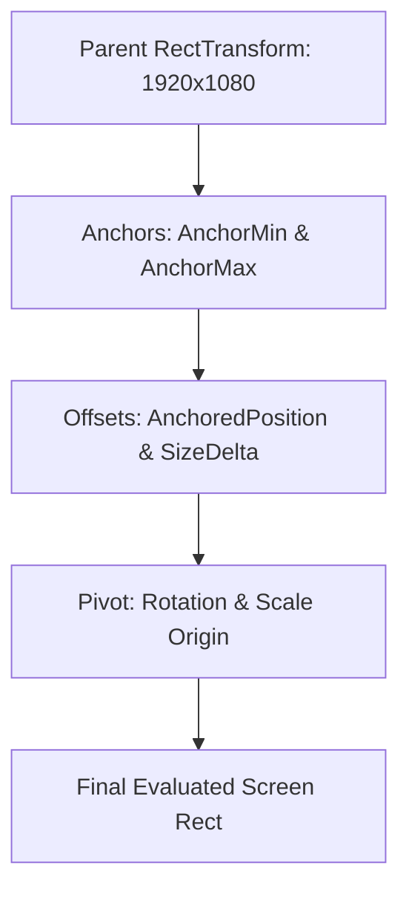

# 📐 RectTransform & Layouts in Prowl Engine

While 3D scene objects utilize a standard [`Transform`](file:///c:/Users/SaidR/Documents/GitHub/ProwlStar/Prowl.Runtime/Math/Transform.cs) component to define position and rotation in Euclidean space, 2D UI elements require responsive rectangular bounding geometries that adapt dynamically across diverse aspect ratios and display resolutions.

In Prowl Engine, responsive UI positioning is handled by [`RectTransform.cs`](file:///c:/Users/SaidR/Documents/GitHub/ProwlStar/Prowl.Runtime/Components/UI/RectTransform.cs) and auto-layout controllers in [`Layout/`](file:///c:/Users/SaidR/Documents/GitHub/ProwlStar/Prowl.Runtime/Components/UI/Layout).

---

## 🎯 Anchors & Pivot Paradigm



### 1. `Pivot` (Reference Origin)
A normalized 2D vector ranging from `(0, 0)` to `(1, 1)` defining the origin point of the rect itself:
- `(0.5, 0.5)`: Geometric center.
- `(0.0, 1.0)`: Top-left corner.
- `(1.0, 0.0)`: Bottom-right corner.

### 2. `AnchorMin` & `AnchorMax` (Parent Anchoring)
Defines how the rectangle pins and stretches against its parent:

#### Case A: Point Anchoring (`AnchorMin == AnchorMax`)
The element preserves a fixed pixel size (`SizeDelta`) and positions relative to a specific reference point on the parent:
- **Top-Right Minimap:**
  `AnchorMin = Float2(1, 1)`, `AnchorMax = Float2(1, 1)`, `Pivot = Float2(1, 1)`.
- **Centered Bottom Health Bar:**
  `AnchorMin = Float2(0.5, 0)`, `AnchorMax = Float2(0.5, 0)`, `Pivot = Float2(0.5, 0)`.

#### Case B: Stretch Anchoring (`AnchorMin != AnchorMax`)
The element stretches proportionally as the parent container resizes:
- **Full Screen Background Panel:**
  `AnchorMin = Float2(0, 0)`, `AnchorMax = Float2(1, 1)`, `SizeDelta = Float2(0, 0)`.
- **Top Navigation Banner:**
  `AnchorMin = Float2(0, 1)`, `AnchorMax = Float2(1, 1)`. Horizontal width stretches to 100% of parent width while vertical height remains constant.

---

## 💻 Scripting RectTransform in C#

```csharp
using Prowl.Runtime;
using Prowl.Runtime.UI;
using Prowl.Vector;

public class MinimapSetup : MonoBehaviour
{
    public override void Awake()
    {
        base.Awake();

        if (TryGetComponent<RectTransform>(out var rect))
        {
            // Pin to upper-right corner
            rect.AnchorMin = new Float2(1f, 1f);
            rect.AnchorMax = new Float2(1f, 1f);
            rect.Pivot = new Float2(1f, 1f);

            // Fixed dimensions: 200x200 pixels
            rect.SizeDelta = new Float2(200f, 200f);

            // 20-pixel inward margin
            rect.AnchoredPosition = new Float2(-20f, -20f);
        }
    }
}
```

---

## 🗂️ Auto-Layout Controllers

Eliminate manual placement for dynamic lists and inventories using layout components:

### 1. `VerticalLayoutGroup`
Arranges children in a contiguous vertical stack:
- **`Spacing`:** Vertical gap in pixels between consecutive child elements.
- **`Padding`:** Internal margins (Left, Right, Top, Bottom).
- **`ChildForceExpand`:** Stretches children to fill available height or width.

### 2. `HorizontalLayoutGroup`
Arranges children in a single horizontal row (ideal for hotbars and ability action trays).

### 3. `GridLayoutGroup`
Arranges children across a 2D matrix of uniform cells:
- **`CellSize`:** Uniform width and height per slot (`Float2(64, 64)` for inventory grids).
- **`Constraint`:** Locks either `FixedColumnCount` or `FixedRowCount`.

### 4. `ContentSizeFitter`
Dynamically resizes the parent `RectTransform` to snugly fit its child content (e.g., expanding dialogue box height to match variable text length).

---

## 🔗 Related Topics
- Canvas root: [[🖼️ Game Canvas UI System]].
- Interactive widgets: [[🔘 UI Components (Button, Slider, InputField, ScrollRect)]].
- UI raycasting: [[🖱️ EventSystem & UIRaycaster]].
