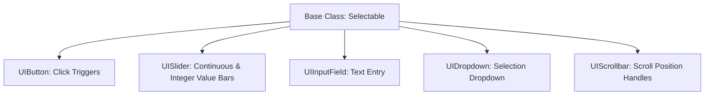

# 🔘 UI Components (Button, Slider, InputField, ScrollRect) in Prowl Engine

Building functional, responsive menus in Prowl Engine relies upon a cohesive library of visual renderers and interactive controls.

All interactive widgets derive from the base [`Selectable.cs`](file:///c:/Users/SaidR/Documents/GitHub/ProwlStar/Prowl.Runtime/Components/UI/Input/Selectable.cs) class, providing a standardized visual state machine (**Normal**, **Highlighted/Hover**, **Pressed**, **Selected**, **Disabled**), gamepad/keyboard focus navigation, and smooth color crossfades via [`ColorBlock`](file:///c:/Users/SaidR/Documents/GitHub/ProwlStar/Prowl.Runtime/Components/UI/Input/ColorBlock.cs).

---

## 🎨 1. Foundational Visual Renderers

### [`UIImage`](file:///c:/Users/SaidR/Documents/GitHub/ProwlStar/Prowl.Runtime/Components/UI/UIImage.cs)
Renders 2D sprites and textured quads onto the canvas:
- **`Sprite`:** The graphical asset to render.
- **`Color`:** Color tint and alpha transparency.
- **Image Types:**
  - `Simple`: Stretches the texture over the entire bounding rectangle.
  - `Sliced (9-Slice)`: Preserves corner pixel dimensions while scaling border segments and the center tile. Essential for rounded windows and buttons.
  - `Filled`: Fills the sprite based on a fractional percentage from 0.0 to 1.0 (ideal for radial or horizontal cooldown and health bars).

### [`TextComponent`](file:///c:/Users/SaidR/Documents/GitHub/ProwlStar/Prowl.Runtime/Components/UI/TextComponent.cs)
High-definition vector font rendering via [`UIFontSystem.cs`](file:///c:/Users/SaidR/Documents/GitHub/ProwlStar/Prowl.Runtime/Components/UI/UIFontSystem.cs):
- **`Text`:** The visible string payload.
- **`FontSize`:** Point size of font glyphs.
- **`Alignment`:** Horizontal and vertical bounding box alignment (`TopLeft`, `Center`, `BottomRight`).
- **`RichText`:** Full formatting tag support, including `<b>bold</b>`, `<i>italic</i>`, and `<color=#FF0000>red</color>`.

---

## 🕹️ 2. Primary Interactive Widgets



### 1. [`UIButton`](file:///c:/Users/SaidR/Documents/GitHub/ProwlStar/Prowl.Runtime/Components/UI/Input/UIButton.cs)
Standard clickable button component:
- `OnClick` Event: Fires upon user click or controller submit press.
- Automatic color tint transitions via `ColorBlock`.

### 2. [`UISlider`](file:///c:/Users/SaidR/Documents/GitHub/ProwlStar/Prowl.Runtime/Components/UI/Input/UISlider.cs)
Linear slider widget for numerical range selection:
- **`MinValue` / `MaxValue`:** Bounding values of the slider scale.
- **`Value`:** Current scalar value.
- **`WholeNumbers`:** Restricts selection to discrete integers.
- **`OnValueChanged`:** Event fired whenever the slider updates.

### 3. [`UIInputField`](file:///c:/Users/SaidR/Documents/GitHub/ProwlStar/Prowl.Runtime/Components/UI/Input/UIInputField.cs)
Interactive single or multiline text field:
- Supports text caret blinking, cursor dragging text selection, and clipboard paste.
- **`ContentType`:** `Standard`, `IntegerNumber`, `DecimalNumber`, or `Password` (masks inputs with asterisks `***`).

### 4. [`UIScrollRect`](file:///c:/Users/SaidR/Documents/GitHub/ProwlStar/Prowl.Runtime/Components/UI/Input/UIScrollRect.cs)
Scrolling viewport container for extensive content (inventories, leaderboards, dialogue logs):
- Physical momentum drag inertia with elastic rubber-band boundaries.
- Pairs with [`RectMask.cs`](file:///c:/Users/SaidR/Documents/GitHub/ProwlStar/Prowl.Runtime/Components/UI/RectMask.cs) to clip child geometry overflowing view bounds.

---

## 💻 Scripting Interactive Menus in C#

```csharp
using Prowl.Runtime;
using Prowl.Runtime.UI;

public class SettingsMenuController : MonoBehaviour
{
    [SerializeField] private UIButton _applyButton;
    [SerializeField] private UISlider _volumeSlider;
    [SerializeField] private UIInputField _playerNameInput;

    public override void Awake()
    {
        base.Awake();

        // 1. Subscribe to button click using named method (Zero GC)
        if (_applyButton.IsValid())
        {
            _applyButton.OnClick += OnApplyClicked;
        }

        // 2. Listen to slider adjustments
        if (_volumeSlider.IsValid())
        {
            _volumeSlider.OnValueChanged += OnVolumeChanged;
        }

        // 3. Listen to input field text submission
        if (_playerNameInput.IsValid())
        {
            _playerNameInput.OnSubmit += OnPlayerNameSubmitted;
        }
    }

    private void OnApplyClicked()
    {
        Debug.Log("Settings committed successfully.");
    }

    private void OnVolumeChanged(float newVolume)
    {
        Debug.Log($"Volume set to: {newVolume}");
    }

    private void OnPlayerNameSubmitted(string name)
    {
        Debug.Log($"Player handle updated: {name}");
    }
}
```

---

## 👻 Hierarchy-Wide Control: CanvasGroup

The [`CanvasGroup`](file:///c:/Users/SaidR/Documents/GitHub/ProwlStar/Prowl.Runtime/Components/UI/CanvasGroup.cs) component modifies an entire UI panel branch in a single call:
- **`Alpha` (0.0f to 1.0f):** Seamlessly fades a panel tree without mutating individual widget colors.
- **`Interactable` (bool):** Toggles clickability across all child buttons simultaneously.
- **`BlocksRaycasts` (bool):** Allows mouse clicks to penetrate through hidden menus.

---

## 🔗 Related Topics
- Canvas root: [[🖼️ Game Canvas UI System]].
- Layout groups: [[📐 RectTransform & Layouts]].
- Event routing: [[🖱️ EventSystem & UIRaycaster]].
