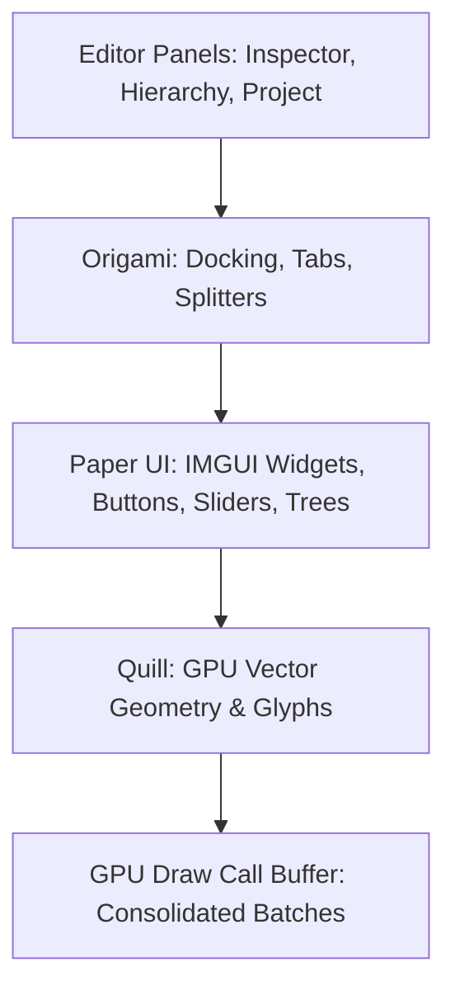

# 🖋️ Editor UI Internals (Paper, Origami, Quill) in Prowl Engine

While games developed in Prowl utilize a retained-mode UI system anchored on GameObjects and [`RectTransform`](file:///c:/Users/SaidR/Documents/GitHub/ProwlStar/Prowl.Runtime/Components/UI/RectTransform.cs), the graphical authoring environment of the **Editor** ([`Prowl.Editor`](file:///c:/Users/SaidR/Documents/GitHub/ProwlStar/Prowl.Editor)) is constructed upon an independent technological stack of three specialized libraries:
1. **Paper UI:** An ultra-fast, modern Immediate Mode GUI (**IMGUI**) framework tailored for C# tooling.
2. **Origami:** A dockable window manager managing tabs, splitters, floating frames, and layout persistence.
3. **Quill:** A hardware-accelerated vector graphics rasterizer and SDF font glyph engine.

---

## 🏛️ Editor UI Architecture



---

## 📄 1. Paper UI: Modern Immediate Mode in C#

Unlike retained UI frameworks where developers must instantiate and persist UI widget objects in memory, **Immediate Mode (IMGUI)** defines interface structure and user interaction synchronously within a single per-frame pass:

```csharp
// Pure IMGUI paradigm: Declaration and execution unified
if (Paper.Button("Compile Scripts"))
{
    // Executes immediately upon user click
    CompileProjectScripts();
}

float newSpeed = Paper.SliderFloat("Speed", currentSpeed, 0f, 20f);
```

### Why Immediate Mode for Authoring Tools?
- **Zero State Synchronization:** If a gameplay field updates via reflection or scripts, the editor reflects it on the very next frame without change listeners.
- **Rapid Tooling Velocity:** Constructing comprehensive custom inspectors takes only procedural lines of code.
- **Zero Memory Leaks:** No persistent UI object instances to track or manually garbage collect.

---

## 🪟 2. Origami: Docking & Windowing

[`Origami`](file:///c:/Users/SaidR/Documents/GitHub/ProwlStar/Prowl.Editor/GUI) governs the spatial layout of Prowl's editor:
- **Multi-Edge Docking:** Drag any panel tab (Scene View, Inspector, Console) to the top, bottom, left, or right edges of another pane to partition it via interactive splitters.
- **Tab Stacking:** Group multiple panels within a single tabbed container.
- **Floating Windows:** Detach panels into independent floating native windows across dual-monitor workstations.
- **Layout Serialization:** Viewport arrangements, tab states, and divider coordinates automatically serialize to JSON upon exiting and restore seamlessly on boot.

---

## ✒️ 3. Quill: Hardware Vector Graphics & Sharp Glyphs

Traditional editors encounter pixelation artifacts when scaling UI curves, animation timeline keys, or high-DPI displays.

**Quill** executes vector rendering directly on the GPU:
- **Mathematical Bézier Curves:** Renders node graph connections, timeline curves, and anti-aliased rounded rectangles with mathematical precision independent of monitor DPI scaling.
- **Native SVG Rendering:** Editor iconography is rendered vectorially from SVG assets in real time, guaranteeing crisp visuals across 4K and 8K displays.
- **Dynamic SDF Font Atlasing:** Synthesizes vector font glyphs on the fly utilizing Signed Distance Fields.

---

## 💻 Authoring a Custom Component Inspector with Paper UI

```csharp
using Prowl.Editor;
using Prowl.PaperUI;
using Prowl.Runtime;

[CustomEditor(typeof(VehicleEngine))]
public class VehicleEngineEditor : CustomEditor
{
    public override void OnInspectorGUI()
    {
        VehicleEngine engine = (VehicleEngine)target;

        Paper.Text("Engine Performance Tuning", FontStyle.Bold);
        Paper.Separator();

        engine.Horsepower = Paper.SliderFloat("Horsepower (HP)", engine.Horsepower, 50f, 1200f);
        engine.TurboBoost = Paper.Checkbox("Enable Turbocharger", engine.TurboBoost);

        if (engine.TurboBoost)
        {
            engine.BoostPressure = Paper.SliderFloat("Boost Pressure (Bar)", engine.BoostPressure, 0.5f, 3.5f);
        }

        if (Paper.Button("Test Rev Audio"))
        {
            engine.PlayRevSound();
        }
    }
}
```

---

## 🔗 Related Topics
- In-game retained UI: [[🖼️ Game Canvas UI System]].
- Extending the inspector: [[🎛️ Custom Editors & Inspector Customization]].
- Creating custom editor panels: [[🪟 Custom Editor Panels]].
