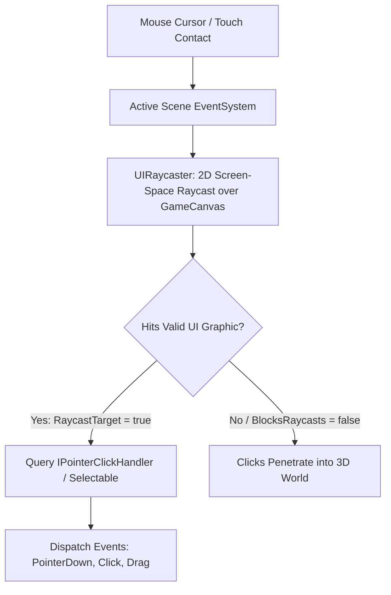

# 🖱️ EventSystem & UIRaycaster in Prowl Engine

For buttons, sliders, and input fields to respond to mouse clicks, touch taps, and gamepad directional inputs, an event dispatcher and an optimized screen-space collision query system are required.

In Prowl Engine, this responsibility is managed by [`EventSystem.cs`](file:///c:/Users/SaidR/Documents/GitHub/ProwlStar/Prowl.Runtime/Components/UI/Input/EventSystem.cs) and [`UIRaycaster.cs`](file:///c:/Users/SaidR/Documents/GitHub/ProwlStar/Prowl.Runtime/Components/UI/Input/UIRaycaster.cs).

---

## 🧭 Event Detection and Dispatch Pipeline



---

## 🎯 The Role of UIRaycaster

[`UIRaycaster`](file:///c:/Users/SaidR/Documents/GitHub/ProwlStar/Prowl.Runtime/Components/UI/Input/UIRaycaster.cs) attaches to each [`GameCanvas`](file:///c:/Users/SaidR/Documents/GitHub/ProwlStar/Prowl.Runtime/Components/GameCanvas.cs):
1. Projects screen cursor coordinates into canvas local coordinate space.
2. Evaluates active [`Graphic`](file:///c:/Users/SaidR/Documents/GitHub/ProwlStar/Prowl.Runtime/Components/UI/Graphic.cs) elements (`UIImage`, `TextComponent`) holding `RaycastTarget = true`.
3. Respects hierarchy Z-ordering: the topmost element intercepts and consumes the pointer event, preventing inadvertent activation of occluded background buttons.
4. If an element is nested inside a [`RectMask`](file:///c:/Users/SaidR/Documents/GitHub/ProwlStar/Prowl.Runtime/Components/UI/RectMask.cs) and scrolls beyond the clipping boundary, the raycaster automatically culls it.

---

## 📦 Pointer Event Context: PointerEventData

Upon interaction, the system constructs a [`PointerEventData`](file:///c:/Users/SaidR/Documents/GitHub/ProwlStar/Prowl.Runtime/Components/UI/Input/PointerEventData.cs) payload:
- **`Position` (`Float2`):** Current cursor screen coordinates in pixels.
- **`Delta` (`Float2`):** Per-frame relative motion delta.
- **`Button` (`PointerEventData.InputButton`):** Depressed button (`Left`, `Right`, `Middle`).
- **`ClickCount` (`int`):** Multi-click counter for double-click detection.
- **`Dragging` (`bool`):** Indicates whether an active drag operation is in progress.

---

## 🕹️ Controller & Gamepad Navigation

Console experiences require seamless D-Pad and analog stick navigation without a mouse pointer.

The foundational [`Selectable`](file:///c:/Users/SaidR/Documents/GitHub/ProwlStar/Prowl.Runtime/Components/UI/Input/Selectable.cs) class provides automatic spatial navigation ([`Navigation.cs`](file:///c:/Users/SaidR/Documents/GitHub/ProwlStar/Prowl.Runtime/Components/UI/Input/Navigation.cs)):

- **`NavigationMode.Automatic`:** Prowl evaluates the 2D planar distances between adjacent interactables, calculating optimal focus hops when directional inputs occur.
- **`NavigationMode.Explicit`:** Hand-configure specific target selections for asymmetrical menu designs.

---

## 💻 Custom Drag & Drop Interaction Example

Make any inventory slot or widget draggable by implementing Prowl's pointer event interfaces:

```csharp
using Prowl.Runtime;
using Prowl.Runtime.UI;
using Prowl.Vector;

public class DraggableItem : MonoBehaviour, IBeginDragHandler, IDragHandler, IEndDragHandler
{
    private RectTransform _rect;
    private CanvasGroup _canvasGroup;

    public override void Awake()
    {
        base.Awake();
        TryGetComponent(out _rect);
        TryGetComponent(out _canvasGroup);
    }

    public void OnBeginDrag(PointerEventData eventData)
    {
        // Lower opacity and allow raycasts to drop-target slots beneath
        if (_canvasGroup.IsValid())
        {
            _canvasGroup.Alpha = 0.6f;
            _canvasGroup.BlocksRaycasts = false;
        }
    }

    public void OnDrag(PointerEventData eventData)
    {
        // Follow cursor translation
        _rect.AnchoredPosition += eventData.Delta;
    }

    public void OnEndDrag(PointerEventData eventData)
    {
        // Restore opacity and collision blocking
        if (_canvasGroup.IsValid())
        {
            _canvasGroup.Alpha = 1.0f;
            _canvasGroup.BlocksRaycasts = true;
        }
    }
}
```

---

## 🔗 Related Topics
- Canvas root: [[🖼️ Game Canvas UI System]].
- Interactive widgets: [[🔘 UI Components (Button, Slider, InputField, ScrollRect)]].
- Input architecture: [[🎮 Input System Architecture]].
