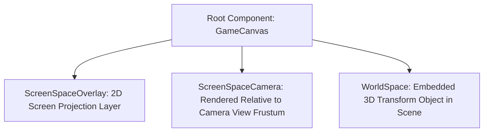

# 🖼️ Game Canvas UI System in Prowl Engine

In-game user interfaces (health bars, crosshairs, inventory menus, dialogue boxes, and 3D spatial computer screens) are governed by the root [`GameCanvas.cs`](file:///c:/Users/SaidR/Documents/GitHub/ProwlStar/Prowl.Runtime/Components/GameCanvas.cs) component.

Unlike the Editor UI (which relies on immediate-mode rendering via Paper UI), gameplay UI in Prowl Engine follows a retained-mode architecture anchored on **GameObjects**, hierarchical [`RectTransform`](file:///c:/Users/SaidR/Documents/GitHub/ProwlStar/Prowl.Runtime/Components/UI/RectTransform.cs) geometry, and decoupled input routing via [`EventSystem.cs`](file:///c:/Users/SaidR/Documents/GitHub/ProwlStar/Prowl.Runtime/Components/UI/Input/EventSystem.cs).

---

## 🖥️ Canvas Projection Modes (`RenderMode`)

A `GameCanvas` renders under one of three distinct projection strategies:



### 1. `RenderMode.ScreenSpaceOverlay` (HUDs & Standard Menus)
- Automatically resizes to encompass the entire active display window.
- Renders directly on top of all 3D world geometry, decoupled from scene cameras.
- The default standard for main title menus, HUDs, minimaps, and inventory screens.

### 2. `RenderMode.ScreenSpaceCamera`
- Renders at a configurable planar offset in front of an explicit camera.
- Allows camera post-processing effects and 3D particles to composite seamlessly in front of or behind UI layers.

### 3. `RenderMode.WorldSpace` (Diegetic & In-World Holograms)
- Behave as a true 3D entity in the scene graph.
- Scale and orientation are governed by the attached [`Transform`](file:///c:/Users/SaidR/Documents/GitHub/ProwlStar/Prowl.Runtime/Math/Transform.cs).
- Used for floating overhead health bars, interactive vehicle dashboards, and in-game computer monitors.

---

## 📱 Resolution Scaling Modes (`ScaleMode`)

Ensuring an interface designed at `1920x1080` appears crisp and proportional across high-DPI displays or ultrawide monitors is managed by the canvas scaler:

| Scaling Mode | Operational Behavior | Typical Use Case |
| :--- | :--- | :--- |
| **`ScaleWithScreenSize`** | Scales all UI elements proportionally against a reference design resolution (`ReferenceResolution`). | **Standard recommendation for the vast majority of titles.** |
| **`ConstantPixelSize`** | Elements retain fixed absolute pixel metrics regardless of display resolution. | Specialized developer utilities and retro pixel-art games. |
| **`ConstantPhysicalSize`**| Scales elements relative to screen physical DPI dimensions. | Cross-platform mobile touch experiences. |

---

## 💻 Instantiating a UI Canvas in C#

```csharp
using Prowl.Runtime;
using Prowl.Runtime.UI;
using Prowl.Vector;

public class HUDInitializer : MonoBehaviour
{
    public override void Awake()
    {
        base.Awake();

        // 1. Create root GameObject
        GameObject canvasGo = new GameObject("GameHUD");

        // 2. Attach and configure GameCanvas
        GameCanvas canvas = canvasGo.AddComponent<GameCanvas>();
        canvas.RenderMode = RenderMode.ScreenSpaceOverlay;
        canvas.ScaleMode = ScaleMode.ScaleWithScreenSize;
        canvas.ReferenceResolution = new Float2(1920, 1080);
        canvas.ScreenMatchMode = ScreenMatchMode.MatchWidthOrHeight;
        canvas.MatchWidthOrHeight = 0.5f; // Balanced width/height scaling

        // 3. Ensure an EventSystem exists in the scene
        if (FindObjectsOfType<EventSystem>().Length == 0)
        {
            GameObject eventSystemGo = new GameObject("EventSystem");
            eventSystemGo.AddComponent<EventSystem>();
        }
    }
}
```

---

## ⚡ UI Batching & Render Tree Internals

Under the hood, `GameCanvas` avoids issuing fragmented GPU draw commands:
- Gathers child visual components ([`UIBehaviour`](file:///c:/Users/SaidR/Documents/GitHub/ProwlStar/Prowl.Runtime/Components/UI/UIBehaviour.cs)) such as images and text glyphs.
- Synthesizes dynamic batch meshes via [`UIMeshBuilder.cs`](file:///c:/Users/SaidR/Documents/GitHub/ProwlStar/Prowl.Runtime/Components/UI/UIMeshBuilder.cs).
- Combines quads sharing texture atlases and font glyph sheets into consolidated draw batches, keeping draw calls minimal.

---

## 🔗 Related Topics
- 2D layout and anchors: [[📐 RectTransform & Layouts]].
- Interactive widgets: [[🔘 UI Components (Button, Slider, InputField, ScrollRect)]].
- Event dispatch and selection: [[🖱️ EventSystem & UIRaycaster]].
