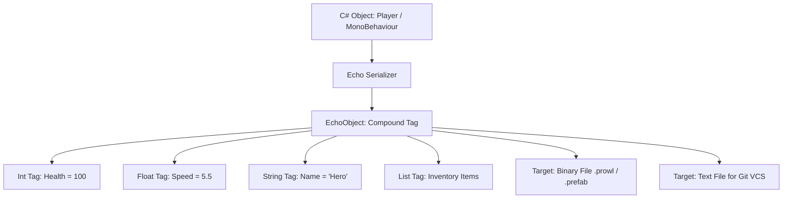

# 📜 Serialization with Prowl.Echo in Prowl Engine

Scene persistence, prefab authoring, project configuration, and component state retention in Prowl Engine does not depend on standard JSON or Unity's bloated YAML format.

Prowl utilizes **Prowl.Echo**, a high-performance deep serialization and memory cloning framework engineered expressly for the rigors of modern real-time engines.

---

## ⚡ Why Prowl.Echo Over YAML or JSON?

| Feature | Unity YAML | Conventional JSON | Prowl.Echo |
| :--- | :--- | :--- | :--- |
| **Parsing Speed** | Extremely Slow (complex text parsing). | Moderate (string allocation overhead). | **Blazing Fast (direct binary traversal).** |
| **Scene Disk Footprint** | Massive (multi-megabyte files for modest scenes). | Moderate. | **Extremely Compact (60% to 80% savings).** |
| **Version Control (Git)** | Notorious for unresolvable merge conflicts. | Friendly. | **Clean, diff-friendly human-readable format.** |
| **Deep Cloning** | Requires hacky re-instantiation. | Slow (serialize -> deserialize cycle). | **Native in-memory cloning engine.** |
| **Polymorphism** | Partial support via `$type`. | Requires custom converters. | **Native polymorphic type hierarchy support.** |

---

## 🧱 The Echo Data Model (EchoObject)

Echo serializes C# object graphs into a strongly typed intermediate hierarchical tag tree termed `EchoObject`:



### Supported Serialization Formats:
1. **`EchoFormat.Binary`:** Packed binary stream. Employed in standalone releases (*Desktop Player*) for instantaneous, allocation-free level loading.
2. **`EchoFormat.Text`:** Formatted structured text stream. Employed inside editor development projects so asset updates yield clean pull request diffs.

---

## 🏷️ Precision Serialization Attributes

Echo equips developers with fine-grained attributes to control how state is serialized:

```csharp
using Prowl.Echo;
using Prowl.Runtime;

public class CharacterData : MonoBehaviour
{
    // 1. Serialize private field (Best Practice for Encapsulation)
    [SerializeField]
    private int _maxHealth = 100;

    // 2. Ignore transient runtime-only field
    [SerializeIgnore]
    private float _currentShieldRechargeTimer;

    // 3. Conditional serialization (Only serialized if the condition property returns true)
    [SerializeField]
    [SerializeIf(nameof(HasCustomGravity))]
    private float _customGravityScale = -9.81f;

    public bool HasCustomGravity => _customGravityScale != -9.81f;

    // 4. Data migration following field renames in C#
    [SerializeField]
    [FormerlySerializedAs("movementSpeed")]
    private float _speed = 10f;
}
```

---

## 🧬 Instant Deep Memory Cloning (`Serializer.Clone`)

A hallmark capability of Echo is instant deep object duplication in memory without round-tripping to storage:

```csharp
// Deep-clone an entire complex object graph including nested collections
WeaponConfig clonedConfig = Serializer.Clone(originalConfig);
```
- Unlike shallow `MemberwiseClone()`, Echo recursively duplicates arrays, lists, dictionaries, and nested component references.
- Powers the engine's prefab delta computation and the Editor's **Undo/Redo** subsystem.

---

## 🔗 Related Topics
- Asset database: [[🗄️ AssetDatabase & AssetRef]].
- Prefabs: [[📦 Prefabs & Override System]].
- Project configuration: [[⚙️ Project Settings & Tags-Layers]].
