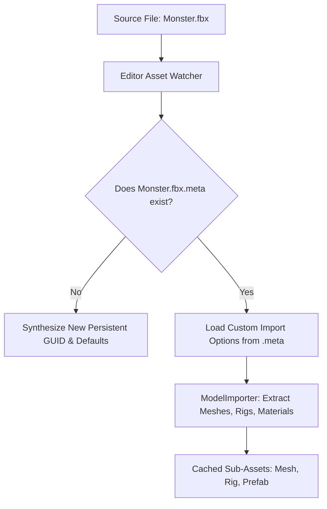

# 📥 Asset Importers (Models, Textures, Audio) in Prowl Engine

When you place raw source files (a PNG texture, an FBX or OBJ 3D model, an OGG soundtrack) into the project directory, real-time graphics APIs cannot ingest these formats directly from disk.

Prowl Engine processes each external asset through its specialized **Asset Importers ([`AssetImporting`](file:///c:/Users/SaidR/Documents/GitHub/ProwlStar/Prowl.Runtime/AssetImporting))** pipeline, compiling raw exchange formats into GPU-ready binary representations while emitting a companion `.meta` metadata file.

---

## 🔄 The Ingestion Pipeline & `.meta` Sidecars



### The `.meta` Sidecar File
Every project file is paired with an adjacent `.meta` file:
```yaml
Guid: 7f3a8b2c-4e1d-4890-a519-7c824e819b3f
Importer: ModelImporter
Settings:
  Scale: 1.0
  GenerateNormals: true
  GenerateTangents: true
  ImportAnimations: true
```
> [!IMPORTANT]
> **Never delete or exclude `.meta` files in Git.** Deleting `.meta` sidecars forces Prowl to issue a brand-new random GUID, immediately severing all existing scene and prefab references (*Missing References*).

---

## 🧊 1. ModelImporter (3D Meshes & Skeletons)

Ingests industry-standard interchange formats including **FBX**, **OBJ**, **glTF**, and **GLB**:

### Key Parameters:
- **`Scale`:** Uniform import scalar (e.g., 0.01 to convert Maya/Blender centimeters to Prowl meters).
- **`GenerateTangents`:** Evaluates tangent-space vectors for micro-relief normal mapping.
- **`OptimizeMesh`:** Reorders triangle indexing to maximize GPU vertex post-transform cache hit rates.
- **`ImportBlendShapes`:** Ingests facial animation morph targets.
- **`BakePhysicsOnImport`:** Precomputes collision BVH hierarchies asynchronously during asset import.

---

## 🖼️ 2. TextureImporter (Maps & Sprites)

Ingests **PNG**, **JPG**, **TGA**, **BMP**, **HDR**, and **EXR**:

### Texture Roles:
- **`TextureType.Default`:** Standard diffuse albedo color maps (sRGB gamma correction enabled).
- **`TextureType.NormalMap`:** Tangent-space normal bump maps (sRGB disabled to prevent mathematical vector distortion).
- **`TextureType.Sprite`:** 2D canvas UI sprites ([`GameCanvas`](file:///c:/Users/SaidR/Documents/GitHub/ProwlStar/Prowl.Runtime/Components/GameCanvas.cs)).
- **`TextureType.Cubemap`:** Panoramic environment reflections and skybox assets.

### Filtering and Mipmaps:
- **`FilterMode`:**
  - `Point`: Sharp nearest-neighbor sampling (retro pixel art).
  - `Bilinear`: Smooth linear interpolation across neighboring texels.
  - `Trilinear`: Bilinear filtering blended smoothly across Mipmap tiers.
- **`GenerateMipmaps`:** Precomputes downscaled resolution pyramids to eradicate shimmering aliasing across distant surfaces.

---

## 🎵 3. AudioImporter (Music & SFX)

Ingests **WAV**, **OGG**, **MP3**, and **FLAC**:

### Ingestion Controls:
- **`ForceToMono`:** Downmixes stereo audio to a single channel (mandatory for 3D positional [`AudioSource`](file:///c:/Users/SaidR/Documents/GitHub/ProwlStar/Prowl.Runtime/Components/Audio/AudioSource.cs) emitters, as stereo channels cannot be mathematically spatialized).
- **`Quality` (0 to 100):** Adjusts variable compression bitrates for distribution builds.
- **`LoadType`:** `DecompressOnLoad` (for instant-fire SFX) versus `Streaming` (for background music).

---

## 🔗 Related Topics
- Asset database: [[🗄️ AssetDatabase & AssetRef]].
- Materials and shaders: [[🔮 Materials, Shaders & PropertyState]].
- Spatial audio: [[🎧 AudioListener & 3D AudioSource]].
