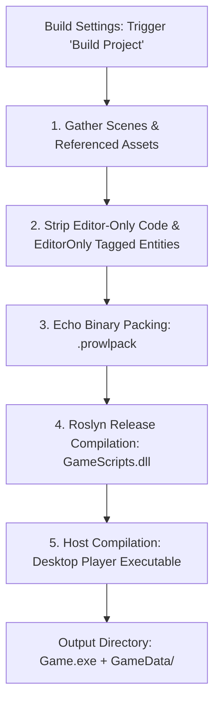

# 📦 Build System & Desktop Player in Prowl Engine

The ultimate milestone of any development cycle in Prowl Engine is publishing a standalone, highly optimized executable distribution package for commercial platforms (Steam, Epic Games Store, GOG, Itch.io).

Prowl's build pipeline ([`Build/`](file:///c:/Users/SaidR/Documents/GitHub/ProwlStar/Prowl.Editor/Projects/Build)) and the host runtime wrapper ([`Players/Desktop`](file:///c:/Users/SaidR/Documents/GitHub/ProwlStar/Players/Desktop)) package assets, compile game scripts into high-performance Release assemblies, and produce a lightweight native distribution bundle with **zero dependencies on Prowl.Editor**.

---

## 🏗️ Packaging and Compilation Pipeline



---

## 🎛️ Build Settings Configuration

Accessible through **File -> Build Settings** ([`BuildSettingsPanel.cs`](file:///c:/Users/SaidR/Documents/GitHub/ProwlStar/Prowl.Editor/GUI/Panels/BuildSettingsPanel.cs)):

### 1. Scenes in Build
- The sequential list of scenes bundled into the production package.
- The scene declared at **Index 0** serves as the initial boot scene loaded automatically upon application start.

### 2. Target Platforms
Prowl supports cross-compilation across platforms powered by modern .NET 10 runtimes and precompiled native binaries in `Libraries/`:
- **Windows:** Native `.exe` (x64 / x86).
- **Linux:** Native ELF executable (x64 / ARM64).
- **macOS:** Universal `.app` application bundle (Intel & Apple Silicon M-Series).

### 3. Asset Packaging Modes ([`AssetPackagingMode.cs`](file:///c:/Users/SaidR/Documents/GitHub/ProwlStar/Prowl.Runtime/AssetPackagingMode.cs))
- **`SinglePackage`:** Merges all referenced textures, models, and audio clips into a unified compressed binary archive.
- **`PerScenePackages`:** Emits dedicated archive blobs per scene, accelerating level load times and supporting DLC expansion pipelines.

---

## ⚡ Anatomical Layout of an Exported Build

A completed standalone build directory is clean, isolated, and self-contained:

```
MyGame_Release/
├── MyGame.exe                  # Standalone native launcher (Players/Desktop)
├── Prowl.Runtime.dll           # Engine runtime stripped of editor tooling
├── GameScripts.dll             # User gameplay scripts compiled in Release mode
├── Libraries/                  # Platform native wrappers (MiniAudio)
└── GameData/
    ├── Manifest.echo           # PlayerManifest recording scenes and settings
    ├── Settings.echo           # Compiled ProjectSettings
    └── GameAssets.prowlpack    # Compressed binary asset archive
```

---

## 🚀 Production Optimizations

1. **Editor Code Stripping:**
   Any code encapsulated inside `#if PROWL_EDITOR` or entities marked with the `EditorOnly` tag are stripped from the output assembly and scene assets.
2. **Release JIT Optimizations (.NET 10):**
   C# IL is compiled with Tiered Compilation, Aggressive Inlining, and array bounds-check elimination across vector loops.
3. **Zero File-System Search Overhead:**
   Driven by [`PlayerAssetBackend.cs`](file:///c:/Users/SaidR/Documents/GitHub/ProwlStar/Prowl.Runtime/PlayerAssetBackend.cs), assets are located via direct byte offsets inside binary packages, eliminating operating system file-search latency entirely.

---

## 🔗 Related Topics
- Decoupled runtime architecture: [[⚡ Core Architecture (Runtime vs Editor)]].
- Asset backend: [[🗄️ AssetDatabase & AssetRef]].
- Binary serialization: [[📜 Serialization with Prowl.Echo]].
