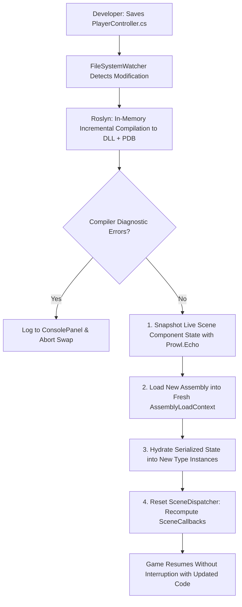

# ⚡ Roslyn Hot Reload & Live Compilation in Prowl Engine

In modern game development, restarting the entire engine or waiting 30 seconds every time a single line of script code is altered shatters developer productivity and flow state.

Prowl Engine incorporates an advanced **Hot Reload** architecture built upon the **Microsoft.CodeAnalysis (Roslyn)** compiler API, orchestrated by [`RoslynScriptBackend.cs`](file:///c:/Users/SaidR/Documents/GitHub/ProwlStar/Prowl.Editor/Projects/Scripting/RoslynScriptBackend.cs) and [`SceneHotReload.cs`](file:///c:/Users/SaidR/Documents/GitHub/ProwlStar/Prowl.Editor/Projects/Scripting/SceneHotReload.cs). It compiles C# script modifications and swaps live assembly code **in under a second without restarting the editor or losing scene play state**.

---

## 🔄 The Live Hot Reload Pipeline

---

## 🧩 Architectural Stages in Depth

### 1. In-Memory Incremental Compilation
- A `FileSystemWatcher` continuously monitors the project's `Scripts/` directory.
- Upon file save, the backend triggers an in-memory Roslyn compilation pass.
- Emits portable binaries and debugging symbol maps (`PDB`) in tens of milliseconds, outputting any diagnostics directly to [`ConsolePanel.cs`](file:///c:/Users/SaidR/Documents/GitHub/ProwlStar/Prowl.Editor/GUI/Panels/ConsolePanel.cs).

### 2. Scene State Retention via Prowl.Echo ([`SceneHotReload.cs`](file:///c:/Users/SaidR/Documents/GitHub/ProwlStar/Prowl.Editor/Projects/Scripting/SceneHotReload.cs))
- To prevent entities from resetting their coordinates, health values, or AI states, the engine utilizes **Prowl.Echo** to capture a deep memory snapshot of all live `MonoBehaviour` fields across the active scene.

### 3. Assembly Swap and Context Migration
- The updated assembly is loaded into an isolated `AssemblyLoadContext`.
- Component references in the scene graph are migrated in place to point to the newly loaded class definitions.

### 4. State Hydration & SceneDispatcher Re-Evaluation
- The serialized data is restored into the fresh type instances.
- The scene dispatcher ([`SceneDispatcher.cs`](file:///c:/Users/SaidR/Documents/GitHub/ProwlStar/Prowl.Runtime/GameObject/SceneDispatcher.cs)) drops cached reflection answers (`Reset()`):
  - If you introduced a new `public override void Update()` callback, the dispatcher immediately identifies the override and binds it into the execution loop on the very next frame.
  - If you removed a callback, the corresponding bitmask flag (`SceneCallbacks`) is stripped, ensuring zero empty method calls.

---

## 🛡️ Hot Reload Best Practices

To ensure completely seamless hot reloads:

1. **Mark Vital State as Serializable:**
   Any gameplay variable intended to survive assembly hot reloads should be decorated with `[SerializeField]`.
2. **Transient State:**
   Fields marked with `[SerializeIgnore]` reset to their initial default type values upon reload.
3. **Cancel Background Threads:**
   If spinning up custom background threads (`new Thread()`), abort them inside `OnDisable()` so they do not execute lingering code against unloaded assembly versions.

---

## 🔗 Related Topics
- Engine dispatching: [[⏱️ Lifecycle & Game Loop]].
- Serialization internals: [[📜 Serialization with Prowl.Echo]].
- Editor architecture: [[🛠️ Prowl.Editor Architecture]].
