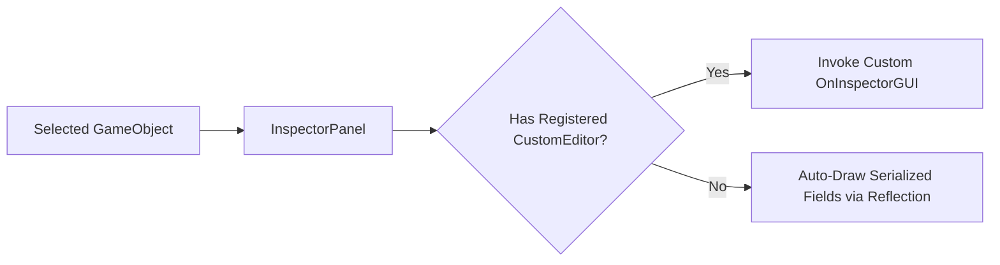

# 🎛️ Custom Editors & Inspector Customization in Prowl Engine

By default, Prowl Engine automatically reflects and draws all serialized fields (`[SerializeField]`) of any [`MonoBehaviour`](file:///c:/Users/SaidR/Documents/GitHub/ProwlStar/Prowl.Runtime/GameObject/MonoBehaviour.cs) inside the [`InspectorPanel`](file:///c:/Users/SaidR/Documents/GitHub/ProwlStar/Prowl.Editor/GUI/Panels/InspectorPanel.cs).

However, to build streamlined level design tools, automated data validators, or designer-friendly interfaces (action buttons, visual asset pickers, conditional warnings), you can craft a dedicated **Custom Editor** by subclassing [`CustomEditor.cs`](file:///c:/Users/SaidR/Documents/GitHub/ProwlStar/Prowl.Editor/GUI/CustomEditor.cs).

---

## 🏗️ The CustomEditor Base Class

To register a custom inspector for an entity component:
1. Decorate the editor class with `[CustomEditor(typeof(TargetComponent))]`.
2. Override `public override void OnInspectorGUI()`.
3. Use **Paper UI** and **EditorGUI** widgets to declare interactive controls.



---

## 💻 Practical Example: Procedural Generator with Custom Tooling

Consider a procedural dungeon generation component:

### The Runtime Component (`Prowl.Runtime`):
```csharp
using Prowl.Runtime;
using Prowl.Vector;

public class DungeonGenerator : MonoBehaviour
{
    [SerializeField] private int _roomCount = 10;
    [SerializeField] private float _roomSpacing = 15f;
    [SerializeField] private bool _generateEnemies = true;

    public int RoomCount { get => _roomCount; set => _roomCount = value; }
    public float RoomSpacing { get => _roomSpacing; set => _roomSpacing = value; }
    public bool GenerateEnemies { get => _generateEnemies; set => _generateEnemies = value; }

    public void GenerateDungeon()
    {
        Debug.Log($"Generating dungeon with {_roomCount} rooms...");
        // Procedural generation logic
    }

    public void ClearDungeon()
    {
        Debug.Log("Dungeon cleared.");
    }
}
```

### The Custom Inspector (`Prowl.Editor`):
```csharp
#if PROWL_EDITOR
using Prowl.Editor;
using Prowl.PaperUI;
using Prowl.Runtime;

[CustomEditor(typeof(DungeonGenerator))]
public class DungeonGeneratorEditor : CustomEditor
{
    public override void OnInspectorGUI()
    {
        // 1. Cast target to concrete component type
        DungeonGenerator generator = (DungeonGenerator)target;

        Paper.Text("Procedural Generation Controller", FontStyle.Bold);
        Paper.Separator();

        // 2. Render responsive input controls
        generator.RoomCount = Paper.SliderInt("Room Count", generator.RoomCount, 1, 100);
        generator.RoomSpacing = Paper.SliderFloat("Room Spacing (m)", generator.RoomSpacing, 5f, 50f);
        generator.GenerateEnemies = Paper.Checkbox("Spawn Enemy Encounters", generator.GenerateEnemies);

        // 3. Render contextual warning banner
        if (generator.RoomCount > 50)
        {
            Paper.PushColor(PaperColor.Text, new Color(1f, 0.7f, 0.2f, 1f));
            Paper.Text("⚠️ Warning: >50 rooms significantly increases generation time.");
            Paper.PopColor();
        }

        Paper.Spacing(8);

        // 4. One-click editor trigger buttons
        if (Paper.Button("🎲 Generate Dungeon Now"))
        {
            generator.GenerateDungeon();
        }

        if (Paper.Button("🗑️ Clear Dungeon"))
        {
            generator.ClearDungeon();
        }
    }
}
#endif
```

---

## 🎨 Essential Paper UI Controls

When authoring custom inspector layouts, Paper UI provides a rich palette of immediate-mode widgets:

- `Paper.Text("Label")`: Plain and formatted text.
- `Paper.Button("Text")`: Clickable button returning `true` during the frame of interaction.
- `Paper.SliderFloat("Label", val, min, max)`: Scalar slider.
- `Paper.Checkbox("Label", boolVal)`: Toggle checkbox.
- `Paper.ColorPicker("Color", colorVal)`: Interactive color picker with HDR and alpha support.
- `Paper.Separator()`: Horizontal divider line.
- `Paper.PushID("Key")` / `Paper.PopID()`: Scopes widget IDs to prevent interaction clashes in lists.

---

## 🔗 Related Topics
- Editor architecture: [[🛠️ Prowl.Editor Architecture]].
- Viewport handles: [[🪄 Scene View Editors & Gizmos]].
- Custom docked windows: [[🪟 Custom Editor Panels]].
