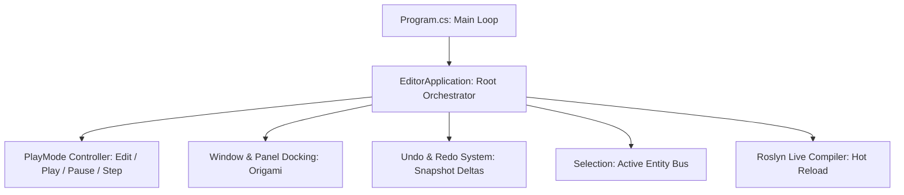

# 🛠️ Prowl.Editor Architecture in Prowl Engine

[`Prowl.Editor`](file:///c:/Users/SaidR/Documents/GitHub/ProwlStar/Prowl.Editor) is the visual integrated authoring environment (IDE) used to compose, edit, debug, and playtest game projects in real time.

It is engineered with a **zero-restart philosophy**: scripts compile live while the editor is running, scenes save and revert instantaneously, and switching between edit and play modes (*PlayMode*) executes in milliseconds without application reloads.

---

## 🏛️ Central Orchestration: EditorApplication

The backbone of the authoring layer is [`EditorApplication.cs`](file:///c:/Users/SaidR/Documents/GitHub/ProwlStar/Prowl.Editor/Core/EditorApplication.cs):

### Execution States:
- **Edit Mode:**
  Physics simulations and default `Update()` loops are quiescent (unless a component declares `[ExecuteAlways]`). Scene view cameras permit free flight navigation, and transformation gizmos manipulate objects in 3D space.
- **Play Mode:**
  An ephemeral in-memory clone of the active scene is constructed. Jitter 2 physics, spatial audio, and game loops execute identically to the standalone production player.
- **Pause & Step:**
  Suspends physics and logic execution, permitting frame-by-frame stepping to diagnose complex physics interactions or projectile collisions.

---

## ↩️ Undo / Redo Architecture

Prowl provides a transactional, crash-proof undo/redo system ([`Undo.cs`](file:///c:/Users/SaidR/Documents/GitHub/ProwlStar/Prowl.Editor/Core/Undo.cs)):
- Prior to property mutation in the Inspector or spatial manipulation via gizmos, the editor records a differential state delta powered by **Prowl.Echo**.
- Pressing `Ctrl + Z` seamlessly restores previous object state without pointer corruption or dangling references.
- Supports entity creation, deletion, hierarchy parenting, and bulk property edits.

---

## 📋 Selection & Clipboard Bus

- **[`Selection.cs`](file:///c:/Users/SaidR/Documents/GitHub/ProwlStar/Prowl.Editor/Core/Selection.cs):** Centrally tracks active `GameObject`, asset file, or component selections across all editor panels.
- **[`GameObjectClipboard.cs`](file:///c:/Users/SaidR/Documents/GitHub/ProwlStar/Prowl.Editor/Core/GameObjectClipboard.cs) & [`ComponentClipboard.cs`](file:///c:/Users/SaidR/Documents/GitHub/ProwlStar/Prowl.Editor/Core/ComponentClipboard.cs):** Support full entity duplication, cross-scene copying, and *"Paste Component Values"* across divergent GameObjects.

---

## 🪟 Core Editor Panels

| Panel | Source Implementation | Purpose |
| :--- | :--- | :--- |
| **Hierarchy** | [`HierarchyPanel.cs`](file:///c:/Users/SaidR/Documents/GitHub/ProwlStar/Prowl.Editor/GUI/Panels/HierarchyPanel.cs) | Scene graph tree with drag-and-drop parenting and multi-selection. |
| **Inspector** | [`InspectorPanel.cs`](file:///c:/Users/SaidR/Documents/GitHub/ProwlStar/Prowl.Editor/GUI/Panels/InspectorPanel.cs) | Component property reflection and `CustomEditor` rendering. |
| **Scene View** | [`SceneViewPanel.cs`](file:///c:/Users/SaidR/Documents/GitHub/ProwlStar/Prowl.Editor/GUI/Panels/SceneViewPanel.cs) | 3D interactive viewport with translation, rotation, and scale gizmos. |
| **Game View** | [`GameViewPanel.cs`](file:///c:/Users/SaidR/Documents/GitHub/ProwlStar/Prowl.Editor/GUI/Panels/GameViewPanel.cs) | Real-time viewport from the player camera perspective. |
| **Project** | [`ProjectPanel.cs`](file:///c:/Users/SaidR/Documents/GitHub/ProwlStar/Prowl.Editor/GUI/Panels/ProjectPanel.cs) | File system asset browser with 3D model and texture thumbnail previews. |
| **Console** | [`ConsolePanel.cs`](file:///c:/Users/SaidR/Documents/GitHub/ProwlStar/Prowl.Editor/GUI/Panels/ConsolePanel.cs) | Interactive log console capturing `Debug.Log`, warnings, and exceptions. |

---

## 🔗 Related Topics
- Custom inspector authoring: [[🎛️ Custom Editors & Inspector Customization]].
- Viewport gizmos: [[🪄 Scene View Editors & Gizmos]].
- Live script compilation: [[⚡ Roslyn Hot Reload & Live Compilation]].
