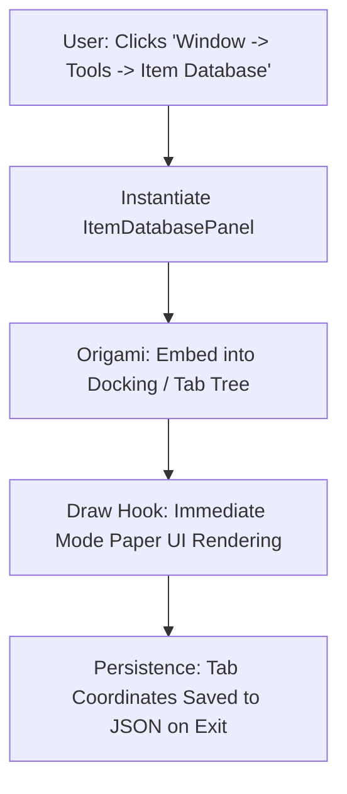

# 🪟 Custom Editor Panels in Prowl Engine

For extensive developer tooling that spans beyond single component inspection (such as quest designers, game balance editors, dialogue tree creators, or runtime telemetry monitors), Prowl Engine enables developers to author **Custom Dockable Editor Panels**.

These panels integrate directly into **Origami's** multi-monitor docking hierarchy, save cleanly to persistent workspace layout profiles, and execute with zero garbage collection overhead powered by **Paper UI**.

---

## 🏗️ Structure of an Editor Panel

To create a custom window panel:
1. Subclass `EditorPanel` (contained inside an Editor assembly or wrapped with `#if PROWL_EDITOR`).
2. Register a top-level menu hook using the `[MenuItem("Category/Tool Name")]` attribute.
3. Override the `Draw()` lifecycle hook to declare IMGUI widgets via Paper UI.



---

## 💻 Complete C# Implementation: Item Database Management Tool

```csharp
#if PROWL_EDITOR
using System.Collections.Generic;
using Prowl.Editor;
using Prowl.PaperUI;
using Prowl.Runtime;
using Prowl.Vector;

public class ItemDatabasePanel : EditorPanel
{
    // 1. Tab display label
    public override string Title => "📦 Item Manager";

    // 2. Register into editor menu bar
    [MenuItem("Window/Tools/Item Manager")]
    public static void OpenPanel()
    {
        EditorApplication.Instance.OpenPanel<ItemDatabasePanel>();
    }

    private string _searchFilter = "";
    private int _selectedItemIndex = -1;

    private readonly List<string> _dummyItems = new()
    {
        "Iron Longsword",
        "Healing Potion",
        "Wooden Tower Shield",
        "Elven Bow",
        "Full Plate Armor"
    };

    // 3. Declare panel immediate-mode layout
    public override void Draw()
    {
        Paper.Text("Global Master Item Database", FontStyle.Bold);
        Paper.Separator();

        // Search bar
        _searchFilter = Paper.InputField("Search:", _searchFilter);
        Paper.Spacing(4);

        // 2-Column partitioned layout: List on Left, Properties on Right
        Paper.BeginColumns(2);

        // --- COLUMN 1: Master List ---
        Paper.SetColumnWidth(0, 220f);
        Paper.Text("Catalog Items:");

        for (int i = 0; i < _dummyItems.Count; i++)
        {
            string item = _dummyItems[i];
            if (!string.IsNullOrEmpty(_searchFilter) && !item.Contains(_searchFilter, System.StringComparison.OrdinalIgnoreCase))
                continue;

            bool isSelected = (_selectedItemIndex == i);
            if (Paper.Selectable(item, isSelected))
            {
                _selectedItemIndex = i;
            }
        }

        Paper.NextColumn();

        // --- COLUMN 2: Selected Item Inspector ---
        if (_selectedItemIndex >= 0 && _selectedItemIndex < _dummyItems.Count)
        {
            Paper.Text($"Attributes: {_dummyItems[_selectedItemIndex]}", FontStyle.Bold);
            Paper.Separator();

            Paper.Text("Gameplay Modifiers:");
            Paper.SliderInt("Gold Value", 150, 1, 5000);
            Paper.SliderFloat("Weight (kg)", 3.5f, 0.1f, 50f);

            if (Paper.Button("Spawn Prefab into Scene"))
            {
                Debug.Log($"Spawning prefab for {_dummyItems[_selectedItemIndex]}...");
            }
        }
        else
        {
            Paper.Text("Select an item from the master catalog to inspect properties.");
        }

        Paper.EndColumns();
    }
}
#endif
```

---

## 🎛️ EditorPanel Lifecycle Hooks

An `EditorPanel` exposes structured lifecycle methods:

- **`OnEnable()`:** Triggered upon window creation or when restored upon launching the editor. Ideal for subscribing to asset updates or loading data from disk.
- **`OnDisable()`:** Invoked when the tab is closed or the editor shuts down.
- **`Update()`:** Invoked per frame regardless of whether the panel is in focus (useful for asynchronous background tasks).
- **`Draw()`:** The main UI drawing loop where Paper UI layout calls are declared.

---

## 🔗 Related Topics
- Editor core: [[🛠️ Prowl.Editor Architecture]].
- Origami docking framework: [[🖋️ Editor UI Internals (Paper, Origami, Quill)]].
- Custom inspectors: [[🎛️ Custom Editors & Inspector Customization]].
