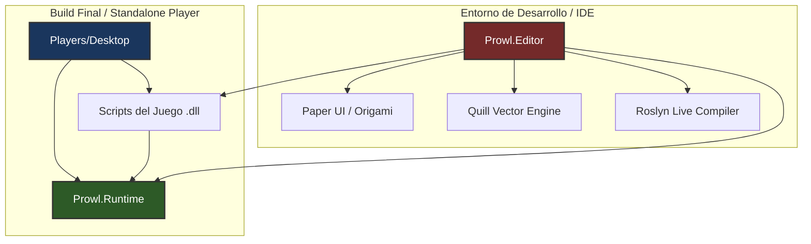

# ⚡ Arquitectura General (Runtime vs Editor)

Uno de los pilares de ingeniería más importantes en **Prowl Engine** es la separación estricta entre el entorno de ejecución (**Runtime**) y el entorno de herramientas (**Editor**).

En muchos motores de juegos comerciales, el código del editor y del runtime se encuentra fuertemente entrelazado, lo que genera dependencias ocultas, sobrecarga innecesaria en ejecutables de producción y riesgos de que código exclusivo de herramientas termine empaquetado en el juego final.

En Prowl, esta frontera es infranqueable a nivel de compilación y ensamblados.

---

## 🏛️ Diagrama de Ensamblados y Dependencias



---

## 🟢 1. Prowl.Runtime: El Motor Puro

[`Prowl.Runtime`](file:///c:/Users/SaidR/Documents/GitHub/ProwlStar/Prowl.Runtime) es un ensamblado completamente autónomo. No contiene ninguna referencia a `Prowl.Editor`, ni a interfaces gráficas del editor, ni a librerías de compilación.

### Responsabilidades del Runtime:
1. **Loop Principal del Motor:** Controlado en [`Game.cs`](file:///c:/Users/SaidR/Documents/GitHub/ProwlStar/Prowl.Runtime/Game.cs) y [`Application.cs`](file:///c:/Users/SaidR/Documents/GitHub/ProwlStar/Prowl.Runtime/Application.cs).
2. **Escena y Despacho:** Grafo de objetos [`GameObject`](file:///c:/Users/SaidR/Documents/GitHub/ProwlStar/Prowl.Runtime/GameObject/GameObject.cs) y despacho por máscara binaria en [`SceneDispatcher.cs`](file:///c:/Users/SaidR/Documents/GitHub/ProwlStar/Prowl.Runtime/GameObject/SceneDispatcher.cs).
3. **Pipeline Gráfico:** [`DefaultRenderPipeline.cs`](file:///c:/Users/SaidR/Documents/GitHub/ProwlStar/Prowl.Runtime/Rendering/DefaultRenderPipeline.cs) con aceleración espacial [`LightBVH.cs`](file:///c:/Users/SaidR/Documents/GitHub/ProwlStar/Prowl.Runtime/Rendering/LightBVH.cs).
4. **Física Determinista:** Wrapper de alto rendimiento sobre Jitter Physics 2 ([`PhysicsWorld.cs`](file:///c:/Users/SaidR/Documents/GitHub/ProwlStar/Prowl.Runtime/Physics/PhysicsWorld.cs)).
5. **Audio Espacial:** Capa administrada sobre MiniAudio nativo.
6. **Input:** Sistema desacoplado de mapas de acción y bindings.
7. **Resolución de Assets:** [`AssetDatabase`](file:///c:/Users/SaidR/Documents/GitHub/ProwlStar/Prowl.Runtime/AssetDatabase.cs) abstracto, cargador [`PlayerAssetBackend.cs`](file:///c:/Users/SaidR/Documents/GitHub/ProwlStar/Prowl.Runtime/PlayerAssetBackend.cs) para juegos construidos.

> [!TIP]
> **Envío sin Editor:** Puedes referenciar directamente `Prowl.Runtime.dll` en una aplicación de consola o juego personalizado sin necesidad de instalar o arrancar el Editor.

---

## 🔴 2. Prowl.Editor: El Entorno de Autoría

[`Prowl.Editor`](file:///c:/Users/SaidR/Documents/GitHub/ProwlStar/Prowl.Editor) es una aplicación cliente enriquecida construida **sobre** `Prowl.Runtime`.

### Responsabilidades del Editor:
1. **Interfaz Visual:** Construida con bibliotecas en modo inmediato (**Paper UI**, **Origami**) y renderizado vectorial (**Quill**).
2. **Espacio de Trabajo y Paneles:**
   - [`HierarchyPanel`](file:///c:/Users/SaidR/Documents/GitHub/ProwlStar/Prowl.Editor/GUI/Panels/HierarchyPanel.cs): Árbol de la escena en tiempo real con drag & drop.
   - [`InspectorPanel`](file:///c:/Users/SaidR/Documents/GitHub/ProwlStar/Prowl.Editor/GUI/Panels/InspectorPanel.cs): Serialización y edición interactiva de componentes mediante `CustomEditor`.
   - [`SceneViewPanel`](file:///c:/Users/SaidR/Documents/GitHub/ProwlStar/Prowl.Editor/GUI/Panels/SceneViewPanel.cs): Cámara de edición, gizmos de manipulación (traslación, rotación, escala) y rendering de depuración.
   - [`GameViewPanel`](file:///c:/Users/SaidR/Documents/GitHub/ProwlStar/Prowl.Editor/GUI/Panels/GameViewPanel.cs): Vista de juego con captura de entrada simulada.
   - [`ProjectPanel`](file:///c:/Users/SaidR/Documents/GitHub/ProwlStar/Prowl.Editor/GUI/Panels/ProjectPanel.cs): Explorador de activos, importación y previsualización 3D/audio.
3. **Compilación en Caliente (Hot-Reload):**
   Utiliza las APIs de Roslyn ([`RoslynScriptBackend.cs`](file:///c:/Users/SaidR/Documents/GitHub/ProwlStar/Prowl.Editor/Projects/Scripting/RoslynScriptBackend.cs)) para detectar modificaciones en los archivos `.cs` del proyecto, recompilar los ensamblados en memoria y transferir el estado de los componentes vivos sin reiniciar la sesión.
4. **Sistema de Prefabs Avanzado:**
   Rastreo de deltas de propiedades, anidamiento de prefabs y aplicación/reversión de overrides en [`PrefabUtility.cs`](file:///c:/Users/SaidR/Documents/GitHub/ProwlStar/Prowl.Editor/Prefabs/PrefabUtility.cs).

---

## 🔵 3. Players/Desktop: El Ejecutable de Distribución

Ubicado en [`Players/Desktop`](file:///c:/Users/SaidR/Documents/GitHub/ProwlStar/Players/Desktop), este proyecto es la plantilla de host para construir el ejecutable final del juego (`.exe` en Windows, binario en Linux/Mac).

### Flujo de Ejecución en Standalone:
1. **Punto de Entrada (`Program.cs`):** Inicia la ventana nativa mediante el subsistema de ventanas.
2. **Carga del Manifiesto:** Lee `PlayerManifest` y la configuración empaquetada.
3. **Inicialización de Assets:** Asigna `AssetDatabase.Current = new PlayerAssetBackend(...)` para resolver activos desde archivos empaquetados comprimidos.
4. **Carga de Escena Inicial:** Instancia la primera escena definida en la configuración del proyecto y entra al bucle continuo de `Game.Run()`.

---

## 🛡️ Regla de Oro para el Desarrollador

```csharp
// ❌ INCORRECTO: Jamás importes Prowl.Editor en un MonoBehaviour de juego
using Prowl.Editor; // Provocará fallo de compilación al exportar el Standalone Player

// ✅ CORRECTO: Si requieres código exclusivo de editor, usa directivas de compilación:
#if PROWL_EDITOR
using Prowl.Editor;
#endif

public class MyGameComponent : MonoBehaviour
{
    public float Speed = 5f;

#if PROWL_EDITOR
    // Este código solo se compilará dentro del entorno del Editor
    public override void DrawGizmos()
    {
        // Dibujar gizmo de depuración
    }
#endif
}
```

---

## 🔗 Temas Relacionados
- Aprende a extender el inspector: [[🎛️ Custom Editors e Inspector Personalizado]].
- Conoce el flujo de compilación y empaquetado: [[📦 Build System y Exportación Standalone (Desktop Player)]].
- Explora la gestión de escenas: [[🧱 GameObjects y Componentes]].
