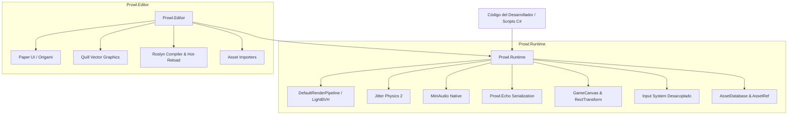

# 🧭 Qué es Prowl Engine

**Prowl Engine** (ProwlStar) es un motor de videojuegos 3D y 2D de código abierto bajo licencia **MIT**, desarrollado íntegramente en **C# moderno sobre .NET 10**. Nació con el objetivo de proporcionar a la comunidad un entorno productivo, potente y transparente, manteniendo una arquitectura y API extremadamente cercana a **Unity**, pero eliminando las cajas negras propietarias, la sobrecarga innecesaria y las ataduras a un único ecosistema comercial.

---

## 🎯 Filosofía de Diseño

1. **C# Puro y Moderno (.NET 10):**
   A diferencia de otros motores que usan C++ como capa interna con bindings hacia C# (lo que introduce marshaling y pérdida de control), Prowl está escrito en C# desde el kernel hasta los editores. Esto permite depuración completa con breakpoints en cualquier nivel del motor, profiling directo y portabilidad nativa.

2. **KISS (Keep It Simple, Stupid):**
   Las abstracciones se mantienen delgadas y directas. No hay jerarquías de herencia artificialmente profundas ni código generado críptico.

3. **Desacoplamiento Estricto Runtime vs Editor:**
   `Prowl.Runtime` es una biblioteca completamente autónoma. Un juego empaquetado no compila ni incluye ninguna referencia a `Prowl.Editor`, lo que garantiza ejecutables ligeros y arranque ultrarrápido.

4. **Zero GC en Rutas Críticas:**
   Los bucles principales de ejecución (`Update`, `FixedUpdate`, `RenderPass`, `PhysicsStep`) están diseñados para operar sin generar memoria en el Garbage Collector (GC), utilizando tipos por valor (`struct`), búferes estáticos preasignados y APIs `in`/`ref`.

---

## 🏗️ Pila Tecnológica del Motor

---

## ⚡ Capacidades Principales

### 1. Scripting y Modelo de Entidades
- Paradigma `GameObject` y `MonoBehaviour` idéntico al estándar de la industria.
- Sistema de despacho de eventos optimizado mediante `SceneDispatcher` (evaluación de bitmasks en lugar de reflexión en cada frame).
- Soporte para **Hot Reloading** con Roslyn sin perder el estado de la escena en ejecución.

### 2. Gráficos y Renderizado de Vanguardia
- Pipeline de renderizado modular (**DefaultRenderPipeline**) con soporte Forward/Deferred.
- Aceleración espacial **LightBVH** para calcular la influencia de cientos de luces dinámicas en tiempo real con sombras proyectadas vía **ShadowAtlas**.
- Sombreado basado en la física (PBR) con mapas de rugosidad, metalicidad, normales, oclusión ambiental y LUTs BRDF precomputadas.
- Renderizado de mallas instanciadas (`InstancedMeshRenderable`) y mallas con deformación de huesos (`SkinnedMeshRenderer`).
- Anti-aliasing por SMAA (Subpixel Morphological Anti-Aliasing).

### 3. Física de Alta Precisión (Jitter Physics 2)
- Simulación 3D multihilo rápida y estable.
- Cuerpos rígidos (`Rigidbody3D`) con modos dinámico, cinemático y estático, y soporte para interpolación/extrapolación visual.
- Soporte integral de colisionadores: cajas, esferas, cápsulas, cilindros, conos, mallas complejas y terrenos (`TerrainCollider`).
- Restricciones cinemáticas y uniones: rótulas (`BallSocket`), bisagras (`HingeJoint`), pistones (`PrismaticJoint`), uniones universales y motores.
- Físicas especializadas para vehículos (`WheelCollider`) y controladores de personajes cinemáticos (`CharacterController`).

### 4. Audio Espacial 3D (MiniAudio)
- Backend nativo integrado para Windows, Linux, macOS y Android.
- Espacialización de audio 3D con atenuación de distancia y efecto Doppler.
- Mezclador de audio profesional (`AudioMixer`) con buses agrupados y transiciones suaves de instantáneas (`Snapshots`).
- Cadena de efectos DSP: reverberación, delays, filtros pasabajos/pasaaltos y phaser.

### 5. Interfaz de Usuario (UI) Doble
- **Game UI:** Basado en `GameCanvas`, `RectTransform` y componentes interactivos (`UIButton`, `UISlider`, `UIInputField`, `UIScrollRect`) con `EventSystem` desacoplado para teclado, ratón y gamepad.
- **Editor UI:** Motor visual en modo inmediato (*Immediate Mode*) ultrarrápido desarrollado con **Paper UI**, **Origami** y renderizado vectorial **Quill**.

### 6. Serialización y Gestión de Assets
- Serialización mediante **Prowl.Echo**, un serializador ultra veloz sin la pesadez de los archivos YAML monolíticos.
- Sistema de activos referenciados por identificadores únicos (`Guid`) con carga perezosa y recolección por tiempo de inactividad (`AssetRef<T>`).

---

## 🔗 Navegación Rápida
- ¿Vienes de Unity? Lee: [[🔄 Comparativa y Migración desde Unity]].
- Para entender la división modular: [[⚡ Arquitectura General (Runtime vs Editor)]].
- Para comenzar a programar: [[⏱️ Ciclo de Vida y Game Loop]].
