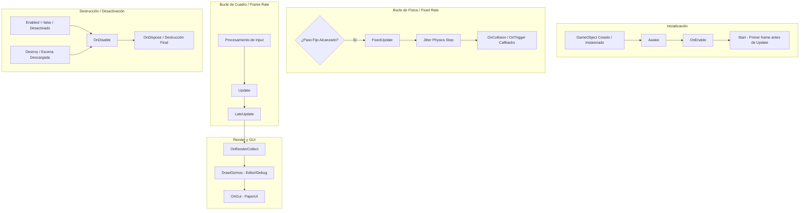

# ⏱️ Ciclo de Vida y Game Loop en Prowl Engine

El ciclo de vida de un juego en **Prowl Engine** está orquestado por dos componentes centrales: el bucle principal de la aplicación ([`Game.cs`](file:///c:/Users/SaidR/Documents/GitHub/ProwlStar/Prowl.Runtime/Game.cs)) y el despachador de eventos de la escena ([`SceneDispatcher.cs`](file:///c:/Users/SaidR/Documents/GitHub/ProwlStar/Prowl.Runtime/GameObject/SceneDispatcher.cs)).

A diferencia de Unity, donde los mensajes mágicos se invocan mediante reflexión interna en C++, en Prowl los métodos de ciclo de vida son **métodos virtuales** que se resuelven y almacenan en caché mediante máscaras de bits (`SceneCallbacks`), lo que elimina cualquier costo de reflexión o llamadas vacías en cada frame.

---

## 🔄 Diagrama del Ciclo de Vida Completo



---

## ⚡ El Rol de SceneDispatcher

El motor utiliza [`SceneDispatcher`](file:///c:/Users/SaidR/Documents/GitHub/ProwlStar/Prowl.Runtime/GameObject/SceneDispatcher.cs) para organizar la ejecución de todos los componentes activos.

### Cómo funciona internamente:
1. **Detección Única por Tipo (`Compute`):**
   Cuando un tipo derivado de `MonoBehaviour` entra en la escena por primera vez, el despachador analiza qué métodos virtuales han sido sobreescritos (`OverridesVirtual`).
2. **Máscara Binaria (`SceneCallbacks`):**
   Genera una bandera binaria:
   ```csharp
   [Flags]
   internal enum SceneCallbacks
   {
       None = 0,
       Start = 1 << 0,
       Update = 1 << 1,
       LateUpdate = 1 << 2,
       FixedUpdate = 1 << 3,
       RenderCollect = 1 << 4,
       DrawGizmos = 1 << 5,
       OnGui = 1 << 6,
       CollisionBegin = 1 << 7,
       CollisionEnd = 1 << 8,
       TriggerEnter = 1 << 9,
       TriggerStay = 1 << 10,
       TriggerExit = 1 << 11,
   }
   ```
3. **Despacho Directo sin Búsquedas:**
   En cada tick, la comprobación para saber si un componente debe ejecutarse es una simple operación a nivel de bits: `(callbacks & SceneCallbacks.Update) != 0`. Si no sobrescribiste el método, el motor **ni siquiera sabe que tu componente existe** en ese bucle.

---

## 📋 Métodos del Ciclo de Vida en Detalle

### 1. Inicialización
- `Awake()`: Se llama inmediatamente cuando el `MonoBehaviour` es añadido al `GameObject` o durante la deserialización de la escena. Es el lugar ideal para inicializar variables internas y cachear referencias de componentes locales.
- `OnEnable()`: Se dispara cada vez que el componente pasa a estar habilitado y activo en la jerarquía (`EnabledInHierarchy == true`). Se ejecuta tanto en PlayMode como con el atributo `[ExecuteAlways]`.
- `Start()`: Se ejecuta una única vez en la vida del componente, antes del primer frame en el que se ejecuta `Update()`. Es seguro para vincular dependencias externas con otros GameObjects ya inicializados.

### 2. Bucle de Simulación Física (`FixedUpdate`)
- Se invoca a intervalos regulares de tiempo fijo (`Physics.FixedDeltaTime`), independientemente de los FPS de la pantalla.
- Toda la manipulación de fuerzas (`rb.AddForce(...)`), torques y velocidades debe ocurrir aquí.
- Los eventos de contacto de física (`OnCollisionBegin`, `OnCollisionEnd`, `OnTriggerEnter`, `OnTriggerStay`, `OnTriggerExit`) se despachan inmediatamente después del paso de simulación de Jitter.

### 3. Bucle de Lógica por Cuadro (`Update` y `LateUpdate`)
- `Update()`: Se llama una vez por fotograma. Se utiliza para temporizadores, lectura de input y lógica de juego general.
- `LateUpdate()`: Se invoca después de que todos los `Update()` de la escena hayan concluido. Es el lugar ideal para cámaras de seguimiento de personajes, para asegurar que el objetivo ya se ha movido por completo.

### 4. Ciclo Gráfico y UI
- `OnRenderCollect()`: Permite a un componente registrar elementos renderizables o comandos en el pipeline gráfico antes de que se dibuje la escena.
- `DrawGizmos()`: Se ejecuta en el Editor para dibujar volúmenes de depuración, iconos y líneas en la vista de escena.
- `OnGui()`: Dibuja elementos de interfaz en modo inmediato con PaperUI.

### 5. Finalización y Desecho
- `OnDisable()`: Se dispara cuando el componente o su GameObject padre es desactivado.
- `OnDispose()`: Se llama cuando el objeto es destruido definitivamente. Es la última oportunidad para liberar recursos no administrados o cancelar suscripciones a eventos globales.

---

## 💻 Ejemplo Práctico de Implementación

```csharp
using Prowl.Runtime;
using Prowl.Vector;

public class PlayerLifecycleDemo : MonoBehaviour
{
    private Rigidbody3D _rb;
    private Float3 _moveInput;
    private float _moveSpeed = 8.0f;

    public override void Awake()
    {
        base.Awake();
        // Caching de componentes locales (Zero GC)
        TryGetComponent<Rigidbody3D>(out _rb);
    }

    public override void OnEnable()
    {
        base.OnEnable();
        // Suscripción a eventos
    }

    public override void Start()
    {
        base.Start();
        // Vinculación con otros sistemas
    }

    public override void Update()
    {
        base.Update();
        // Captura de entrada
        float x = (Input.GetKey(Key.D) ? 1 : 0) - (Input.GetKey(Key.A) ? 1 : 0);
        float z = (Input.GetKey(Key.W) ? 1 : 0) - (Input.GetKey(Key.S) ? 1 : 0);
        _moveInput = new Float3(x, 0, z);
    }

    public override void FixedUpdate()
    {
        base.FixedUpdate();
        // Aplicación física
        if (_rb.IsValid() && _moveInput.sqrMagnitude > 0.001f)
        {
            Float3 force = _moveInput * _moveSpeed;
            _rb.AddForce(force, ForceMode.Force);
        }
    }

    public override void OnDisable()
    {
        base.OnDisable();
        // Cancelar tareas o desuscribirse de eventos
    }
}
```

---

## 🔗 Navegación
- Aprende más sobre la clase base: [[🧬 MonoBehaviour en Prowl]].
- Conoce el modelo de composición: [[🧱 GameObjects y Componentes]].
- Optimiza tus bucles: [[🎯 Buenas Prácticas y Rendimiento (Zero GC)]].
