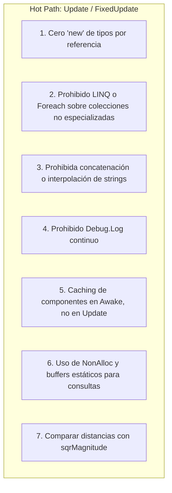

# 🎯 Buenas Prácticas y Rendimiento (Zero GC) en Prowl Engine

En videojuegos de alto rendimiento construidos sobre plataformas gestionadas (.NET), el recolector de basura (**Garbage Collector o GC**) es la causa número uno de tirones (*stutter* o *frame drops*). Cuando el GC se activa para limpiar objetos temporales de corta vida, detiene los hilos de ejecución (*Stop-the-World*), rompiendo la fluidez a 60 o 120 FPS.

En Prowl Engine, la regla de oro para cualquier código que se ejecute en rutas críticas (**Hot Paths**: `Update`, `FixedUpdate`, `LateUpdate`, pasos de física y renderizado) es: **CERO ASIGNACIONES EN EL HEAP (ZERO GC)**.

---

## 🛑 Las 7 Reglas Cardinales del Hot Path



---

## 🔍 Análisis Detallado de Patrones y Soluciones

### 1. Prohibido `new` de Clases en Bucles por Frame
Los tipos por referencia (`class`) se asignan en el Heap del GC. Los tipos por valor (`struct`) en la pila (*Stack*).
```csharp
// ❌ INCORRECTO: Genera basura por frame en el GC
public override void Update()
{
    base.Update();
    List<Enemy> enemies = new List<Enemy>(); // 💥 Alloc en cada frame
}

// ✅ CORRECTO: Reutilizar colecciones preasignadas
private readonly List<Enemy> _cachedEnemies = new(64);

public override void Update()
{
    base.Update();
    _cachedEnemies.Clear(); // No libera la memoria, solo resetea el contador (0 Alloc)
}
```

---

### 2. Prohibido LINQ en Bucles de Juego
Las consultas LINQ (`.Where()`, `.Select()`, `.OrderBy()`, `.FirstOrDefault()`) crean delegados anónimos, iteradores y cierres (*closures*) en el Heap en cada llamada.
```csharp
// ❌ INCORRECTO: Múltiples asignaciones de memoria invisibles
var closest = _enemies.Where(e => e.IsAlive).OrderBy(e => (e.Position - pos).sqrMagnitude).FirstOrDefault();

// ✅ CORRECTO: Bucle clásico for indexado con tipos por valor
Enemy bestTarget = null;
float minSqrDist = float.MaxValue;

for (int i = 0; i < _enemies.Count; i++)
{
    Enemy e = _enemies[i];
    if (!e.IsAlive) continue;

    float d = (e.Position - pos).sqrMagnitude;
    if (d < minSqrDist)
    {
        minSqrDist = d;
        bestTarget = e;
    }
}
```

---

### 3. Strings y `Debug.Log`: Coste Invisible
Los strings en .NET son inmutables. Toda concatenación (`+`) o interpolación (`$"Valor: {x}"`) genera un nuevo objeto string en memoria.
```csharp
// ❌ INCORRECTO: Asignación de strings continua + overhead de I/O en consola
public override void Update()
{
    base.Update();
    Debug.Log($"Posición actual: {Transform.Position.x}, {Transform.Position.y}"); // 💥 Catastrófico para los FPS
}

// ✅ CORRECTO: Logs condicionales solo en eventos clave o inicialización
public override void Awake()
{
    base.Awake();
    Debug.Log("Sistema inicializado correctamente.");
}
```

---

### 4. Consultas Físicas: Uso de Buffers `NonAlloc`
Al lanzar rayos o verificar áreas de impacto, usa variantes `NonAlloc` con búferes preasignados.
```csharp
// ❌ INCORRECTO: RaycastAll asigna un nuevo array en cada disparo
RaycastHit[] hits = Physics.RaycastAll(ray, maxDistance);

// ✅ CORRECTO: Buffer estático reutilizable
private static readonly RaycastHit[] s_hitBuffer = new RaycastHit[16];

public void CheckObstacles()
{
    int hitCount = Physics.RaycastNonAlloc(Transform.Position, Transform.Forward, s_hitBuffer, 10.0f);
    for (int i = 0; i < hitCount; i++)
    {
        ref readonly RaycastHit hit = ref s_hitBuffer[i];
        // Procesar impacto sin ninguna asignación
    }
}
```

---

### 5. Comparaciones de Distancia: `sqrMagnitude` vs `Distance`
Calcular la raíz cuadrada (`Math.Sqrt`) es una de las operaciones matemáticas más costosas en la CPU.
```csharp
// ❌ LENTO: Calcula raíz cuadrada innecesariamente
float distance = Float3.Distance(Transform.Position, targetPos);
if (distance < 5.0f) { ... }

// ✅ RÁPIDO: Comparar con la distancia al cuadrado (5 * 5 = 25)
float sqrDist = (Transform.Position - targetPos).sqrMagnitude;
if (sqrDist < 25.0f) { ... }
```

---

### 6. Comparación de Tags: `CompareTag`
```csharp
// ❌ INCORRECTO: .Tag == genera un string copiado en memoria
if (other.Tag == "Player") { }

// ✅ CORRECTO: Comparación optimizada sin allocs
if (other.CompareTag("Player")) { }
```

---

### 7. Uso de Object Pooling para Entidades Frecuentes
Balas, partículas y efectos visuales temporales deben reutilizarse mediante un pool de objetos en lugar de ser instanciados y destruidos continuamente:

```csharp
public class BulletPool : MonoBehaviour
{
    [SerializeField] private AssetRef<Prefab> _bulletPrefab;
    [SerializeField] private int _initialPoolSize = 50;

    private readonly Queue<GameObject> _pool = new();

    public override void Awake()
    {
        base.Awake();
        for (int i = 0; i < _initialPoolSize; i++)
        {
            GameObject b = GameObject.Instantiate(_bulletPrefab.Res);
            b.Enabled = false;
            _pool.Enqueue(b);
        }
    }

    public GameObject Spawn(Float3 position, Quaternion rotation)
    {
        GameObject b = _pool.Count > 0 ? _pool.Dequeue() : GameObject.Instantiate(_bulletPrefab.Res);
        b.Transform.Position = position;
        b.Transform.Rotation = rotation;
        b.Enabled = true;
        return b;
    }

    public void Despawn(GameObject b)
    {
        b.Enabled = false;
        _pool.Enqueue(b);
    }
}
```

---

## 🔗 Temas Relacionados
- Ciclo de vida y game loop: [[⏱️ Ciclo de Vida y Game Loop]].
- Consultas de física sin alloc: [[🎯 Raycasting y Shape Queries]].
- Materiales y batches de renderizado: [[🔮 Materiales, Shaders y PropertyState]].
