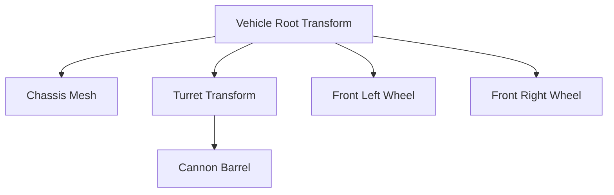

# 📐 Transform y Jerarquías en Prowl Engine

La representación espacial y la estructura de árbol de cualquier entidad en la escena está gobernada por la clase [`Transform`](file:///c:/Users/SaidR/Documents/GitHub/ProwlStar/Prowl.Runtime/Math/Transform.cs) (ubicada en el namespace `Prowl.Vector`).

Cada [`GameObject`](file:///c:/Users/SaidR/Documents/GitHub/ProwlStar/Prowl.Runtime/GameObject/GameObject.cs) posee exactamente una instancia de `Transform`. No es un `MonoBehaviour`, sino un componente estructural intrínseco que administra las matrices de transformación local y de mundo ([`Float4x4`](file:///c:/Users/SaidR/Documents/GitHub/ProwlStar/Prowl.Runtime/Math)), así como las relaciones padre-hijo del grafo de la escena.

---

## 🧭 Sistema de Coordenadas y Tipos Matemáticos

Prowl Engine utiliza un sistema de coordenadas de **mano derecha** (o convención estándar compatible con renderizado moderno) y opera con los tipos matemáticos optimizados de `Prowl.Vector`:

| Tipo | Representación | Uso Común |
| :--- | :--- | :--- |
| `Float2` | Vector 2D `(x, y)` | Coordenadas de pantalla, UVs, UI. |
| `Float3` | Vector 3D `(x, y, z)` | Posición, escala, velocidades, direcciones espaciales. |
| `Float4` | Vector 4D `(x, y, z, w)` | Colores HDR, vectores homogéneos. |
| `Quaternion` | Cuaternión `(x, y, z, w)` | Rotaciones espaciales continuas sin bloqueo de cardán (*Gimbal Lock*). |
| `Float4x4` | Matriz 4x4 | Transformaciones afines (traslación, rotación, proyección). |

---

## 📊 Propiedades de Transform

### 1. Posición
- `Transform.LocalPosition`: Posición relativa respecto a su objeto padre en el espacio local.
- `Transform.Position`: Posición absoluta en el espacio de mundo (calculada mediante la matriz `Parent.LocalToWorldMatrix`).

### 2. Rotación
- `Transform.LocalRotation`: Rotación `Quaternion` en espacio local.
- `Transform.Rotation`: Rotación absoluta en espacio de mundo.
- `Transform.LocalEulerAngles` / `Transform.EulerAngles`: Representación en grados de ángulo (Roll, Pitch, Yaw).

### 3. Escala
- `Transform.LocalScale`: Escala tridimensional en espacio local (`Float3`).
- `Transform.LossyScale`: Escala absoluta aproximada en espacio de mundo (considera las escalas acumuladas de los ancestros).

### 4. Vectores Direccionales Unitarios
- `Transform.Forward`: Vector unitario que apunta hacia el frente del objeto en coordenadas de mundo.
- `Transform.Up`: Vector unitario que apunta hacia arriba.
- `Transform.Right`: Vector unitario que apunta hacia la derecha.

---

## 🌲 Gestión de Jerarquías Padre-Hijo



### Operaciones de Jerarquía en C#:
```csharp
using Prowl.Runtime;
using Prowl.Vector;

// Establecer un nuevo padre preservando la posición en el mundo
childGo.Transform.SetParent(parentGo.Transform, worldPositionStays: true);

// Desvincular del padre (convertir en objeto raíz de escena)
childGo.Transform.SetParent(null);

// Recorrer hijos
int count = parentGo.Transform.ChildCount;
for (int i = 0; i < count; i++)
{
    Transform child = parentGo.Transform.GetChild(i);
    Debug.Log($"Hijo {i}: {child.GameObject.Name}");
}

// Desacoplar todos los hijos
parentGo.Transform.DetachChildren();
```

---

## 🧮 Transformación de Puntos, Direcciones y Vectores

Para convertir coordenadas entre el espacio local de un objeto y el espacio global de mundo:

```csharp
// 1. Transformar un punto (Afectado por Posición, Rotación y Escala)
// Por ejemplo: Determinar la posición en el mundo de la boca de un cañón
Float3 worldMuzzle = cannonTransform.TransformPoint(new Float3(0, 0, 2.5f));

// Inversa: De mundo a espacio local
Float3 localTarget = cannonTransform.InverseTransformPoint(enemyWorldPosition);

// 2. Transformar una dirección (Afectada solo por Rotación, normalizada)
Float3 worldShootDirection = cannonTransform.TransformDirection(Float3.Forward);

// 3. Transformar un vector (Afectado por Rotación y Escala, no traslación)
Float3 worldOffset = cannonTransform.TransformVector(localOffset);
```

---

## 🔄 Métodos de Manipulación Cinemática

```csharp
public class HelicopterRotor : MonoBehaviour
{
    [SerializeField] private float _rotationSpeed = 720.0f;

    public override void Update()
    {
        base.Update();

        // Rotar localmente en el eje Y
        Transform.Rotate(new Float3(0, _rotationSpeed * (float)Time.deltaTime, 0), isWorldSpace: false);
    }
}

public class TurretLook : MonoBehaviour
{
    public void AimAtTarget(Float3 targetPosition)
    {
        // Orientar el frontal hacia el objetivo manteniendo Up alineado
        Transform.LookAt(targetPosition, Float3.Up);
    }
}
```

---

## ⚡ Caché de Matrices y Versionado

Internamente, `Transform` utiliza un contador de versión incremental (`_version`). Las matrices `LocalToWorldMatrix` y `WorldToLocalMatrix` se recalculan de forma perezosa (*lazy evaluation*) únicamente cuando la posición, rotación o escala de este objeto o de cualquiera de sus ancestros ha cambiado.

> [!TIP]
> **Eficiencia Máxima:**
> Modificar `Transform.Position` repetidas veces en el mismo frame invalida el caché matricial. Siempre que acumules movimientos, calcula el vector final y asígnalo una sola vez por frame.

---

## 🔗 Temas Relacionados
- Ciclo de actualización: [[⏱️ Ciclo de Vida y Game Loop]].
- Contenedor de entidades: [[🧱 GameObjects y Componentes]].
- Renderizado de cámaras: [[📷 Cámaras y RenderContext]].
