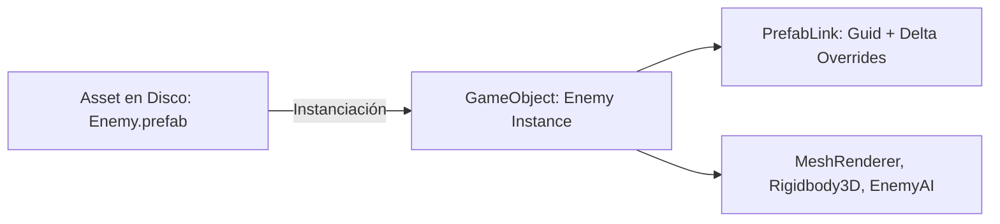

# 📦 Prefabs y Sistema de Overrides en Prowl Engine

Un **Prefab** en Prowl Engine es un activo serializado que encapsula una jerarquía completa de [`GameObject`](file:///c:/Users/SaidR/Documents/GitHub/ProwlStar/Prowl.Runtime/GameObject/GameObject.cs) con todos sus componentes configurados. Permite instanciar entidades preconfiguradas tantas veces como sea necesario, manteniendo un enlace directo con el activo maestro en disco.

Prowl incorpora un sistema avanzado de **Nested Prefabs** (prefabs anidados) y **Property Overrides** (sobrescritura diferencial de propiedades), gestionado en el runtime mediante [`PrefabLink.cs`](file:///c:/Users/SaidR/Documents/GitHub/ProwlStar/Prowl.Runtime/GameObject/PrefabLink.cs) y en el editor mediante [`PrefabUtility.cs`](file:///c:/Users/SaidR/Documents/GitHub/ProwlStar/Prowl.Editor/Prefabs/PrefabUtility.cs).

---

## 🧬 Anatomía de una Instancia de Prefab

Cuando un prefab se arrastra a una escena o se instancia en tiempo de ejecución, no es simplemente una copia desvinculada. El `GameObject` raíz y sus hijos reciben un componente interno de vinculación ([`PrefabLink`](file:///c:/Users/SaidR/Documents/GitHub/ProwlStar/Prowl.Runtime/GameObject/PrefabLink.cs)):



### ¿Qué hace PrefabLink?
1. **Rastreo de Identidad:** Almacena el `Guid` del asset `.prefab` maestro del cual desciende.
2. **Registro de Modificaciones (Deltas):** Registra únicamente las propiedades que el usuario ha modificado localmente en la instancia con respecto al original.
3. **Sincronización:** Si el prefab maestro se actualiza en el editor (por ejemplo, cambiando el material de un arma), todas las instancias en todas las escenas reciben el cambio automáticamente, excepto en las propiedades que tengan un override explícito.

---

## 🛠️ Tipos de Overrides Soportados

El sistema de prefabs de Prowl rastrea tres tipos fundamentales de cambios locales:

1. **Property Overrides:**
   Modificación de valores de campos serializados (`[SerializeField]`), como alterar la vida de un enemigo o su velocidad máxima.
2. **Added Components / Objects:**
   Componentes adicionales añadidos exclusivamente a una instancia particular (por ejemplo, un script de misión temporal adjunto a un NPC).
3. **Removed Components:**
   Componentes originales del prefab que han sido deliberadamente removidos o desactivados en esa instancia específica.

---

## 💻 Instanciación de Prefabs en Código

### 1. Referencia Fuerte mediante `AssetRef<Prefab>`
En Prowl, la forma recomendada de exponer un prefab en el Inspector es mediante `AssetRef<Prefab>`:

```csharp
using Prowl.Runtime;
using Prowl.Runtime.Resources;
using Prowl.Vector;

public class Spawner : MonoBehaviour
{
    // Campo expuesto en el inspector con referencia tipada por GUID
    [SerializeField] private AssetRef<Prefab> _enemyPrefab;
    [SerializeField] private float _spawnInterval = 2.0f;

    private float _timer;

    public override void Update()
    {
        base.Update();

        _timer += (float)Time.deltaTime;
        if (_timer >= _spawnInterval)
        {
            _timer = 0f;
            SpawnEnemy();
        }
    }

    private void SpawnEnemy()
    {
        // Verificar que el asset esté asignado
        if (!_enemyPrefab.IsAvailable) return;

        // Instanciar en la escena actual
        GameObject enemyInstance = GameObject.Instantiate(_enemyPrefab.Res);
        enemyInstance.Transform.Position = Transform.Position + new Float3(0, 1, 0);
        enemyInstance.Transform.Rotation = Transform.Rotation;
    }
}
```

---

## 🎛️ Operaciones de Prefabs en el Editor

Al seleccionar una instancia de Prefab en el `HierarchyPanel` o `InspectorPanel`:

- **Apply Overrides:** Aplica las modificaciones locales de vuelta al archivo `.prefab` en disco, propagando los cambios a todas las instancias existentes en el proyecto.
- **Revert Overrides:** Descarta las modificaciones locales de la instancia y restaura exactamente los valores del prefab original.
- **Unpack / Break Prefab:** Rompe el enlace con el prefab maestro (`PrefabLink`), transformando la jerarquía en GameObjects normales e independientes.

---

## ⚡ Formato de Almacenamiento con Prowl.Echo

A diferencia de los archivos `.prefab` de Unity basados en YAML (pesados, lentos de procesar y propensos a conflictos en Git), Prowl utiliza **Prowl.Echo**:
- Formato estructurado de alta velocidad.
- Serialización binaria para builds y serialización legible para control de versiones.
- Almacenamiento diferencial: las instancias solo guardan el ID del prefab y los deltas, minimizando drásticamente el tamaño de las escenas en disco.

---

## 🔗 Temas Relacionados
- Ciclo de instanciación: [[🧱 GameObjects y Componentes]].
- Serialización profunda: [[📜 Serialización con Prowl.Echo]].
- Base de datos de assets: [[🗄️ AssetDatabase y AssetRef]].
