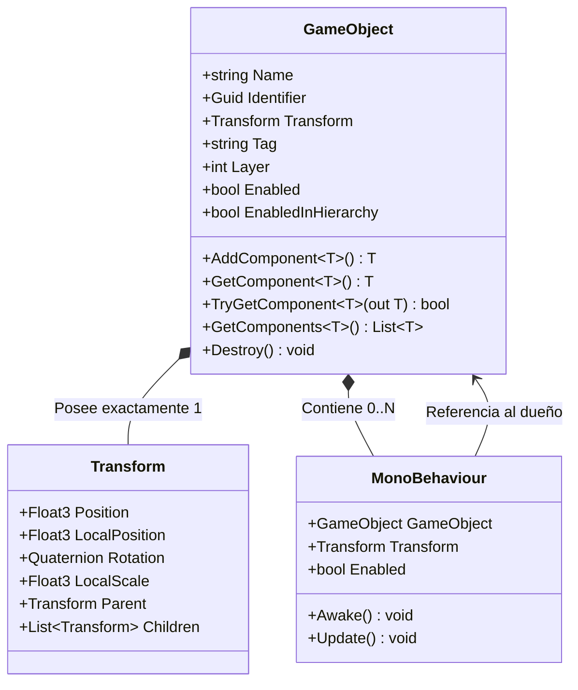

# 🧱 GameObjects y Componentes en Prowl Engine

El núcleo de la escena en **Prowl Engine** se fundamenta en el patrón de composición **GameObject-Componente**. Toda entidad presente en una escena es una instancia de [`GameObject`](file:///c:/Users/SaidR/Documents/GitHub/ProwlStar/Prowl.Runtime/GameObject/GameObject.cs), cuya funcionalidad y comportamiento están determinados por la colección de componentes [`MonoBehaviour`](file:///c:/Users/SaidR/Documents/GitHub/ProwlStar/Prowl.Runtime/GameObject/MonoBehaviour.cs) que tiene asociados.

---

## 🏗️ Anatomía de un GameObject

Un `GameObject` en Prowl no es una clase monolítica con comportamientos rígidos; actúa como un contenedor ligero que posee:
1. **Identidad:** Un nombre (`Name`), un identificador único global (`Guid Identifier`) y una referencia a su escena contenedora (`Scene`).
2. **Transformación Espacial:** Todo `GameObject` posee obligatoriamente un componente [`Transform`](file:///c:/Users/SaidR/Documents/GitHub/ProwlStar/Prowl.Runtime/Math/Transform.cs) que define su posición, rotación, escala y lugar en la jerarquía.
3. **Clasificación:** Un `Tag` (etiqueta de texto para identificación rápida) y una capa física/render (`LayerMask`).
4. **Estado de Activación:** Propiedades `Enabled` y `EnabledInHierarchy`.
5. **Lista de Componentes:** Lista densa de comportamientos `MonoBehaviour`.



---

## 🛠️ Manipulación de GameObjects en Código

### 1. Creación e Instanciación
```csharp
using Prowl.Runtime;
using Prowl.Vector;

// Crear un GameObject vacío
GameObject emptyEntity = new GameObject("MiEntidad");
emptyEntity.Transform.Position = new Float3(0, 5, 0);

// Crear con componentes iniciales
GameObject lightEntity = new GameObject("LuzPrincipal", typeof(PointLight));

// Instanciar un Prefab o GameObject existente
GameObject clone = GameObject.Instantiate(existingPrefab);
clone.Transform.Position = new Float3(10, 0, 0);
```

### 2. Gestión de Componentes
```csharp
// Añadir un componente
Rigidbody3D rb = playerGo.AddComponent<Rigidbody3D>();
rb.Mass = 75f;

// Obtener un componente existente
Camera cam = playerGo.GetComponent<Camera>();

// Obtención segura recomendada (Zero Alloc)
if (playerGo.TryGetComponent<AudioSource>(out var audio))
{
    audio.Play();
}

// Obtener múltiples componentes
var allColliders = playerGo.GetComponents<Collider>();

// Buscar en la jerarquía
CharacterController controller = playerGo.GetComponentInParent<CharacterController>();
MeshRenderer[] meshRenderers = playerGo.GetComponentsInChildren<MeshRenderer>().ToArray();

// Eliminar un componente
playerGo.RemoveComponent(rb);
```

### 3. Activación y Desactivación
```csharp
// Activar o desactivar el GameObject
playerGo.Enabled = false; // Desactiva este objeto y sus hijos

// Comprobar estado en la jerarquía
if (playerGo.EnabledInHierarchy)
{
    // Solo se ejecuta si tanto el objeto como todos sus ancestros están activos
}
```

### 4. Destrucción de Objetos
```csharp
// Destrucción inmediata al final del frame
playerGo.Destroy();

// Destrucción con retraso en segundos
bulletGo.Destroy(3.0f);
```

---

## 🏷️ Sistema de Tags y Layers

Prowl incluye un administrador global de etiquetas y capas ([`TagLayerManager.cs`](file:///c:/Users/SaidR/Documents/GitHub/ProwlStar/Prowl.Runtime/GameObject/TagLayerManager.cs)).

### Uso de Tags
```csharp
// Asignar tag
enemyGo.Tag = "Enemy";

// Comparación eficiente
if (other.CompareTag("Player"))
{
    // Lógica al colisionar con el jugador
}
```

### Uso de Layers
Las capas se utilizan para filtrado de consultas de física (raycasts) y máscaras de renderizado de cámaras.
```csharp
// Asignar capa numérica (0 a 31)
doorGo.Layer = LayerMask.NameToLayer("Interactable");

// Comprobar máscara de capa
LayerMask mask = LayerMask.GetMask("Enemy", "Obstacle");
if (((1 << other.Layer) & mask.Value) != 0)
{
    // El objeto pertenece a una de las capas de la máscara
}
```

---

## ⚡ Rendimiento: Caching y Evitar Búsquedas Repetitivas

> [!CAUTION]
> **Prohibido en Rutas Críticas (`Update`/`FixedUpdate`):**
> Jamás invoques `GetComponent`, `Find`, o `GetComponentsInChildren` dentro de bucles por frame. Estas operaciones recorren listas y generan coste de CPU.

### Patrón Correcto de Caching:
```csharp
public class EnemyAI : MonoBehaviour
{
    private Rigidbody3D _rb;
    private AudioSource _audio;

    public override void Awake()
    {
        base.Awake();
        // Caching una única vez en Awake
        TryGetComponent(out _rb);
        TryGetComponent(out _audio);
    }

    public override void FixedUpdate()
    {
        base.FixedUpdate();
        // Uso directo de la referencia cacheada (Zero GC, O(1))
        if (_rb.IsValid())
        {
            _rb.AddForce(Float3.Forward, ForceMode.Force);
        }
    }
}
```

---

## 🔗 Continuar Leyendo
- Profundiza en el ciclo de vida: [[⏱️ Ciclo de Vida y Game Loop]].
- Conoce la clase base: [[🧬 MonoBehaviour en Prowl]].
- Manipulación de posición y jerarquía: [[📐 Transform y Jerarquías]].
