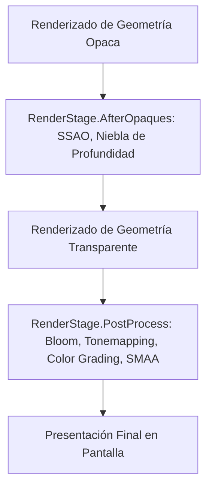

# ✨ Efectos de Post-procesamiento y SMAA en Prowl Engine

Los efectos de post-procesamiento transforman la imagen renderizada aplicando filtros ópticos, corrección de color y anti-aliasing antes de enviar los fotogramas finales a la pantalla.

En Prowl Engine, todos los efectos de pantalla se implementan heredando de la clase base [`ImageEffect`](file:///c:/Users/SaidR/Documents/GitHub/ProwlStar/Prowl.Runtime/Rendering/ImageEffect.cs) y se ejecutan dentro del ciclo de [`DefaultRenderPipeline`](file:///c:/Users/SaidR/Documents/GitHub/ProwlStar/Prowl.Runtime/Rendering/DefaultRenderPipeline.cs). Además, el motor incluye una implementación nativa de **SMAA (Subpixel Morphological Anti-Aliasing)** ([`SMAALookupTextures.cs`](file:///c:/Users/SaidR/Documents/GitHub/ProwlStar/Prowl.Runtime/Rendering/SMAALookupTextures.cs)).

---

## ⏳ Etapas de Inyección (RenderStage)

Un `ImageEffect` puede configurarse para ejecutarse en dos momentos estratégicos del pipeline:



1. **`RenderStage.AfterOpaques`:**
   Se ejecuta justo después de dibujar los objetos opacos y el cielo, pero **antes** de dibujar las partículas y objetos transparentes. Es la fase ideal para Oclusión Ambiental (SSAO), niebla volumétrica y efectos dependientes del buffer de profundidad.
2. **`RenderStage.PostProcess`:**
   Se ejecuta sobre la imagen completa terminada. Es la etapa indicada para Bloom, aberración cromática, viñeta, mapeo tonal HDR->LDR y técnicas de Anti-Aliasing.

---

## 🎯 SMAA: Anti-Aliasing de Calidad Cinematográfica

El anti-aliasing morfológico subpixel (**SMAA**) es una de las soluciones de suavizado de bordes más avanzadas en gráficos en tiempo real:

### ¿Por qué SMAA en vez de FXAA o TAA?
- **Frente a FXAA:** FXAA aplica un filtro de desenfoque general que elimina los dientes de sierra a costa de volver borrosas las texturas finas y el texto. SMAA reconstruye vectores de bordes geométricos precisos, manteniendo las texturas nítidas.
- **Frente a TAA:** TAA requiere vectores de movimiento y reproyección temporal, lo que genera artefactos de estela (*ghosting*) en objetos en movimiento rápido. SMAA 1x no sufre de ghosting.
- **Frente a MSAA:** MSAA multiplica el consumo de memoria del búfer de profundidad y no suaviza bordes dentro de materiales alfa o geometrías transparentes. SMAA opera con coste de memoria mínimo.

### El Pipeline de SMAA en Prowl:
1. **Detección de Bordes:** Analiza variaciones bruscas de luminancia o profundidad entre píxeles vecinos.
2. **Cálculo de Pesos de Mezcla:** Utiliza dos texturas de búsqueda precomputadas (`SearchTex` y `AreaTex` generadas en [`SMAALookupTextures.cs`](file:///c:/Users/SaidR/Documents/GitHub/ProwlStar/Prowl.Runtime/Rendering/SMAALookupTextures.cs)) para determinar la distancia y ángulo del patrón geométrico subpixel.
3. **Mezcla de Vecindad:** Mezcla suavemente los colores a lo largo de la tangente del borde detectado.

---

## 💻 Cómo Crear un Efecto de Post-Procesado Personalizado

Crear un efecto de post-procesamiento (por ejemplo, un filtro de viñeta o visión nocturna) requiere solo unas pocas líneas de código:

```csharp
using Prowl.Runtime;
using Prowl.Runtime.Rendering;
using Prowl.Runtime.Resources;
using Prowl.Vector;

[ExecuteAlways]
public class NightVisionEffect : ImageEffect
{
    [SerializeField] private AssetRef<Shader> _nightVisionShader;
    [SerializeField] private float _intensity = 1.5f;

    private Material _material;

    // Declarar en qué etapa debe ejecutarse
    public override RenderStage Stage => RenderStage.PostProcess;

    public override void OnRenderEffect(RenderContext context)
    {
        if (!_nightVisionShader.IsAvailable) return;

        // Lazy initialization del material
        if (_material.IsNotValid())
            _material = new Material(_nightVisionShader.Res);

        _material.SetFloat("_Intensity", _intensity);

        // Solicitar un RenderTexture temporal del pool
        RenderTexture temp = context.GetTemporaryRT();

        // Aplicar el shader del contexto al búfer temporal
        Graphics.Blit(context.ColorBuffer, temp, _material);

        // Reemplazar el búfer de color principal
        Graphics.Blit(temp, context.ColorBuffer);

        // Liberar la textura temporal (Zero Memory Leaks)
        context.ReleaseTemporaryRT(temp);
    }
}
```

### Activación en la Cámara
Basta con añadir el componente `NightVisionEffect` al mismo `GameObject` que contiene el componente [`Camera`](file:///c:/Users/SaidR/Documents/GitHub/ProwlStar/Prowl.Runtime/Components/Camera.cs). El pipeline detectará automáticamente el efecto durante la fase de recolección (`GatherImageEffects`).

---

## 🔗 Temas Relacionados
- Arquitectura del pipeline: [[🎨 Pipeline de Renderizado (DefaultRenderPipeline)]].
- Contexto de render: [[📷 Cámaras y RenderContext]].
- Shaders y materiales: [[🔮 Materiales, Shaders y PropertyState]].
