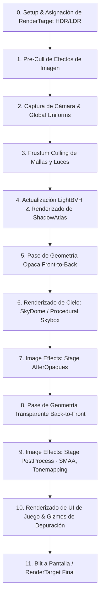

# 🎨 Pipeline de Renderizado (DefaultRenderPipeline) en Prowl Engine

El subsistema gráfico de Prowl Engine está estructurado alrededor de la abstracción [`RenderPipeline`](file:///c:/Users/SaidR/Documents/GitHub/ProwlStar/Prowl.Runtime/Rendering/RenderPipeline.cs), siendo [`DefaultRenderPipeline`](file:///c:/Users/SaidR/Documents/GitHub/ProwlStar/Prowl.Runtime/Rendering/DefaultRenderPipeline.cs) la implementación estándar encargada de dibujar la geometría 3D/2D, resolver iluminación dinámica mediante BVH, calcular sombras en cascada y aplicar efectos de post-procesamiento.

---

## 🔄 Flujo y Etapas del Renderizado (Order of Operations)

El método `Internal_Render` ejecuta las siguientes fases estrictas en cada fotograma:



---

## 🧩 Fases Principales en Detalle

### 1. Frustum Culling y Colección de Renderizables
- La cámara captura una instantánea (`CameraSnapshot`) con sus matrices `View` y `Projection`.
- El método `CollectRenderables` extrae todas las instancias de mallas (`MeshRenderable`, `InstancedMeshRenderable`, `SkinnedMeshRenderable`) y fuentes de luz de la escena activa.
- Se descartan de forma instantánea (`CullRenderables`) todas las entidades cuyos volúmenes delimitadores (`Bounds`) queden fuera del tronco de visión frustum de la cámara o de su máscara de capas (`CullingMask`).

### 2. Aceleración de Luces con LightBVH y Shadow Atlas
- En lugar del enfoque clásico de pasar un número fijo y bajo de luces por shader (p. ej. 4 o 8 luces en Forward tradicional), Prowl utiliza **SceneLightSystem** y **LightBVH** ([`LightBVH.cs`](file:///c:/Users/SaidR/Documents/GitHub/ProwlStar/Prowl.Runtime/Rendering/LightBVH.cs)).
- Todas las luces puntuales y focales activas se insertan en un árbol de jerarquía de volúmenes delimitadores (BVH) empaquetado en texturas de GPU.
- Las sombras se renderizan en una textura global compartida: el **ShadowAtlas** ([`ShadowAtlas.cs`](file:///c:/Users/SaidR/Documents/GitHub/ProwlStar/Prowl.Runtime/Rendering/ShadowAtlas.cs)).

### 3. Pase Opaco (Front-to-Back)
- Las geometrías opacas se ordenan de cerca a lejos con respecto a la cámara.
- Esto aprovecha el **Early-Z testing** del hardware gráfico para evitar ejecutar fragment shaders en píxeles que terminarían ocultos detrás de otros objetos.

### 4. Entorno y Cielo
- Si la cámara tiene activado el dibujo de cielo, se evalúa el componente de atmósfera o el material procedural asignado ([`DefaultShader.ProceduralSkybox`](file:///c:/Users/SaidR/Documents/GitHub/ProwlStar/Prowl.Runtime/Rendering/DefaultRenderPipeline.cs)).

### 5. Pase Transparente (Back-to-Front)
- Las mallas con materiales translúcidos o modos de mezcla alfa (*Alpha Blending*) se ordenan de lejos a cerca para garantizar una composición cromática correcta.

### 6. Pases de Efectos de Imagen (Post-Processing)
- Divididos en dos etapas (`RenderStage.AfterOpaques` y `RenderStage.PostProcess`), permiten inyectar efectos como SSAO, Bloom, Corrección de Color y Anti-aliasing morfológico subpixel (**SMAA**).

---

## ⚙️ Control y Configuración desde la Cámara

Puedes personalizar la forma en que el pipeline procesa la imagen a través del componente [`Camera`](file:///c:/Users/SaidR/Documents/GitHub/ProwlStar/Prowl.Runtime/Components/Camera.cs):

```csharp
using Prowl.Runtime;
using Prowl.Vector;

public class CameraSetup : MonoBehaviour
{
    public override void Awake()
    {
        base.Awake();
        if (TryGetComponent<Camera>(out var cam))
        {
            cam.HDR = true; // Activa buffer de coma flotante de 16 bits
            cam.FarClipPlane = 1000f;
            cam.NearClipPlane = 0.1f;
            cam.FieldOfView = 65f;
            cam.ClearColor = new Color(0.1f, 0.12f, 0.15f, 1f);
        }
    }
}
```

---

## 🔗 Temas Relacionados
- Cámaras y visualización: [[📷 Cámaras y RenderContext]].
- Sistema de iluminación espacial: [[💡 Iluminación, Sombras y LightBVH]].
- Materiales y paso de uniformes: [[🔮 Materiales, Shaders y PropertyState]].
- Anti-aliasing y post-procesado: [[✨ Efectos de Post-procesamiento y SMAA]].
