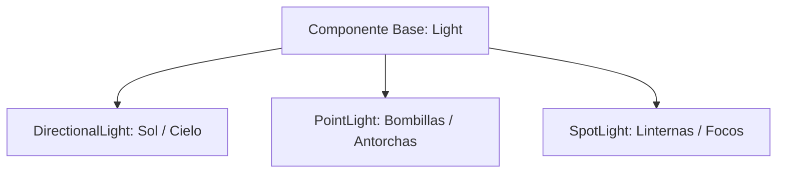

# 💡 Iluminación, Sombras y LightBVH en Prowl Engine

El sistema de iluminación de Prowl Engine combina el cálculo físico de radiación lumínica (PBR) con una arquitectura de aceleración espacial de última generación denominada **LightBVH** ([`LightBVH.cs`](file:///c:/Users/SaidR/Documents/GitHub/ProwlStar/Prowl.Runtime/Rendering/LightBVH.cs)), permitiendo renderizar escenas con **cientos de luces dinámicas en tiempo real** sin penalizar el rendimiento del shader de fragmentos.

---

## 🔦 Tipos de Fuentes de Luz Soportadas



### 1. `DirectionalLight` (Luz Direccional)
- Emula fuentes de luz situadas en el infinito (como el Sol o la Luna).
- Los rayos son perfectamente paralelos en toda la escena.
- Soporta **Sombras en Cascada (CSM - Cascaded Shadow Maps)** para mantener alta resolución de sombras tanto cerca del jugador como en el horizonte lejano.

### 2. `PointLight` (Luz Puntual / Omnidireccional)
- Emite luz en todas las direcciones desde un punto central en el espacio.
- Parámetros: `Intensity`, `Color`, y `Range` (radio de atenuación esférico).
- La atenuación sigue la ley del inverso del cuadrado con un decaimiento suave en el borde exterior.

### 3. `SpotLight` (Luz Focal / Cónica)
- Emite luz en un cono direccional específico.
- Parámetros: `SpotAngle` (ángulo exterior del cono), `InnerSpotAngle` (ángulo interior para penumbra suave) y `Range`.
- Proyecta sombras mediante una perspectiva única en el atlas.

---

## 🚀 La Revolución de LightBVH: Cientos de Luces sin Deferred Tradicional

En los pipelines Forward tradicionales de Unity o Godot, cada objeto solo puede recibir entre 4 y 8 luces por pase; si hay más luces, se requieren múltiples pases por objeto (aumentando drásticamente las draw calls) o una arquitectura Deferred pura (que consume enorme ancho de banda de memoria y dificulta transparencias y MSAA).

Prowl soluciona este dilema mediante **LightBVH**:

### ¿Cómo funciona LightBVH?
1. **Árbol de Volúmenes Jerárquicos (BVH):**
   En cada fotograma, el sistema [`SceneLightSystem`](file:///c:/Users/SaidR/Documents/GitHub/ProwlStar/Prowl.Runtime/Rendering/SceneLightSystem.cs) agrupa los radios de influencia de todas las luces activas en un árbol binario espacial balanceado.
2. **Empaquetado en Texturas GPU:**
   La estructura del árbol y los datos de cada luz (posición, color, intensidad, atenuación) se serializan en texturas buffer 1D/2D optimizadas ([`LightBVHTextures.cs`](file:///c:/Users/SaidR/Documents/GitHub/ProwlStar/Prowl.Runtime/Rendering/LightBVHTextures.cs)).
3. **Travesía O(log N) en el Fragment Shader:**
   Cuando un píxel se sombrea en la GPU, el shader recorre el árbol BVH evaluando únicamente las cajas que intersectan la posición del píxel en el mundo. Si una habitación tiene 10 luces y otra vecina tiene 50, cada píxel solo procesa las luces que realmente le aportan iluminación, pasando de complejidad lineal $O(N)$ a logarítmica $O(\log N)$.

---

## 🌑 Sistema de Sombras y ShadowAtlas

Todas las sombras proyectadas en la escena se concentran en una única textura global compartida: el **ShadowAtlas** ([`ShadowAtlas.cs`](file:///c:/Users/SaidR/Documents/GitHub/ProwlStar/Prowl.Runtime/Rendering/ShadowAtlas.cs)).

### Características del Atlas de Sombras:
- **Gestión Dinámica de Cuadrantes:** Se asignan porciones de resolución del atlas en función de la proximidad y tamaño en pantalla de la luz (las luces cercanas reciben mayor resolución de sombra).
- **Anti-Shadow Acne (Bias):** Propiedades `ShadowBias` y `NormalBias` para evitar artefactos de auto-sombreado en superficies en ángulo.
- **Filtrado Suave (PCF):** Filtrado porcentual para bordes de penumbra suaves y realistas.

---

## 💻 Configuración de Luces en Código

```csharp
using Prowl.Runtime;
using Prowl.Vector;

public class LightingSetupExample : MonoBehaviour
{
    public override void Awake()
    {
        base.Awake();

        // Crear una luz puntual dinámica
        GameObject lampGo = new GameObject("StreetLamp");
        lampGo.Transform.Position = new Float3(0, 4, 0);

        PointLight lamp = lampGo.AddComponent<PointLight>();
        lamp.Color = new Color(1.0f, 0.85f, 0.6f); // Luz cálida
        lamp.Intensity = 5.0f;
        lamp.Range = 15.0f;
        lamp.CastShadows = true;
        lamp.ShadowBias = 0.005f;
    }
}
```

---

## 🔗 Temas Relacionados
- Pipeline de renderizado: [[🎨 Pipeline de Renderizado (DefaultRenderPipeline)]].
- Shaders y uniformes: [[🔮 Materiales, Shaders y PropertyState]].
- Iluminación indirecta: [[🪞 Probes de Luz y Spherical Harmonics]].
