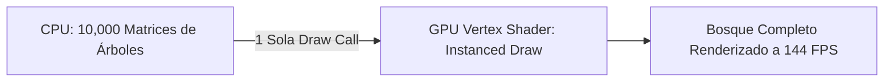

# 💨 Instanced & Skinned Mesh Rendering en Prowl Engine

Para renderizar mundos densos (bosques con miles de árboles, ejércitos con cientos de soldados o campos de hierba) y personajes animados de forma fluida, Prowl Engine implementa dos sistemas especializados de renderizado en GPU:
1. **GPU Instancing:** Mediante [`InstancedMeshRenderable.cs`](file:///c:/Users/SaidR/Documents/GitHub/ProwlStar/Prowl.Runtime/InstancedMeshRenderable.cs) y [`ProceduralInstancedRenderable.cs`](file:///c:/Users/SaidR/Documents/GitHub/ProwlStar/Prowl.Runtime/ProceduralInstancedRenderable.cs).
2. **Skeletal Mesh Deforming (Skinning):** Mediante [`SkinnedMeshRenderer.cs`](file:///c:/Users/SaidR/Documents/GitHub/ProwlStar/Prowl.Runtime/Components/SkinnedMeshRenderer.cs) y [`SkinnedMeshRenderable.cs`](file:///c:/Users/SaidR/Documents/GitHub/ProwlStar/Prowl.Runtime/SkinnedMeshRenderable.cs).

---

## 🌲 GPU Instancing: Dibujando Miles de Mallas en 1 Draw Call

El cuello de botella habitual en gráficos 3D no es la capacidad de la GPU para procesar triángulos, sino la sobrecarga de la CPU al enviar comandos individuales de dibujo (*Draw Calls*).

### ¿Cómo funciona el Instancing en Prowl?
En lugar de emitir una draw call por cada árbol o piedra:
1. El motor agrupa las entidades que comparten la misma malla ([`Mesh`](file:///c:/Users/SaidR/Documents/GitHub/ProwlStar/Prowl.Runtime/Resources/Mesh.cs)) y el mismo [`Material`](file:///c:/Users/SaidR/Documents/GitHub/ProwlStar/Prowl.Runtime/Resources/Material.cs).
2. Sube un array de matrices de transformación (`Float4x4[]`) a un buffer de instancias de la GPU.
3. Emite una única llamada `DrawMeshInstanced`, instruyendo a la GPU a dibujar $N$ copias de la malla en una sola operación atómica.



### Ejemplo de Renderizado Instanciado en C#:
```csharp
using Prowl.Runtime;
using Prowl.Runtime.Resources;
using Prowl.Vector;

public class AsteroidBeltSpawner : MonoBehaviour
{
    [SerializeField] private AssetRef<Mesh> _asteroidMesh;
    [SerializeField] private AssetRef<Material> _asteroidMaterial;
    [SerializeField] private int _count = 2000;

    private Float4x4[] _matrices;

    public override void Awake()
    {
        base.Awake();
        _matrices = new Float4x4[_count];

        for (int i = 0; i < _count; i++)
        {
            float angle = (i / (float)_count) * MathF.PI * 2f;
            float distance = 50f + (Random.Shared.NextSingle() * 20f);
            Float3 pos = new Float3(MathF.Cos(angle) * distance, (Random.Shared.NextSingle() - 0.5f) * 10f, MathF.Sin(angle) * distance);

            _matrices[i] = Float4x4.CreateTranslation(pos);
        }
    }

    public override void OnRenderCollect()
    {
        base.OnRenderCollect();

        if (_asteroidMesh.IsAvailable && _asteroidMaterial.IsAvailable)
        {
            // Registrar lote instanciado en el pipeline
            Graphics.DrawMeshInstanced(_asteroidMesh.Res, _asteroidMaterial.Res, _matrices, _count);
        }
    }
}
```

---

## 🦴 SkinnedMeshRenderer: Animación Esquelética

Para personajes con articulaciones, telas o monstruos con deformación orgánica, Prowl proporciona [`SkinnedMeshRenderer`](file:///c:/Users/SaidR/Documents/GitHub/ProwlStar/Prowl.Runtime/Components/SkinnedMeshRenderer.cs).

### Estructura de Datos de la Malla Deformable:
- **Huesos (`Bones`):** Lista de referencias a los componentes [`Transform`](file:///c:/Users/SaidR/Documents/GitHub/ProwlStar/Prowl.Runtime/Math/Transform.cs) que componen el esqueleto.
- **Hueso Raíz (`RootBone`):** Origen de la jerarquía esquelética.
- **Bind Poses:** Las matrices de transformación inversas de cada hueso capturadas en la postura de descanso (*T-Pose* o *A-Pose*).
- **Pesos por Vértice:** Cada vértice de la malla puede ser influenciado por hasta 4 huesos simultáneamente con factores de ponderación que suman 1.0.

```csharp
public class CharacterRigViewer : MonoBehaviour
{
    public override void Awake()
    {
        base.Awake();

        if (TryGetComponent<SkinnedMeshRenderer>(out var skinnedRenderer))
        {
            Debug.Log($"Personaje cargado con {skinnedRenderer.Bones.Length} huesos.");
            Debug.Log($"Hueso raíz: {skinnedRenderer.RootBone.GameObject.Name}");
        }
    }
}
```

### Pipeline de Deformación en GPU:
1. Al actualizarse la pose en cada frame (por el componente de animación o por ragdolls de física), el motor calcula la matriz de paleta de cada hueso:
   $$\text{BoneMatrix}_i = \text{CurrentPose}_i \times \text{BindPose}_i$$
2. Estas matrices se suben al shader de vértices.
3. El vertex shader interpola la posición final de cada vértice combinando las matrices de sus huesos asociados:
   $$v_{\text{deformado}} = \sum_{j=0}^{3} w_j \cdot (\text{BoneMatrix}_j \cdot v_{\text{original}})$$

---

## ⚡ Consejos de Rendimiento
- **Límite de Huesos por Vértice:** Usa 4 huesos por vértice para el jugador principal y 2 huesos por vértice para NPCs secundarios o personajes distantes.
- **Culling por Bounds del Esqueleto:** Asegúrate de que los `Bounds` del `SkinnedMeshRenderer` abarquen toda la amplitud de las animaciones para evitar que el personaje desaparezca si el hueso raíz queda fuera de la pantalla.

---

## 🔗 Temas Relacionados
- Ciclo de render: [[🎨 Pipeline de Renderizado (DefaultRenderPipeline)]].
- Materiales y texturas: [[🔮 Materiales, Shaders y PropertyState]].
- Reglas de optimización: [[🎯 Buenas Prácticas y Rendimiento (Zero GC)]].
