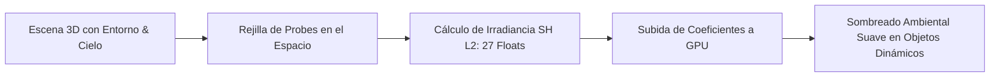

# 🪞 Probes de Luz y Spherical Harmonics en Prowl Engine

Para lograr una iluminación realista, los objetos dinámicos (personajes, vehículos, objetos físicos) deben recibir la luz indirecta rebotada del entorno (paredes, cielo, suelos coloreados). Sin embargo, calcular rebotes de luz en tiempo real mediante raytracing completo es computacionalmente inviable en hardware estándar.

Prowl Engine resuelve este desafío mediante **Light Probes** ([`LightProbeGroup.cs`](file:///c:/Users/SaidR/Documents/GitHub/ProwlStar/Prowl.Runtime/Components/LightProbeGroup.cs)) y **Armónicos Esféricos de Segundo Orden (Spherical Harmonics L2)** ([`SphericalHarmonicsL2.cs`](file:///c:/Users/SaidR/Documents/GitHub/ProwlStar/Prowl.Runtime/Rendering/SphericalHarmonicsL2.cs)).

---

## 🌐 ¿Qué son los Armónicos Esféricos (Spherical Harmonics)?

Los armónicos esféricos son una técnica matemática para representar funciones continuas sobre la superficie de una esfera mediante una serie de coeficientes compactos (similar a cómo una serie de Fourier descompone una señal de audio en frecuencias).

En Prowl:
- Se utiliza una base **L2 (Orden 2)**, lo que significa que la irradiancia lumínica en todas las direcciones tridimensionales se almacena en solo **9 coeficientes por canal de color** (R, G, B), sumando un total de **27 valores float**.
- Esta compresión extrema permite evaluar la luz ambiental difusa que incide sobre cualquier normal de superficie mediante una fórmula polinómica ultrarrápida en el shader con apenas un puñado de operaciones matemáticas de multiplicación y suma (`MAD`).



---

## 📦 LightProbeGroup y LightProbeVolume

### 1. [`LightProbeGroup`](file:///c:/Users/SaidR/Documents/GitHub/ProwlStar/Prowl.Runtime/Components/LightProbeGroup.cs)
Es el componente que se añade a la escena para definir una nube tridimensional de puntos de sondeo.
- Los probes se colocan estratégicamente en transiciones de luz (por ejemplo, entre una habitación oscura y un exterior soleado, o cerca de una pared roja brillante que refleja luz cálida).
- En el Editor, los probes forman una red de tetraedros mediante triangulación de Delaunay 3D.

### 2. [`LightProbeVolume`](file:///c:/Users/SaidR/Documents/GitHub/ProwlStar/Prowl.Runtime/Rendering/LightProbeVolume.cs)
Gestiona la interpolación en tiempo de ejecución:
- Cuando un personaje se mueve por el escenario, el motor localiza los 4 probes más cercanos que forman el tetraedro envolvente.
- Interpola linealmente los coeficientes de armónicos esféricos basándose en las coordenadas baricéntricas de la posición del personaje.
- El resultado es una transición de iluminación ambiental perfectamente suave al cruzar de una zona sombría a una iluminada.

---

## 💻 Uso en Código de SphericalHarmonicsL2

```csharp
using Prowl.Runtime;
using Prowl.Runtime.Rendering;
using Prowl.Vector;

public class AmbientLightingExample : MonoBehaviour
{
    public override void Awake()
    {
        base.Awake();

        // Crear una estructura de armónicos esféricos L2 vacía
        SphericalHarmonicsL2 sh = new SphericalHarmonicsL2();

        // Añadir una contribución de luz direccional difusa desde arriba (cielo azul)
        sh.AddDirectionalLight(Float3.Up, new Color(0.2f, 0.4f, 0.8f, 1f), 1.0f);

        // Añadir un rebote cálido desde el suelo (tierra rojiza)
        sh.AddDirectionalLight(Float3.Down, new Color(0.4f, 0.2f, 0.1f, 1f), 0.5f);

        // Evaluar la luz que recibiría una superficie mirando hacia el frente
        Color evaluatedColor = sh.Evaluate(Float3.Forward);
    }
}
```

---

## ⚡ Ventajas Clave sobre Técnicas Tradicionales
1. **Cero Oclusión de Memoria:** Solo 27 números flotantes por punto en lugar de mapas de cubos (*Cubemaps*) pesados de megabytes.
2. **Excelente para Objetos en Movimiento:** Brinda a los personajes dinámicos la misma riqueza lumínica que a las mallas estáticas cocinadas.
3. **Cero GC:** La estructura `SphericalHarmonicsL2` es un `struct` por valor que reside en el stack o en memoria continua.

---

## 🔗 Temas Relacionados
- Pipeline gráfico: [[🎨 Pipeline de Renderizado (DefaultRenderPipeline)]].
- Iluminación dinámica: [[💡 Iluminación, Sombras y LightBVH]].
- Renderizado de mallas esqueléticas: [[💨 Instanced & Skinned Mesh Rendering]].
