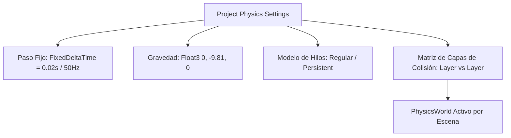

# 🌍 PhysicsWorld y Configuración en Prowl Engine

El motor físico de Prowl Engine está impulsado por **Jitter Physics 2**, una biblioteca de simulación física 3D en C# puro, multihilo, determinista y de altísimo rendimiento.

La clase central que orquesta la simulación por escena es [`PhysicsWorld.cs`](file:///c:/Users/SaidR/Documents/GitHub/ProwlStar/Prowl.Runtime/Physics/PhysicsWorld.cs). Gestiona los cuerpos rígidos, las articulaciones, el paso temporal fijo (*Fixed Timestep*), el filtrado por capas de colisión ([`CollisionMatrix.cs`](file:///c:/Users/SaidR/Documents/GitHub/ProwlStar/Prowl.Runtime/Physics/CollisionMatrix.cs)) y el horneado en segundo plano de mallas complejas.

---

## ⚡ Características Principales de Jitter Physics 2 en Prowl

1. **100% C# Puro y Multihilo:**
   Sin bindings lentos de C++ ni llamadas de P/Invoke. Las tareas de resolución de contactos y detección de fase ancha (*Broad Phase*) se distribuyen entre los núcleos disponibles de la CPU.
2. **Determinismo y Estabilidad:**
   El solver de impulsos y restricciones garantiza una estabilidad superior en apilamientos de cajas (*box stacks*) y mecanismos complejos.
3. **Cuerpos Huérfanos Automáticos:**
   Si colocas un componente `Collider` en un `GameObject` sin añadir un `Rigidbody3D`, Prowl no falla ni se comporta de forma errática: lo adjunta automáticamente a un cuerpo rígido estático global asociado a su capa, permitiendo que actúe como geometría de entorno sólida con coste cero de CPU.

---

## 🎛️ Configuración de la Simulación



### Parámetros Globales:
- **Gravedad (`Gravity`):** Vector tridimensional que actúa sobre todos los cuerpos dinámicos (predeterminado: `Float3(0, -9.81f, 0)`).
- **Paso Temporal Fijo (`FixedDeltaTime`):** Intervalo de tiempo en el que se ejecuta la física (predeterminado: 0.02s = 50 Hz, o 0.0166s = 60 Hz).
- **Modelo de Hilos (`PhysicsThreadModel`):**
  - `Regular`: Destina hilos de trabajo bajo demanda en cada paso.
  - `Persistent`: Mantiene los hilos de simulación activos entre pasos para reducir la latencia de CPU al mínimo.

---

## 🛑 Matriz de Capas de Colisión (CollisionMatrix)

[`CollisionMatrix`](file:///c:/Users/SaidR/Documents/GitHub/ProwlStar/Prowl.Runtime/Physics/CollisionMatrix.cs) permite definir qué capas de objetos pueden colisionar entre sí, evitando cálculos de contacto innecesarios (por ejemplo, proyectiles de jugadores que no deben colisionar con otros jugadores o coleccionables que no deben interactuar con enemigos):

```csharp
using Prowl.Runtime;

public class PhysicsLayerSetup : MonoBehaviour
{
    public override void Awake()
    {
        base.Awake();

        int playerLayer = LayerMask.NameToLayer("Player");
        int playerBullets = LayerMask.NameToLayer("PlayerBullets");
        int enemyBullets = LayerMask.NameToLayer("EnemyBullets");

        // Desactivar colisiones entre proyectiles del jugador y el propio jugador
        Physics.CollisionMatrix.SetCollision(playerLayer, playerBullets, canCollide: false);

        // Desactivar colisiones entre proyectiles amigos y enemigos
        Physics.CollisionMatrix.SetCollision(playerBullets, enemyBullets, canCollide: false);
    }
}
```

### Ignorar Colisiones Específicas por Par de Cuerpos:
Si necesitas que dos objetos concretos no colisionen sin alterar la matriz de capas global:
```csharp
// Ignorar colisión entre el chasis del auto y el personaje dentro de él
Scene.Current.Physics.IgnoreCollisionBetween(carRigidbody, playerRigidbody);

// Restaurar colisión
Scene.Current.Physics.EnableCollisionBetween(carRigidbody, playerRigidbody);
```

---

## 🍞 Horneado de Mallas Físicas (BakeMesh)

Los colisionadores basados en mallas arbitrarias ([`MeshCollider`](file:///c:/Users/SaidR/Documents/GitHub/ProwlStar/Prowl.Runtime/Components/Physics/Colliders/MeshCollider.cs)) requieren una estructura espacial interna de triángulos (BVH estático) para procesar colisiones en microsegundos.

En Prowl, este proceso se realiza a través de [`PhysicsWorld.BakeMesh(mesh)`](file:///c:/Users/SaidR/Documents/GitHub/ProwlStar/Prowl.Runtime/Physics/PhysicsWorld.cs):
- El resultado se cachea directamente en la instancia de [`Mesh`](file:///c:/Users/SaidR/Documents/GitHub/ProwlStar/Prowl.Runtime/Resources/Mesh.cs) (`mesh.BakedPhysics`).
- **Es completamente seguro para subprocesos (Thread-Safe):** Puedes pre-hornear mallas en hilos secundarios en segundo plano mientras se carga el nivel sin congelar el hilo principal.
- Si 50 objetos en la escena usan la misma malla de colisión, solo se hornea una vez y se comparte en memoria.

---

## 🔗 Temas Relacionados
- Cuerpos rígidos y fuerzas: [[🧊 Rigidbodies y Modos de Fuerza]].
- Formas de colisionadores: [[📐 Colliders (Primitivas, Mesh, Terreno)]].
- Consultas y raycasts: [[🎯 Raycasting y Shape Queries]].
