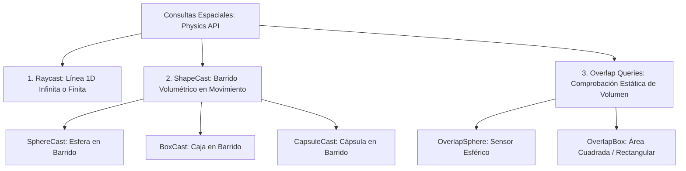

# 🎯 Raycasting y Shape Queries en Prowl Engine

Las consultas espaciales permiten a los sistemas de juego (armas de fuego, inteligencia artificial, visión de enemigos, sensores de proximidad) interrogar la geometría física del mundo sin necesidad de esperar a que ocurran colisiones entre objetos.

Prowl Engine proporciona un conjunto completo de métodos estáticos optimizados en [`Physics`](file:///c:/Users/SaidR/Documents/GitHub/ProwlStar/Prowl.Runtime/Physics/PhysicsWorld.cs), incluyendo lanzamientos de rayos lineales (**Raycasts**), barridos volumétricos (**ShapeCasts**) y comprobaciones de solapamiento (**Overlap Queries**), todos diseñados con variantes `NonAlloc` para garantizar **Cero Asignaciones en el GC**.

---

## 🔍 Tipos de Consultas Espaciales



---

## ⚡ 1. Raycasting (Disparos y Sensores Lineales)

Un **Raycast** traza una semirrecta matemática desde un origen a lo largo de una dirección vectorial hasta una distancia máxima.

### Estructura [`RaycastHit`](file:///c:/Users/SaidR/Documents/GitHub/ProwlStar/Prowl.Runtime/Physics/RaycastHit.cs):
Cuando el rayo impacta contra una superficie, se rellena una estructura con los datos del impacto:
- `hit.Point`: Coordenadas exactas 3D de mundo del punto de contacto (`Float3`).
- `hit.Normal`: Vector unitario perpendicular a la superficie impactada (`Float3`), esencial para orientar efectos de chispas o decals de agujeros de bala.
- `hit.Distance`: Distancia recorrida por el rayo hasta el impacto.
- `hit.Collider`: Referencia al componente [`Collider`](file:///c:/Users/SaidR/Documents/GitHub/ProwlStar/Prowl.Runtime/Components/Physics/Colliders/Collider.cs) impactado.
- `hit.Rigidbody`: Referencia al cuerpo rígido asociado (si existe).

### Ejemplo de Disparo Hitscan (Zero GC):
```csharp
using Prowl.Runtime;
using Prowl.Vector;

public class WeaponHitscan : MonoBehaviour
{
    [SerializeField] private float _range = 100f;
    [SerializeField] private float _damage = 25f;
    [SerializeField] private LayerMask _targetLayers;

    public void FireWeapon(Camera playerCam)
    {
        Float3 rayOrigin = playerCam.Transform.Position;
        Float3 rayDirection = playerCam.Transform.Forward;

        // Consulta directa con máscara de capa
        if (Physics.Raycast(rayOrigin, rayDirection, out RaycastHit hit, _range, _targetLayers.Value))
        {
            Debug.Log($"Impacto contra: {hit.Collider.GameObject.Name} en {hit.Point}");

            // Instanciar chispa de impacto orientada con la normal de superficie
            // SpawnHitSparks(hit.Point, hit.Normal);

            // Aplicar daño si tiene un componente de salud
            if (hit.Collider.GameObject.TryGetComponent<Health>(out var health))
            {
                health.TakeDamage(_damage);
            }
        }
    }
}
```

---

## 🎳 2. Shape Casting (Barridos de Esfera, Caja y Cápsula)

Lanzar un rayo infinitesimal a veces no es suficiente. Por ejemplo, una granada de cañón no es una línea de grosor cero, sino un proyectil con volumen; o un personaje saltando necesita saber si su cuerpo completo cabrá a través de una abertura antes de avanzar.

Los métodos **ShapeCast** barren una forma geométrica 3D a lo largo de un vector:
- `Physics.SphereCast(origin, radius, direction, out RaycastHit hit, distance, layerMask)`
- `Physics.BoxCast(center, halfExtents, direction, orientation, out RaycastHit hit, distance, layerMask)`
- `Physics.CapsuleCast(point1, point2, radius, direction, out RaycastHit hit, distance, layerMask)`

---

## 🧲 3. Consultas NonAlloc: Cero Basura en el GC

> [!IMPORTANT]
> En motores como Unity clásico, invocar `Physics.RaycastAll` o `Physics.OverlapSphere` crea un nuevo array en el Heap en cada llamada, acumulando megabytes de basura por segundo.
> En Prowl Engine, **siempre debes usar las variantes `NonAlloc` con búferes preasignados**.

### Ejemplo de Detección de Explosión de Área (OverlapSphereNonAlloc):
```csharp
public class ExplosiveBarrel : MonoBehaviour
{
    [SerializeField] private float _explosionRadius = 8.0f;
    [SerializeField] private float _explosionForce = 50.0f;

    // Buffer estático reutilizado por todos los barriles del juego (Zero GC)
    private static readonly Collider[] s_overlapBuffer = new Collider[32];

    public void Explode()
    {
        Float3 center = Transform.Position;
        int layerMask = LayerMask.GetMask("Default", "Enemy", "Debris");

        // Rellenar el buffer preasignado
        int hitCount = Physics.OverlapSphereNonAlloc(center, _explosionRadius, s_overlapBuffer, layerMask);

        for (int i = 0; i < hitCount; i++)
        {
            Collider col = s_overlapBuffer[i];
            if (col.TryGetComponent<Rigidbody3D>(out var rb))
            {
                Float3 direction = (rb.Transform.Position - center).normalized;
                float distance = Float3.Distance(rb.Transform.Position, center);
                float falloff = 1.0f - Math.Clamp(distance / _explosionRadius, 0f, 1f);

                // Aplicar impulso proporcional a la distancia
                rb.AddForce(direction * (_explosionForce * falloff), ForceMode.Impulse);
            }
        }

        GameObject.Destroy();
    }
}
```

---

## 🔗 Temas Relacionados
- Arquitectura de colisiones: [[📐 Colliders (Primitivas, Mesh, Terreno)]].
- Cuerpos físicos: [[🧊 Rigidbodies y Modos de Fuerza]].
- Rendimiento y optimización: [[🎯 Buenas Prácticas y Rendimiento (Zero GC)]].
